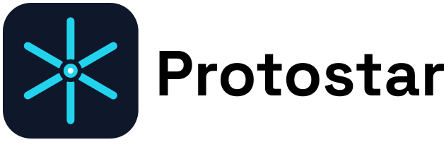

<!-- markdownlint-disable-file MD041 -->

<div align="center">

<picture>
  <source media="(prefers-color-scheme: dark)" srcset="docs/assets/readme-dark.svg">
  <source media="(prefers-color-scheme: light)" srcset="docs/assets/readme-light.svg">
  
</picture>

<br>

**A modular CLI tool for high-velocity environment scaffolding.**

[](https://pypi.org/project/protostar/)
[](https://github.com/jacksonfergusondev/protostar/actions/workflows/ci.yml)
[](https://github.com/jacksonfergusondev/protostar/actions/workflows/release.yml)
[](https://codecov.io/gh/JacksonFergusonDev/protostar)
[](https://www.python.org/downloads/)
[](https://protostar.readthedocs.io/en/latest/)
[](LICENSE)

</div>

Setting up a new project often requires the same manual steps: configuring linters, writing `.gitignore` and `.dockerignore` files, setting up virtual environments, and linking IDEs. **Protostar** automates this boilerplate so you can skip the setup and get straight to writing code.

---

<div align="center">
<picture>
  
</picture>
</div>

---

## 💡 Design Philosophy

Protostar is built to save you time and stay out of your way. It adheres to a strict separation of concerns to avoid generating bloated artifacts you'll inevitably just delete manually:

1. **`init` vs. `generate`:** The `protostar init` command is designed to be run exactly *once* at the inception of a repository to lay the foundational architecture. The `protostar generate` command provides discrete, repeatable scaffolding for files you create regularly (like C++ classes or LaTeX reports).

1. **Manifest-First, Side-Effects-Last:** Many bootstrapping scripts run a sequence of shell commands and fail unpredictably midway through. Protostar separates state definition from execution. Modules declare their requirements into a centralized `EnvironmentManifest`. Disk I/O and subprocesses only execute in a single, deterministic phase at the very end.

1. **Fail Loud, Fail Early:** Pre-flight checks ensure all system dependencies (like `uv`, `git`, `cargo`, or `direnv`) are present before any state is mutated. If a check fails, the environment remains completely untouched.

1. **Non-Destructive by Default:** Protostar never blindly overwrites your existing work. It dynamically appends to `.gitignore` files, intelligently merges IDE JSON configurations, uses deterministic AST modification to deep-merge TOML configurations, and safely aborts if generated files already exist.

1. **Actionable Telemetry:** When things break, Protostar bubbles up the exact `stderr` so you know immediately if a network request or dependency resolution failed. For unexpected internal crashes, it automatically generates a URL-encoded GitHub issue containing your system environment vector to eliminate debugging entropy.

---

## ⚡️ Performance & Latency Isolation

Protostar is built to be lightweight, so Python's startup overhead never slows down your local development.

We measure initialization latency using two benchmarking approaches:

1. **Fast-Path Execution:** Measures the latency of non-interactive commands (e.g., `protostar help init`).
1. **TUI-Path Execution:** Measures the overhead of triggering the interactive `questionary` wizards.

Our CI pipeline enforces a strict performance budget using `hyperfine`, gating any PR that introduces significant regressions in either path. We maintain historical tracking to ensure long-term architectural stability rather than chasing absolute CI metrics (which are subject to heavy VM variance).

- **View CI Trends:** [Performance Dashboard](https://jacksonfergusondev.github.io/protostar/)

---

## 📦 Installation

### macOS (Homebrew)

```bash
brew install jacksonfergusondev/tap/protostar
````

### Universal (uv)

For isolated CLI tool installation on any OS, `uv` is highly recommended:

```bash
uv tool install protostar
```

### Universal (pip)

```bash
pip install protostar
```

> **Note:** If you install Protostar into an existing Python environment with `pip`, it will bring in `questionary` and `prompt_toolkit` for the interactive wizard. For guaranteed isolation and to avoid dependency conflicts, prefer `uv tool` or Homebrew.

---

## 🚀 Quick Start

Protostar is designed to be run right after you `mkdir` a new project.

### The Interactive Wizard

If you run `protostar` without any arguments, it launches an interactive Terminal User Interface (TUI). This wizard allows you to visually select your languages, tools, and presets without needing to memorize CLI flags.

```bash
mkdir orbital-mechanics-sim
cd orbital-mechanics-sim
protostar
```

### Headless Scaffolding

For rapid, repeatable initialization, bypass the TUI entirely by providing your desired environment matrix as CLI flags.

```bash
protostar init --python --astro --docker --direnv -m --mypy --pytest --pre-commit
```

*Result: Scaffolds a Python environment alongside astrophysics dependencies, generates `data/catalogs` and `data/fits` directories, writes optimized `.gitignore` and `.dockerignore` files, configures a `.envrc` file, injects a pragmatic `.markdownlint.yaml` ruleset, and sets up your testing and static analysis tools with dynamic pre-commit hooks.*

---

## 📖 Official Documentation

Ready to dive deeper? The README only scratches the surface.

Head over to the **[Official Documentation](https://protostar.readthedocs.io/en/latest/)** for:

- **Command Reference:** Full flags and capabilities for `init` and `generate`.
- **Domain Presets:** Matrices for Scientific, Astrophysics, ML, DSP, and Embedded workflows.
- **Configuration & Shell Autocomplete:** Setting up global defaults, CLI autocompletion, and advanced AST overrides.
- **Architecture Mechanics:** Deep dives into the Orchestrator, Executor, and Manifest lifecycle.

---

## 🤝 Collaboration

This tool uses a highly decoupled, plugin-style architecture. The CLI parser dynamically evaluates module registries at runtime.

- **To add support for a new language:** Subclass `BootstrapModule`.
- **To add a new dependency pipeline:** Subclass `PresetModule`.

We maintain strict engineering standards to ensure reliability, including 100% type-hinting, isolated `pytest` environments (mocked subprocesses and `tmp_path` disk isolation), and automated `ruff` formatting.

Please see the [Documentation](protostar.readthedocs.io/en/latest/mission-control/overview/) for full details on our development setup, architectural rules, and pull request guidelines.

## 📧 Contact

[](https://github.com/JacksonFergusonDev)
[](https://www.linkedin.com/in/jackson--ferguson/)
[](mailto:jackson.ferguson0@gmail.com)

---

## 📄 License

This project is licensed under the MIT License - see the [LICENSE](LICENSE) file for details.
