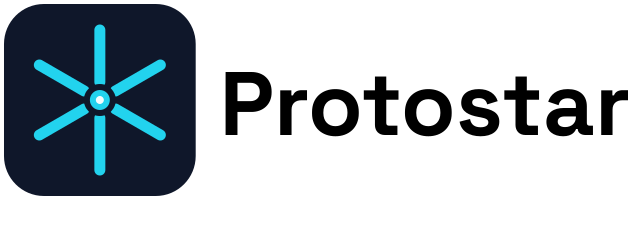
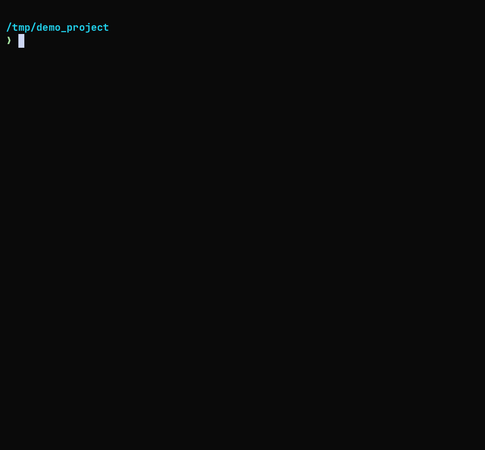
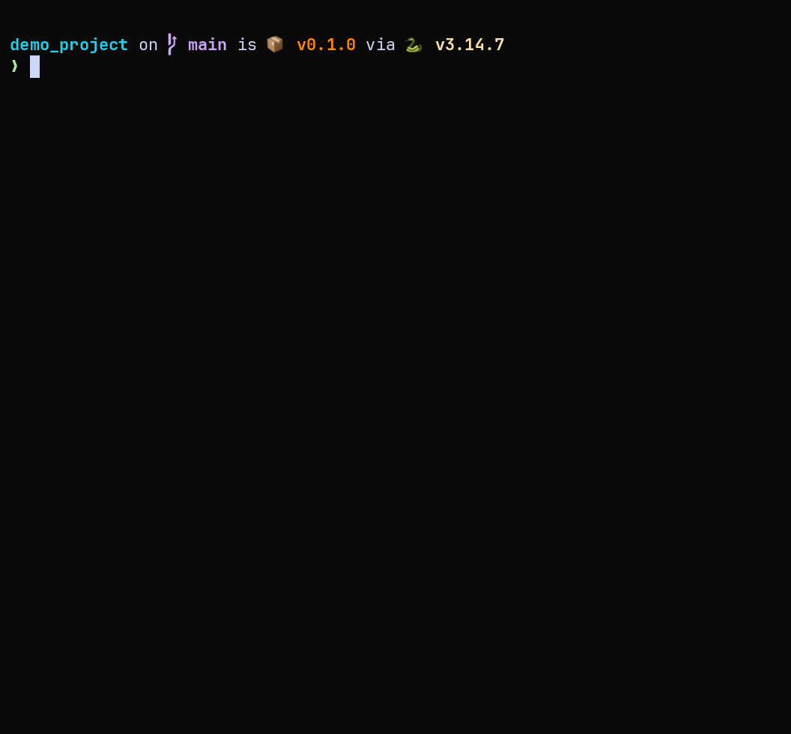

<!-- rumdl-disable-file first-line-heading -->
<div align="center">

<picture>
  <source media="(prefers-color-scheme: dark)" srcset="docs/assets/readme-dark.svg">
  <source media="(prefers-color-scheme: light)" srcset="docs/assets/readme-light.svg">
  
</picture>

[](https://pypi.org/project/protostar/)
[](https://github.com/jacksonfergusondev/protostar/actions/workflows/ci.yml)
[](https://codecov.io/gh/JacksonFergusonDev/protostar)
[](https://protostar.jacksonferguson.me/metrics/#mutations)
[](https://protostar.jacksonferguson.me/metrics/#rollback)

---

### Simple Python project scaffolding that understands your tools

---

| [**Get Started**](https://protostar.jacksonferguson.me/getting-started/)
| [**Docs**](https://protostar.jacksonferguson.me/)
| [**Why Protostar?**](https://protostar.jacksonferguson.me/why-protostar/)
| [**Design Principles**](https://protostar.jacksonferguson.me/design-principles/)
| [**Authoring Templates**](https://protostar.jacksonferguson.me/usage/authoring-templates/)
| [**Troubleshooting**](https://protostar.jacksonferguson.me/usage/troubleshooting/) |

</div>

Pick your tools, and Protostar writes their configuration, hooks, and CI. When your template improves, updates merge into your files by meaning, so your edits stay.

<div align="center">
<picture>
  
</picture>
</div>

## Why Protostar?

> Already know Cookiecutter or Copier? The [detailed comparison](https://protostar.jacksonferguson.me/why-protostar/) runs the same template and the same update through both tools and compares them in more depth.

Plenty of tools can create a Python project. What sets Protostar apart is that it understands the tools it sets up and the files they live in, and that keeps everything simple:

- **Say what you want, not how to build it.** A template is a short list of the tools you want and the packages you need. Protostar writes every configuration file, commit hook, and CI step those tools require.

- **Every tool is a switch.** Want Docker but not direnv? Pass `--docker --no-direnv`. Change your mind a year later, and Protostar adds or removes that tool's setup cleanly.

- **Updates that understand your files.** When a template improves, Protostar merges the change into your project by meaning, not line by line. Your own edits stay, and if you and the update changed the same setting, you get one clear choice instead of a mess to untangle.

- **Preview first, recover on failure.** Protostar shows you every change before making it and restores the files it changed if a step fails. The [published rollback results](https://protostar.jacksonferguson.me/metrics/#rollback) show this recovery tested across Linux, macOS, and Windows; the [rollback guide](https://protostar.jacksonferguson.me/usage/rollback/) explains what is covered.

- **Fits the project you already have**, and runs from scripts, CI, and coding agents without stopping to ask questions.

In a terminal, `protostar sync` shows each conflict with both sides before anything is applied:

<div align="center">
<picture>
  
</picture>
</div>

Protostar is Python-only and builds on uv. It's young, and it grows with the people using it: [feature requests](https://github.com/jacksonfergusondev/protostar/issues/new?template=feature_request.yml) shape what comes next.

---

## Get Started

Install Protostar with [uv](https://docs.astral.sh/uv/) on any platform:

```bash
uv tool install protostar
```

Or with Homebrew on macOS:

```bash
brew install jacksonfergusondev/tap/protostar
```

Protostar needs Python 3.12+, uv, and git. Homebrew installs both for you, and the [installation guide](https://protostar.jacksonferguson.me/installation/) covers every platform.

Then make a folder for your project and run `protostar init` inside it:

```bash
mkdir my-project
cd my-project
protostar init
```

Choose a template and the tools you want, look over a preview of every file it will create, and apply. When it's done, `protostar guide` shows how to run, test, and check the project. New to Python projects? [Your First Project](https://protostar.jacksonferguson.me/first-project/) walks through every step.

---

## Start From a Template

Each built-in template is a project shape. Pick one, then switch its tools on or off:

| Template | For |
| :--- | :--- |
| `cli` | A command-line app, with Typer and Rich |
| `api` | A web API, with FastAPI |
| `lib` | A library other people install from PyPI |
| `ml` | Machine learning and data science, with PyTorch and Jupyter |
| `astro` | Astronomy and astrophysics data analysis, with Astropy |

Every built-in template comes in two tiers. **Workbench** keeps the tooling light, for exploring and analysis. **Production** adds the full quality gate for something you'll publish: type checking, tests, commit hooks, CI, and releases. A project can move up whenever it's ready:

```bash
protostar sync --tier production
```

---

## What It Can Set Up

| Area | Tools |
| :--- | :--- |
| Code quality | Ruff, plus a type checker: mypy, ty, or Pyrefly |
| Tests | pytest, with coverage reports on Codecov |
| Commit checks | pre-commit or prek hooks, and Commitizen for commit messages |
| Automation | GitHub Actions CI, releases to PyPI, and Renovate for dependency updates |
| Documentation | Zensical sites, and publishing on Read the Docs |
| Everyday work | just for short commands, direnv for environments, and Docker images |
| Collaboration | An `AGENTS.md` for coding assistants, and contributing guides and issue forms |
| Markdown | rumdl or markdownlint |

The [tooling matrix](https://protostar.jacksonferguson.me/usage/tooling-matrix/) lists every tool, its flag, and the files it writes.

---

## Everyday Commands

| Command | What it does |
| :--- | :--- |
| `protostar init` | Set up a new project, or bring Protostar into one you already have |
| `protostar status` | Show what an update would change, and anything waiting for your decision |
| `protostar sync` | Apply updates from your template and from Protostar, keeping your edits |
| `protostar guide` | Show how to run, test, check, and document this project |
| `protostar eject` | Stop tracking the project, and keep every file |

---

## Make Your Own Template

A template is a short TOML file. This one gives every new service a team's tools, with stricter type checking than the default:

```toml
name = "Service"
description = "Our team's FastAPI service"

dependencies = ["fastapi", "uvicorn"]

ruff = true
mypy = true
pytest = true
ci = true

[dev.pyproject.strict_typing]
requires = "mypy"
content = '''
[tool.mypy]
strict = true
'''
```

Share it as a file, a URL, or a Git repository, and start projects from it:

```bash
protostar init --from https://github.com/your-org/service-template
```

Tag its releases, and every project made from it can move to the newest one with `protostar sync --to latest`. The [authoring guide](https://protostar.jacksonferguson.me/usage/authoring-templates/) covers starter files, options, tiers, and checking a template in CI.

To see it all working, [protostar-example-templates](https://github.com/JacksonFergusonDev/protostar-example-templates) holds two templates, a one-file one and a fuller service, and [protostar-example-project](https://github.com/JacksonFergusonDev/protostar-example-project) was made from one. When the template tagged a new release, a scheduled workflow in the project opened [this update pull request](https://github.com/JacksonFergusonDev/protostar-example-project/pull/1) on its own.

---

## Go Deeper

Written for people who already know Python tooling:

| If you want to | Read |
| :--- | :--- |
| Compare Protostar with Copier, Cookiecutter, and `uv init` | [Why Protostar?](https://protostar.jacksonferguson.me/why-protostar/) |
| Review and settle updates in a project | [Project Lifecycle](https://protostar.jacksonferguson.me/usage/lifecycle/) |
| Open update pull requests and check projects in CI | [Automating Updates](https://protostar.jacksonferguson.me/usage/automating-updates/) |
| Drive Protostar from scripts or coding agents | [Agent & Machine Interface](https://protostar.jacksonferguson.me/usage/agent-interface/) |
| Write and publish templates for a team | [Authoring Templates](https://protostar.jacksonferguson.me/usage/authoring-templates/) |
| Look up every command and flag | [CLI Reference](https://protostar.jacksonferguson.me/usage/cli-reference/) |
| See how planning, merging, and rollback work | [Design Principles](https://protostar.jacksonferguson.me/design-principles/) |

---

## How It's Built

Protostar edits other people's work, so it's built to be careful:

- **It plans before it acts.** Every change is worked out in memory and shown to you first. If a step fails or you press Ctrl+C, every file it wrote is restored exactly as it was, and nightly tests exercise that recovery by failing real runs at every step; see the [rollback results](https://protostar.jacksonferguson.me/metrics/#rollback).
- **The engine is separate from the interface.** The same core runs behind the interactive editor, the command line, and coding agents, which is why every command can also answer in JSON.
- **It's tested thoroughly.** Over 3,500 tests, including runs of the real tools, pass on Linux, macOS, and Windows, with strict type checking and at least 85% coverage.
- **The tests are challenged with deliberate bugs.** Mutation testing changes selected engine modules one small edit at a time to check whether the tests notice. The [mutation testing results](https://protostar.jacksonferguson.me/metrics/#mutations) show the score and the modules it covers.
- **Its docs are checked against its code.** Before every push, a script confirms that the commands, errors, exit codes, and file paths the docs mention still match the code.
- **Performance stays visible.** CI tracks help-command startup and the recipe editor's first frame, flagging large regressions; see the [benchmarks](https://protostar.jacksonferguson.me/metrics/#benchmarks).

---

## Contributing

Bug reports and feature requests are welcome in [GitHub issues](https://github.com/jacksonfergusondev/protostar/issues). To work on Protostar itself, start with [CONTRIBUTING.md](CONTRIBUTING.md) and the [developer guide](https://protostar.jacksonferguson.me/developer/overview/).

---

## Contact

[](https://github.com/JacksonFergusonDev)
[](https://www.linkedin.com/in/jackson--ferguson/)
[](mailto:jackson.ferguson0@gmail.com)

[](https://jacksonferguson.me)

---

## License

This project is licensed under the MIT License. See the [LICENSE](LICENSE) file for details.
