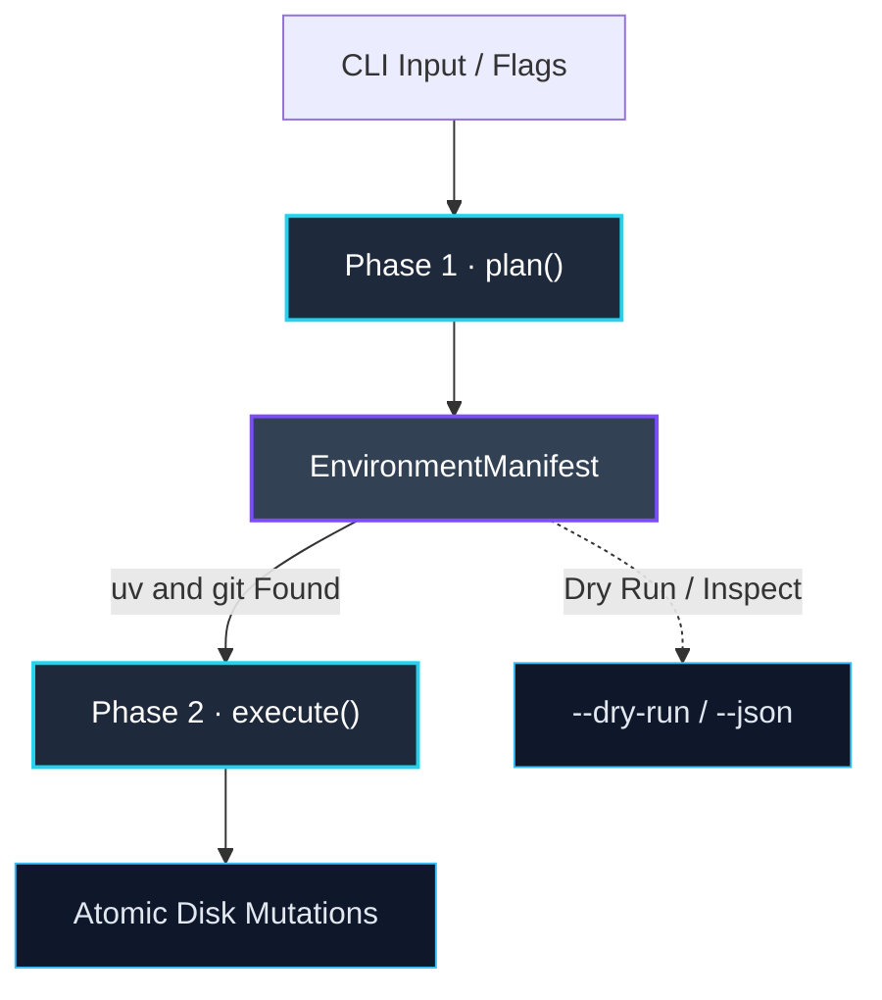
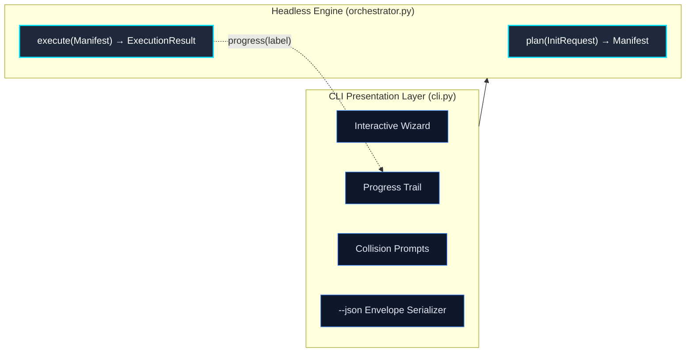

# Design Principles

Every architectural constraint — the two-phase engine, the AST merging, the POSIX exit codes — exists because a simpler alternative has a concrete, observable failure mode.

This page explains the vocabulary: what each principle is called, exactly what problem it solves, and what goes wrong when you ignore it.

## Declarative over Imperative

**You describe the environment you want. Protostar figures out how to produce it.**

A declarative interface separates *what* from *how*. When you write a `protostar.toml` template or pass `--template cli`, you are expressing desired state, not issuing a sequence of commands. The engine resolves the execution steps internally.

The contrasting model is **imperative scripting**: a sequence of shell commands executed top-to-bottom. Imperative scripts are fragile because they bind intent to implementation in a single unbreakable thread. If step 4 of 10 fails, the script has already run steps 1–3 — and you now own the cleanup.

=== "Protostar (Declarative)"

    ```toml
    # Declare the environment you want.
    # Protostar resolves how to construct it.
    dependencies = ["fastapi", "uvicorn[standard]"]
    ruff   = true
    docker = true
    pytest = true
    ```

    ```bash
    # Or express intent via flags:
    protostar init --template api --no-docker --direnv
    ```

=== "Shell Script (Imperative)"

    ```bash
    #!/bin/bash
    # Fragile: step 4 failing leaves steps 1–3 already applied.
    uv init
    uv add fastapi uvicorn
    cat > Dockerfile << 'EOF'
    FROM python:3.13-slim
    EOF
    ruff check .        # fails here — half the workspace is already written
    pre-commit install
    ```

!!! note "Dry-running only works cleanly on declarative interfaces"
    Because Protostar operates on declared intent rather than an imperative list of shell calls, `--dry-run` produces the *exact same manifest* that a live execution would use — not a best-guess simulation. The plan is real; only the side-effect execution is withheld.

## Manifest-First

**All intended state changes are collected into a single `EnvironmentManifest` object before any side effect is permitted to occur.**

Protostar's engine operates in two strictly ordered phases:



**Phase 1 — `plan()`** is read-only. Every module declares what it needs — files to write, TOML payloads to inject, packages to install, subprocesses to run — into the manifest. Nothing touches disk. Planning checks that the binaries Protostar itself runs (`uv` and `git`) are on `$PATH`, and aborts cleanly before the workspace is touched if either is missing. A binary only a selected tool runs (`direnv`, `just`) never aborts a run: planning records it as missing, and execution skips only the steps that run it.

**Phase 2 — `execute(manifest)`** is the *only* place side effects are permitted. The `SystemExecutor` reads the validated manifest and applies mutations in a strict deterministic order within an atomic transaction boundary.

**Why this matters:** Most bootstrapping tools execute imperatively — a sequence of operations where each step may depend on the previous one having succeeded. If step 6 fails, steps 1–5 have already mutated your filesystem. Manifest-first guarantees that the plan is fully valid *before* committing. Furthermore, Protostar's transactional execution engine wraps Phase 2 in a mutation journal: if a write fails, dependency resolution aborts, or the process is interrupted via `Ctrl+C`, managed subprocesses are stopped and all journaled filesystem changes are automatically rolled back.

!!! note "The Transaction Boundary"
    Protostar's automated rollback guarantees byte-accurate restoration for all **transaction-managed paths** — files and directories mutated via `TransactionAwareFS`, and declared subprocess targets (`pyproject.toml` and `uv.lock`). Subprocesses are managed in isolated process groups and reaped before rollback begins. Undeclared filesystem side effects from arbitrary external commands (such as a `.git/` repository created by `git init`) fall outside this boundary. See [Automatic Rollback](./usage/rollback.md) for the full guarantee model, and [Rollback Internals](./mechanics/rollback.md) for the architectural details.

!!! tip "The manifest is the source of truth"
    The `--dry-run --json` output is a direct serialization of the `EnvironmentManifest`. What you see is exactly what would be written to disk — not an approximation.

## The Headless Core

**The core execution engine is completely headless. All terminal interaction lives outside it.**

The engine's public surface — `Orchestrator.plan()` and `Orchestrator.execute()` — takes and returns pure data objects (`InitRequest` → `EnvironmentManifest` → `ExecutionResult`). It has no knowledge of terminal colors, interactive prompts, spinners, or `--json` formatting. Those concerns belong entirely to `cli.py`.

Progress is the one thing that must cross the boundary *during* execution, and it crosses as a callback rather than a dependency. `execute()` accepts an optional `progress` hook (`ProgressStep` in `protostar.progress`): the engine enters `progress(label)` around each subprocess and the initial scaffold, naming the work in plain words. Only a fatal failure raises through a step, so a caller can mark it failed knowing rollback follows; non-fatal outcomes still arrive as diagnostics. The reverse holds too: a presenter must never raise on its own, because the engine cannot tell its exception from a failure of the work and would roll that work back. What a step looks like is the caller's business. The CLI renders it as a spinner that leaves a permanent `✔` or `✖` line; library callers and `--json` pass nothing and get a no-op.



**Why this matters:** Headless separation is what makes Protostar usable as a library and as a subprocess target for AI agents and CI pipelines. Because the engine accepts `InitRequest` and returns `ExecutionResult` without ever touching a terminal, it can be called programmatically, tested in isolation, and driven headlessly without stripping out interactive assumptions. The `--json` flag doesn't "disable" prompts — there were never any prompts inside the engine to begin with.

## Modular & Decoupled

**Each supported tool is an independent `BootstrapModule` subclass. Modules declare their requirements into the manifest and have no knowledge of each other.**

When you toggle `--no-direnv`, the `direnv` module simply isn't loaded. When you toggle `--docker`, the `Docker` module runs its `build()` method against the manifest and declares a `Dockerfile`, a `.dockerignore` update, and a set of ignore patterns. No other module changes. The engine never contains a conditional for Docker.

=== "Module Architecture"

    ```python
    class DockerModule(BootstrapModule):
        def build(self, manifest: EnvironmentManifest) -> None:
            manifest.filesystem.add_file_injection(
                Path("Dockerfile"), self._render_dockerfile()
            )
            manifest.filesystem.add_vcs_ignore("Dockerfile", context=".dockerignore")
    ```

=== "What You'd Have Without It"

    ```python
    # One giant function. Every new tool adds more conditionals.
    def scaffold(flags):
        if flags.docker:
            write_dockerfile()
            if flags.ruff and flags.docker:  # combinatorial explosion
                write_ruff_docker_override()
        if flags.direnv:
            write_envrc()
            if flags.direnv and flags.docker:
                write_docker_env_passthrough()
        ...
    ```

**Why this matters:** Decoupling prevents combinatorial explosion. With `n` tools, a monolithic conditional model can grow to `O(2^n)` interaction cases. A modular architecture keeps complexity linear — each module is an isolated unit, testable without any other module present. Adding a new tool to Protostar means writing one new class, not auditing every existing flag combination.

!!! note "Related: tri-state toggling"
    Because modules are independent, Protostar can offer `--<flag>` / `--no-<flag>` overrides for any module without the template author needing to write any conditional logic. See [Initialization](./usage/init.md) for the full flag matrix.

## Baseline in Modules, Shape in Templates

**Modules ship a baseline tuned for casual projects. Templates add the strictness that defines a particular kind of project.**

Suppose you run Protostar, pick `ruff` and `mypy`, and start writing a few scripts you want to keep modern and clean. If the `mypy` module shipped a strict, production-grade configuration, your first `mypy .` would bury a weekend script in errors you never asked for. The tool would feel like it was fighting you, and you would be right to be annoyed.

So each module's defaults are what a casual user would thank it for. The `cli` template, which produces a published package, adds `strict = true` and stricter lint rules because for that shape they are the point.

=== "Protostar (Baseline + Delta)"

    ```toml
    # Module baseline (always the same, gentle):
    [tool.mypy]
    check_untyped_defs = true
    warn_return_any = true

    # cli template delta (only what defines a published CLI):
    [tool.mypy]
    strict = true
    ```

=== "What You'd Have Without It"

    ```toml
    # Strict defaults in the module, so every user pays for them:
    [tool.mypy]
    strict = true

    # ...and a template that wants *less* strict must now
    # override the module, one setting at a time.
    ```

**Why this matters:** Putting strictness in the shared default makes every user carry the cost of a choice only some of them want, and it forces each relaxed project to undo it setting by setting. Putting it in the template keeps the choice with the shape that needs it, and keeps each template small enough to read at a glance. See [Built-in Templates](./developer/built-in-templates.md) for how this rule is enforced.

## Fail Loud, Fail Early

**All system dependency checks run during `plan()` — before `execute()` is called and before any file is written.**

Only the binaries Protostar itself runs block: `uv` and `git`. If either is missing from `$PATH`, Protostar raises `MissingDependencyError` naming every missing binary with one command that installs them all, and the process exits immediately with `os.EX_UNAVAILABLE`. A binary that only a selected tool runs, such as `direnv`, is declared by the tool's module and reported as `missing_tools` instead: the files it configures are correct whether or not it is installed.

No file has been created. No directory has been staged. The workspace is exactly as you left it.

=== "What Protostar Does"

    ```text
    $ protostar init --template cli

    ✗  Dependency missing: uv

       Protostar uses uv to initialize the project and resolve packages.

       Install uv:
         curl -LsSf https://astral.sh/uv/install.sh | sh
    ```

    *Exit code: 69 (os.EX_UNAVAILABLE). Workspace untouched.*

=== "What an Imperative Script Does"

    ```bash
    mkdir src/myproject
    touch src/myproject/__init__.py
    cat > pyproject.toml << 'EOF'
    [project]
    name = "myproject"
    EOF
    uv init  # ← fails here with a cryptic "command not found"
    # workspace now has partial scaffolding that you need to clean up
    ```

!!! note "Fail loud"
    The word "loud" is deliberate. Protostar doesn't swallow errors into a generic "something failed" message. Domain-specific exceptions carry structured context — which binary is missing, what it's used for, and what command will fix it. When things fail unexpectedly (internal bugs), the crash report surfaces your system environment details and opens a pre-filled GitHub issue automatically.

## Non-Destructive AST Merging

**Configuration files are parsed into Abstract Syntax Trees and surgically updated. Your existing comments, keys, and formatting are preserved.**

When Protostar needs to inject tooling configuration into an existing `pyproject.toml`, it does not open the file and write a new one. It parses the file via `tomlkit` into an in-memory AST, merges the incoming payload at the node level, and writes the result back out.

The practical consequence: fields you've customized survive untouched.

=== "Before (Your Existing pyproject.toml)"

    ```toml
    [project]
    name = "orbital-sim"
    version = "0.1.0"  # version pinned manually — do not change

    [tool.ruff]
    line-length = 100  # non-standard, required for equation alignment
    ```

=== "After (Protostar injects ruff.lint)"

    ```toml
    [project]
    name = "orbital-sim"
    version = "0.1.0"  # version pinned manually — do not change

    [tool.ruff]
    line-length = 100  # non-standard, required for equation alignment

    # --- protostar:ruff ---
    [tool.ruff.lint]
    select = ["E", "F", "I", "UP"]
    # --- end:ruff ---
    ```

    *Your comments and custom `line-length` are untouched. The `[tool.ruff.lint]` table is injected cleanly.*

=== "What Naive Overwrite Does"

    ```toml
    # All your comments and customizations are gone.
    [project]
    name = "orbital-sim"
    version = "0.1.0"

    [tool.ruff]
    line-length = 88

    [tool.ruff.lint]
    select = ["E", "F", "I", "UP"]
    ```

The same principle applies to `.gitignore` — Protostar appends deduplicated patterns inside delimited marker blocks rather than replacing the file. For supported managed configuration, merge mode uses the recorded ownership baseline to preserve unowned content and local edits.

**Why this matters:** Scaffolding tools that write files by template substitution can only safely target *new* repositories. Ownership-aware reconciliation lets Protostar reinitialize an already managed repository without treating its existing content as template-owned.

!!! tip "Collision strategies"
    The merge behavior is tunable. The default is `MERGE` (preserve your scalars, inject missing nodes). `--force-replace` switches to `OVERWRITE` (Protostar's baseline takes precedence on conflicts). See [The Environment Manifest](./mechanics/manifest.md#collision-strategies) for the full behavior matrix.

## Actionable Diagnostics

**When something breaks, Protostar gives you the information you need to fix it — not just that it broke.**

Diagnostics in Protostar operate at three levels:

**1. Subprocess capture.** Every shell command Protostar executes (via `uv`, `git`, `pre-commit`, etc.) is run with full `stdout` / `stderr` capture. On non-zero exit, the raw streams are surfaced in the terminal panel. You see exactly what `uv sync` printed when it failed — not a generic "installation failed."

```text
✗  Command failed: uv add numpy scipy

   Diagnostics:
   --- STDERR ---
   error: Package `scipy` requires Python >=3.10
   hint: Your project targets Python 3.9. Update requires-python in pyproject.toml.
```

**2. Structured diagnostics.** Non-fatal events during scaffolding (optional binaries not found, skipped steps) are collected into `ExecutionResult.diagnostics` and rendered in a summary panel at the end of the run. Nothing is silently dropped.


**3. Automated crash reports.** When Protostar encounters an unexpected internal exception (a genuine bug, not an operational error), it collects non-sensitive system environment details — OS, Python version, command invocation, full traceback — and encodes it into a pre-populated GitHub issue URL. You get one link to click. The debugging back-and-forth doesn't happen.

!!! note "Expected failures vs. unexpected crashes"
    These are explicitly separated. `ProtostarError` subclasses (missing dependency, network drop, config parse error) are *expected operational failures* — clean, formatted, hinted. Unhandled Python exceptions are *unexpected crashes* — they trigger the crash report URL and exit with `os.EX_SOFTWARE`. You are never shown a raw Python traceback unless you explicitly ask for it with `--verbose`.

## POSIX Exit Codes

**Every failure class maps to a specific, standardized POSIX exit integer — not just `0` (success) or `1` (failure).**

POSIX defines a set of exit code semantics beyond the binary success/fail convention. Protostar maps its exception hierarchy directly to them:

--8<-- "table_exit_codes.md"

**Why this matters:** A script that calls Protostar and checks only `if $? -ne 0` can tell that *something* failed. A script that checks specific exit codes can tell whether the failure was a transient network issue (retry), a missing dependency (prompt user to install), or a configuration error (fail fast and alert). The distinction is the difference between a tool that composes well in automation and one that requires a human in the loop to diagnose failures.

The same structured information is available programmatically via `--json`, where every error envelope includes the exception class name and a `docs_url` pointing to the relevant remediation guide.

```json
{
  "api_version": 0,
  "status": "error",
  "error": {
    "type": "MissingDependencyError",
    "message": "Protostar needs uv, which is not installed.",
    "hint": "Install it with:\n    brew install uv",
    "docs_url": "https://protostar.jacksonferguson.me/usage/troubleshooting/"
  }
}
```

!!! tip "For CI pipelines and AI agents"
    Exit codes and `--json` envelopes are designed to be consumed together. A CI pipeline can check the exit code to gate a build; an AI agent can parse the JSON envelope to understand the failure semantics and decide the next action without human intervention.

## Related Pages

- **[Why Protostar?](./why-protostar.md):** How these principles compare against generic templaters like Copier in practice.
- **[The Environment Manifest](./mechanics/manifest.md):** Deep dive into the state object that enforces manifest-first execution.
- **[The Orchestrator](./mechanics/orchestrator.md):** How the headless core and two-phase lifecycle are implemented.
- **[Error Handling Architecture](./mechanics/error_handling.md):** The full exception hierarchy, POSIX routing table, and crash report pipeline.
- **[Agent & Machine Interface](./usage/agent-interface.md):** Driving Protostar programmatically via `--json` and `--dry-run`.
