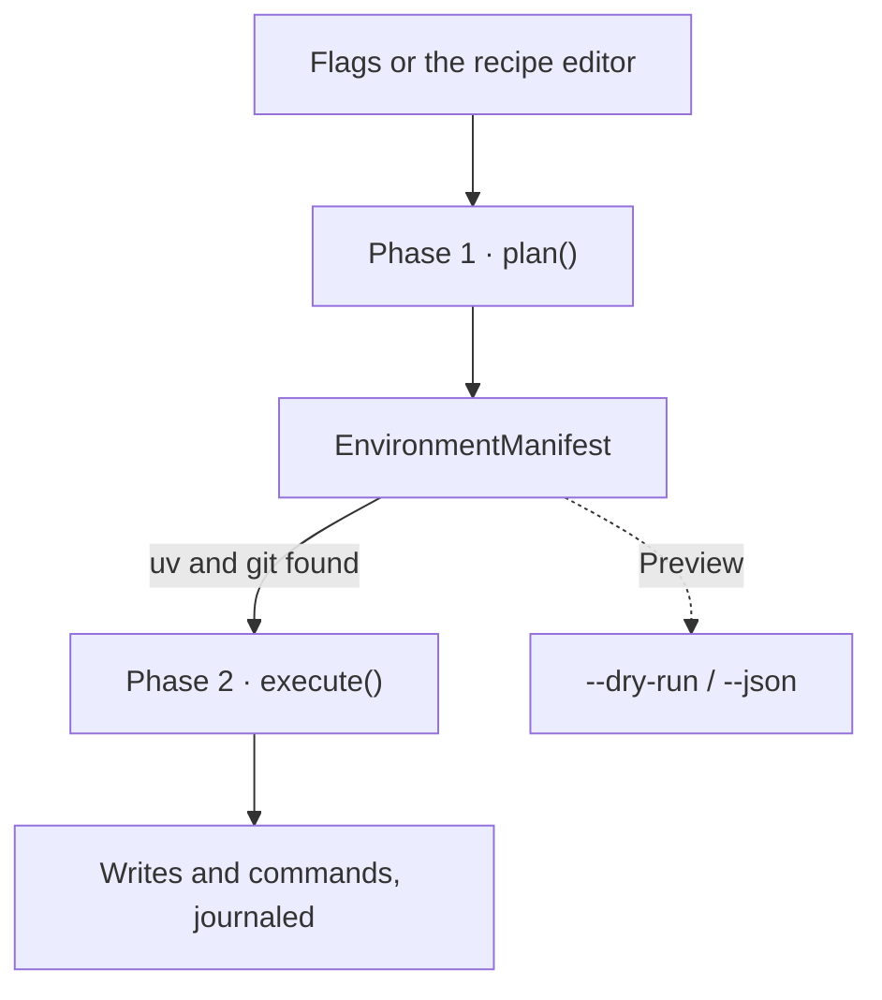
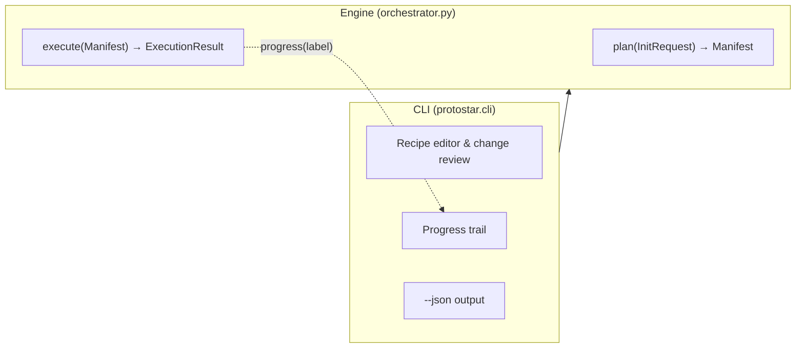
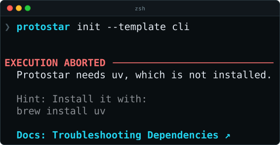
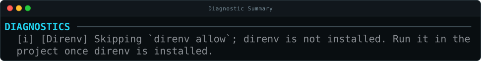

# Design Principles

Protostar edits files people have already written, so its engine follows a few rules that keep that safe. Each section below states one rule, shows it in the code or the output, and says what it prevents. The Mechanics pages, starting with [The Environment Manifest](mechanics/manifest.md), cover how each one is built.

## Templates Say What, Not How

A template lists what a project should have: its tools, its dependencies, and the settings that differ from each tool's defaults. It never lists the steps to build it. Protostar works those out.

```toml
dependencies = ["fastapi", "uvicorn[standard]"]
ruff = true
docker = true
pytest = true
```

The same request can come from flags instead:

```bash
protostar init --template api --no-docker --direnv
```

Because a template describes the result rather than the steps, Protostar can work out the whole plan before it does anything. That is what lets `--dry-run` show the exact plan a real run carries out, rather than a guess at it.

## Plan First, Then Act

Every run has two phases, and only the second one changes anything.


```mermaid
flowchart TD
    A[Flags or the recipe editor] --> B["Phase 1 · plan()"]
    B --> C[EnvironmentManifest]
    C -->|uv and git found| D["Phase 2 · execute()"]
    C -.->|Preview| E[--dry-run / --json]
    D --> F[Writes and commands, journaled]
```

1. **`plan()` only reads.** Each tool's module declares what it needs into one `EnvironmentManifest`: files to write, `pyproject.toml` settings, packages to install, and commands to run. Nothing is written and no command runs. Planning also checks that `uv` and `git` are installed, and stops before touching the project if either is missing.
1. **`execute(manifest)` is the only phase that changes the project.** The `SystemExecutor` applies the manifest in a [fixed order](developer/reconciliation/execution.md#execution-order), and records each path in a journal before it first changes it.

If a write fails, a package doesn't install, or you press `Ctrl+C`, the executor stops the running command and restores every journaled path to its original bytes. A tool that ran its steps one after another would leave the earlier steps in place when a later one failed.

!!! note "What rollback covers"
    Rollback restores every path Protostar recorded before changing it: the files it writes, `pyproject.toml` and `uv.lock` before uv runs, and what its own commands declare, such as the `.git/` directory from `git init`. The virtual environment and global caches fall outside it. [Automatic Rollback](./usage/rollback.md) says exactly what is and isn't restored, and [Rollback Internals](./mechanics/rollback.md) shows how.

!!! tip "The plan you see is the plan that runs"
    `--dry-run` shows the change review built from the same manifest a real run executes, and `--dry-run --json` returns that manifest with the review. Before writing, execution checks that every file the review read is unchanged, and stops if one changed, so a run never applies changes you didn't see.

## The Engine Never Touches the Terminal

The engine's two entry points, `Orchestrator.plan()` and `Orchestrator.execute()`, take data and return data: an `InitRequest` becomes an `EnvironmentManifest`, then an `ExecutionResult`. The engine never prints, prompts, or draws a spinner. The recipe editor, the change review, the progress trail, and `--json` output all live in the `protostar.cli` package.

Two rules keep that boundary:

- **Missing input is an error, not a prompt.** When the engine needs something only a person can supply, such as a template variable's value, it raises an error that lists what's missing (`MissingTemplateVariablesError.variables`). The CLI decides whether to ask.
- **Progress crosses as a callback.** `execute()` takes an optional `progress` hook (`ProgressStep` in `protostar.progress`) and names each slow step in plain words. The CLI draws each step as a spinner that leaves a `✔` or `✖` line, and `--json` and library callers pass nothing. Only a failure that triggers rollback raises through a step. The hook itself must never raise, because the engine would read that as the step failing and roll its work back.


```mermaid
flowchart LR
    subgraph CLI ["CLI (protostar.cli)"]
        direction LR
        TUI["Recipe editor & change review"]
        Trail["Progress trail"]
        JSON["--json output"]
    end

    subgraph Engine ["Engine (orchestrator.py)"]
        direction LR
        Plan["<span style='white-space:nowrap'>plan(InitRequest) → Manifest</span>"]
        Exec["<span style='white-space:nowrap'>execute(Manifest) → ExecutionResult</span>"]
    end

    CLI --> Engine
    Exec -.->|"progress(label)"| Trail
```

So `--json` never has to switch prompts off: the engine never had any. The same engine runs behind the editor, scripts, CI, and coding agents, and its tests need no terminal.

## Each Tool Is a Module That Knows Only Itself

Each tool Protostar supports is one module. A module declares everything its tool needs and knows nothing about the other modules. When mypy is on, its module declares the dependency, the commit hook, the CI step, the `just` recipe, and the `[tool.mypy]` settings. The hook configuration, the CI workflow, and the `justfile` are each assembled from what the enabled modules declared, so the engine has no special case for mypy.

??? example "The mypy module, in full"
    ```python
    --8<-- "src/protostar/modules/tooling_layer.py:mypy_module"
    ```

Adding a tool means writing one module and listing it in a few registries, without checking how it interacts with every other tool; see [Extending Protostar](./developer/extending-protostar.md). It is also why every tool has a `--<tool>` and a `--no-<tool>` flag without the template author writing anything; see [Turning Tools On and Off](./usage/init.md#turning-tools-on-and-off).

## Defaults Stay Gentle, and Templates Add Strictness

Each module ships settings a casual project would want. A template adds the stricter settings its kind of project needs.

If the mypy module set `strict = true`, someone writing a few scripts would get a wall of type errors on their first `mypy .`. So the module stays gentle, and the `cli` template, which builds a package other people install, adds `strict = true` itself:

```toml
# The mypy module's settings, in part:
[tool.mypy]
check_untyped_defs = true
warn_return_any = true
warn_unused_configs = true

# What the cli template adds:
[tool.mypy]
strict = true
```

With strictness in the module, every project would carry it, and a template that wanted less would have to undo it one setting at a time. With strictness in the template, the choice stays with the kind of project that needs it, and each template stays short. [Built-in Templates](./developer/built-in-templates.md) describes how this rule is enforced.

## A Missing Program Stops the Run Before It Starts

Planning checks for the programs Protostar itself runs: `uv` and `git`. If either is missing, Protostar raises `MissingDependencyError`, names each missing program with one command that installs them all, and exits with code `69` (`EX_UNAVAILABLE`). Nothing has been written.



The install command is the one for the package manager Protostar finds.

A program that only a selected tool runs, such as `direnv` or `just`, never stops a run. Planning records it in `missing_tools`, the files that tool needs are written as usual, and execution skips only the steps that run it. The run ends with the command that installs it.

## Files Are Merged by Structure, Not Replaced

When Protostar updates an existing `pyproject.toml`, it edits the file in place. It parses the file with `tomlkit`, which keeps every comment and the layout, changes only the keys it manages, and writes the result back. `protostar.lock` records what it applied to each key, so a later update can tell your edits from its own; see [How Protostar Tracks Your Files](./usage/tracking.md).

Here is a real change. An ML project with its own dependencies and Ruff settings turns on mypy and runs `init --force-merge` again. uv adds the new dependencies, mypy's table arrives under its header, and the project's own lines, including the comment on `extend-select`, are unchanged:

```diff
--8<-- "diff_ml_ml_merged_pyproject_toml.diff"
```

Every managed file works the same way. Workflows merge by job and step, the hook configuration by hook, and `.gitignore` only gains the patterns it's missing. Files with no structure of their own, such as the `justfile`, merge line by line against the last version Protostar wrote, the way Git merges branches.

A tool that fills in templates as text can only write a new project, and can only update one by generating it again. Merging by structure lets Protostar set up a project you already have, and keep updating it, without overwriting your work. To replace existing files with Protostar's version instead, pass `--force-replace`; see [Changes to Files You Already Have](./usage/lifecycle.md#changes-to-files-you-already-have).

## Every Failure Says What to Do Next

Protostar reports problems at three levels:

1. **A failed command shows its own output.** Protostar captures what every command it runs prints, such as `uv add` or `git init`, and shows it when the command fails. You see uv's own explanation, not "installation failed".
1. **Problems that don't stop the run are listed at the end.** A missing optional program or a skipped step is collected into `ExecutionResult.diagnostics` and shown in a summary when the run finishes:

    
1. **A bug in Protostar comes with a bug report.** An unexpected exception prints its traceback and a link that opens a GitHub issue, filled in with your operating system, Python version, the command, and the traceback. Nothing is sent until you submit it.

Expected failures and bugs stay apart. A `ProtostarError`, such as a missing program, a dropped connection, or a configuration file that won't parse, prints a message and a hint, with no traceback unless you pass `--verbose`. Anything else is a bug: it shows the traceback and the issue link, and exits with code `70` (`EX_SOFTWARE`).

## Exit Codes Say What Kind of Failure It Was

Protostar exits with a different code for each kind of failure, not only `1`. The codes follow BSD's `sysexits.h`, which many command-line tools use: `65` for a template it can't read, `69` for a missing `uv` or `git`, and `75` for a network failure worth retrying. Python doesn't define their names on Windows, but the numbers are the same there. The [exit code matrix](./mechanics/error_handling.md#exit-code-matrix) lists every one.

A script that only checks for a non-zero exit knows that something failed. A script that checks the code knows what to do next: retry a network failure, install a missing program, or stop on a broken configuration. With `--json`, the [error envelope](./usage/agent-interface.md#protocol-states) also names the exception class, and most carry a `docs_url` that links to the fix.

## Related Pages

- **[Why Protostar?<span class="hs-icon hs-icon-arrow-right" aria-hidden="true"></span>](./why-protostar.md):** How these rules play out against Copier on a real update.
- **[The Environment Manifest<span class="hs-icon hs-icon-arrow-right" aria-hidden="true"></span>](./mechanics/manifest.md):** The object every module declares into and the executor reads.
- **[The Orchestrator<span class="hs-icon hs-icon-arrow-right" aria-hidden="true"></span>](./mechanics/orchestrator.md):** How `plan()` and `execute()` are built.
- **[Error Handling Architecture<span class="hs-icon hs-icon-arrow-right" aria-hidden="true"></span>](./mechanics/error_handling.md):** Every exception, its exit code, and how a crash report is built.
- **[Agent & Machine Interface<span class="hs-icon hs-icon-arrow-right" aria-hidden="true"></span>](./usage/agent-interface.md):** Driving Protostar from scripts and agents with `--json` and `--dry-run`.
