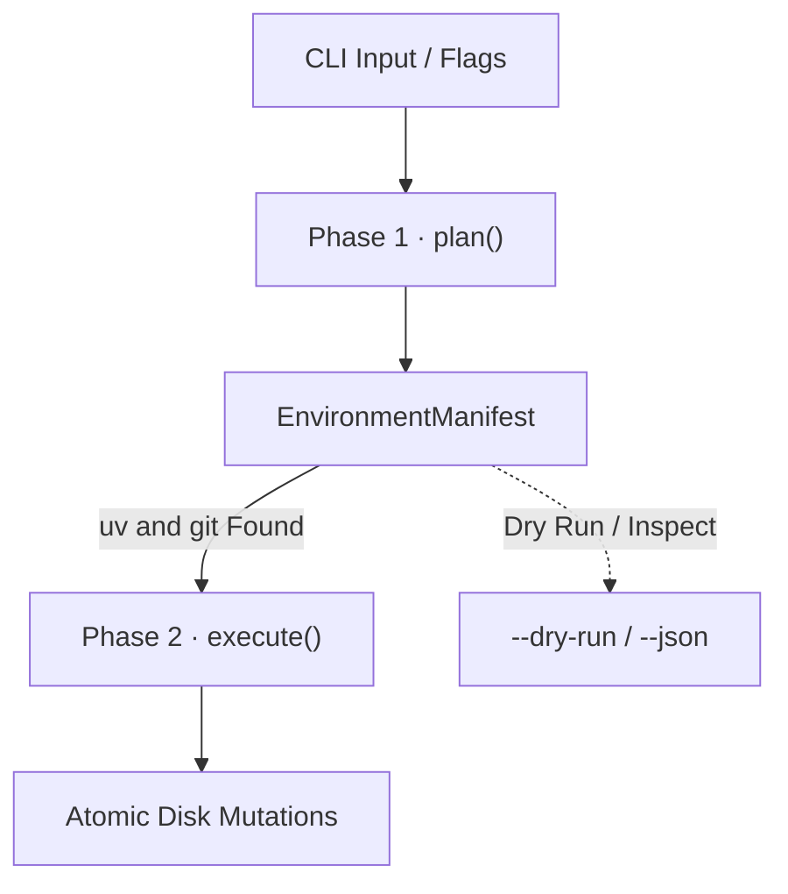
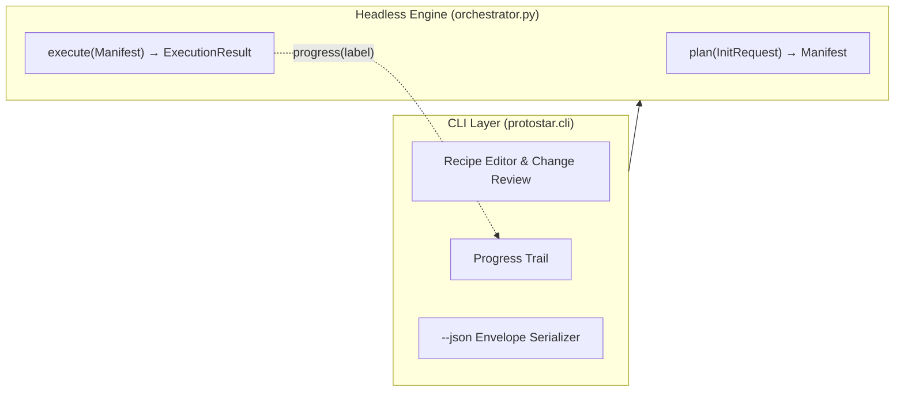

# Design Principles

Every architectural constraint, from the two-phase engine to structured merging and POSIX exit codes, exists because a simpler alternative has a concrete, observable failure mode.

This page explains the vocabulary: what each principle is called, exactly what problem it solves, and what goes wrong when you ignore it.

## Declarative over Imperative

**You describe the environment you want. Protostar figures out how to produce it.**

A declarative interface separates *what* from *how*. When you write a `protostar.toml` template or pass `--template cli`, you are expressing desired state, not issuing a sequence of commands. The engine resolves the execution steps internally.

The contrasting model is **imperative scripting**: a sequence of shell commands executed top-to-bottom. Imperative scripts are fragile because they bind intent to implementation in a single unbreakable thread. If step 4 of 10 fails, the script has already run steps 1–3 — and you now own the cleanup.

=== "Protostar (Declarative)"

    ```toml
    # Declare the environment you want.
    # Protostar resolves how to construct it.
    dependencies = ["fastapi", "uvicorn[standard]"]
    ruff   = true
    docker = true
    pytest = true
    ```

    ```bash
    # Or express intent via flags:
    protostar init --template api --no-docker --direnv
    ```

=== "Shell Script (Imperative)"

    ```bash
    #!/bin/bash
    # Fragile: step 4 failing leaves steps 1–3 already applied.
    uv init
    uv add fastapi uvicorn
    cat > Dockerfile << 'EOF'
    FROM python:3.13-slim
    EOF
    ruff check .        # fails here — half the workspace is already written
    pre-commit install
    ```

!!! note "Dry-running only works cleanly on declarative interfaces"
    Because Protostar operates on declared intent rather than an imperative list of shell calls, `--dry-run` produces the *exact same manifest* that a live execution would use — not a best-guess simulation. The plan is real; only the side-effect execution is withheld.

## Manifest-First

**All intended state changes are collected into a single `EnvironmentManifest` object before any side effect is permitted to occur.**

Protostar's engine operates in two strictly ordered phases:


```mermaid
flowchart TD
    A[CLI Input / Flags] --> B["Phase 1 · plan()"]
    B --> C[EnvironmentManifest]
    C -->|uv and git Found| D["Phase 2 · execute()"]
    C -.->|Dry Run / Inspect| E[--dry-run / --json]
    D --> F[Atomic Disk Mutations]
```

**Phase 1 — `plan()`** is read-only. Every module declares what it needs — files to write, TOML payloads to inject, packages to install, subprocesses to run — into the manifest. Nothing touches disk. Planning checks that the binaries Protostar itself runs (`uv` and `git`) are on `$PATH`, and aborts cleanly before the workspace is touched if either is missing. A binary only a selected tool runs (`direnv`, `just`) never aborts a run: planning records it as missing, and execution skips only the steps that run it.

**Phase 2 — `execute(manifest)`** is the *only* place side effects are permitted. The `SystemExecutor` reads the validated manifest and applies mutations in a strict deterministic order within an atomic transaction boundary.

**Why this matters:** Most bootstrapping tools execute imperatively — a sequence of operations where each step may depend on the previous one having succeeded. If step 6 fails, steps 1–5 have already mutated your filesystem. Manifest-first guarantees that the plan is fully valid *before* committing. Furthermore, Protostar's transactional execution engine wraps Phase 2 in a mutation journal: if a write fails, dependency resolution aborts, or the process is interrupted via `Ctrl+C`, managed subprocesses are stopped and all journaled filesystem changes are automatically rolled back.

!!! note "The Transaction Boundary"
    Rollback restores every path Protostar recorded before changing it: the files it writes, `pyproject.toml` and `uv.lock` before uv runs, and what its own commands declare, such as the `.git/` directory from `git init`. The virtual environment and global caches fall outside it. See [Automatic Rollback](./usage/rollback.md) for exactly what is and isn't restored, and [Rollback Internals](./mechanics/rollback.md) for how.

!!! tip "The plan you see is the plan that runs"
    `--dry-run` shows the change review built from the same manifest a live run executes, and `--dry-run --json` returns that manifest with the review. Execution then checks that every file the review read is unchanged, and stops before writing anything if one changed, so a run never applies changes you didn't see.

## The Headless Core

**The core execution engine is completely headless. All terminal interaction lives outside it.**

The engine's public surface — `Orchestrator.plan()` and `Orchestrator.execute()` — takes and returns pure data objects (`InitRequest` → `EnvironmentManifest` → `ExecutionResult`). It has no knowledge of terminal colors, interactive prompts, spinners, or `--json` formatting. Those belong to the `protostar.cli` package. When the engine needs something only a person can supply, such as a template variable's value, it raises a domain error carrying what's missing (`MissingTemplateVariablesError.variables`), and the CLI decides whether to ask.

Progress is the one thing that must cross the boundary *during* execution, and it crosses as a callback rather than a dependency. `execute()` accepts an optional `progress` hook (`ProgressStep` in `protostar.progress`): the engine enters `progress(label)` around each subprocess and the initial scaffold, naming the work in plain words. Only a fatal failure raises through a step, so a caller can mark it failed knowing rollback follows; non-fatal outcomes still arrive as diagnostics. The reverse holds too: a presenter must never raise on its own, because the engine cannot tell its exception from a failure of the work and would roll that work back. What a step looks like is the caller's business. The CLI renders it as a spinner that leaves a permanent `✔` or `✖` line; library callers and `--json` pass nothing and get a no-op.


```mermaid
flowchart LR
    subgraph CLI ["CLI Layer (protostar.cli)"]
        direction LR
        TUI["Recipe Editor & Change Review"]
        Trail["Progress Trail"]
        JSON["--json Envelope Serializer"]
    end

    subgraph Engine ["Headless Engine (orchestrator.py)"]
        direction LR
        Plan["<span style='white-space:nowrap'>plan(InitRequest) → Manifest</span>"]
        Exec["<span style='white-space:nowrap'>execute(Manifest) → ExecutionResult</span>"]
    end

    CLI --> Engine
    Exec -.->|"progress(label)"| Trail
```

**Why this matters:** Headless separation is what makes Protostar usable as a library and as a subprocess target for AI agents and CI pipelines. Because the engine accepts `InitRequest` and returns `ExecutionResult` without ever touching a terminal, it can be called programmatically, tested in isolation, and driven headlessly without stripping out interactive assumptions. The `--json` flag doesn't "disable" prompts — there were never any prompts inside the engine to begin with.

## Modular & Decoupled

**Each supported tool is an independent module. Modules declare what their tool needs into the manifest and know nothing about each other.**

When `--mypy` is on, the Mypy module declares its dependency, its commit hook, its CI step, its `just` recipe, and its settings. The hook configuration, the CI workflow, and the `justfile` are each assembled from what every enabled module declared, so no module needs to know which others are on, and the engine never contains a conditional for Mypy.

=== "Module Architecture"

    ```python
    --8<-- "src/protostar/modules/tooling_layer.py:mypy_module"
    ```

=== "What You'd Have Without It"

    ```python
    # One giant function. Every new tool adds more conditionals.
    def scaffold(flags):
        if flags.docker:
            write_dockerfile()
            if flags.ruff and flags.docker:  # combinatorial explosion
                write_ruff_docker_override()
        if flags.direnv:
            write_envrc()
            if flags.direnv and flags.docker:
                write_docker_env_passthrough()
        ...
    ```

**Why this matters:** Decoupling prevents combinatorial explosion. With `n` tools, a monolithic conditional model can grow to `O(2^n)` interaction cases. A modular architecture keeps complexity linear — each module is an isolated unit, testable without any other module present. Adding a new tool to Protostar means writing one new module and listing it in a few registries, not auditing every existing flag combination; see [Extending Protostar](./developer/extending-protostar.md).

!!! note "Related: a flag for every tool"
    Because modules are independent, Protostar can offer `--<tool>` and `--no-<tool>` for every module without the template author writing any conditional logic. See [Turning Tools On and Off](./usage/init.md#turning-tools-on-and-off).

## Baseline in Modules, Shape in Templates

**Modules ship a baseline tuned for casual projects. Templates add the strictness that defines a particular kind of project.**

Suppose you run Protostar, pick `ruff` and `mypy`, and start writing a few scripts you want to keep modern and clean. If the `mypy` module shipped a strict, production-grade configuration, your first `mypy .` would bury a weekend script in errors you never asked for. The tool would feel like it was fighting you, and you would be right to be annoyed.

So each module's defaults are what a casual user would thank it for. The `cli` template, which produces a published package, adds `strict = true` and stricter lint rules because for that shape they are the point.

=== "Protostar (Baseline + Delta)"

    ```toml
    # Module baseline (always the same, gentle), in part:
    [tool.mypy]
    check_untyped_defs = true
    warn_return_any = true
    warn_unused_configs = true

    # cli template delta (only what defines a published CLI):
    [tool.mypy]
    strict = true
    ```

=== "What You'd Have Without It"

    ```toml
    # Strict defaults in the module, so every user pays for them:
    [tool.mypy]
    strict = true

    # ...and a template that wants *less* strict must now
    # override the module, one setting at a time.
    ```

**Why this matters:** Putting strictness in the shared default makes every user carry the cost of a choice only some of them want, and it forces each relaxed project to undo it setting by setting. Putting it in the template keeps the choice with the shape that needs it, and keeps each template small enough to read at a glance. See [Built-in Templates](./developer/built-in-templates.md) for how this rule is enforced.

## Fail Loud, Fail Early

**All system dependency checks run during `plan()` — before `execute()` is called and before any file is written.**

Only the binaries Protostar itself runs block: `uv` and `git`. If either is missing from `$PATH`, Protostar raises `MissingDependencyError` naming every missing binary with one command that installs them all, and the process exits immediately with `os.EX_UNAVAILABLE`. A binary that only a selected tool runs, such as `direnv`, is declared by the tool's module and reported as `missing_tools` instead: the files it configures are correct whether or not it is installed.

No file has been created. No directory has been staged. The workspace is exactly as you left it.

=== "What Protostar Does"

    

    *Exit code 69 (`os.EX_UNAVAILABLE`), and the folder is untouched. The install command is the one for the package manager Protostar finds.*

=== "What an Imperative Script Does"

    ```bash
    mkdir src/myproject
    touch src/myproject/__init__.py
    cat > pyproject.toml << 'EOF'
    [project]
    name = "myproject"
    EOF
    uv init  # ← fails here with a cryptic "command not found"
    # workspace now has partial scaffolding that you need to clean up
    ```

!!! note "Fail loud"
    The word "loud" is deliberate. Protostar doesn't swallow errors into a generic "something failed" message. Domain-specific exceptions carry structured context — which binary is missing, what it's used for, and what command will fix it. When something fails unexpectedly (a bug in Protostar), it prints the traceback and a link that opens a pre-filled GitHub issue.

## Merging by Structure

**Configuration files are parsed and updated in place, key by key. Your comments, keys, and formatting stay.**

When Protostar updates an existing `pyproject.toml`, it doesn't write a new one. It parses the file with `tomlkit`, which keeps every comment and the file's formatting, merges the keys it manages, and writes the result back. `protostar.lock` records what it applied to each key, so a later update can tell your edits from its own content; see [How Protostar Tracks Your Files](./usage/tracking.md).

Here is a real change: an ML project, with its own dependencies and Ruff settings, turns on Mypy and runs `init --force-merge` again. The new dependencies come from uv, Mypy's table arrives under its header, and the project's own lines, including the comment on `extend-select`, are untouched:

```diff
--8<-- "diff_ml_ml_merged_pyproject_toml.diff"
```

The same idea runs through every file Protostar manages: workflows merge by job and step, the hook configuration by hook, and `.gitignore` only gains the patterns it's missing. Files with no structure of their own, such as the `justfile`, merge line by line, three ways, like Git.

**Why this matters:** A tool that writes files by template substitution can only safely target a *new* repository, and can only update one by regenerating it. Merging by structure, against a record of what was applied, lets Protostar set up a project you already have, and update it for years, without overwriting your work.

!!! tip "Overwriting instead"
    Merging is the default. `--force-replace` replaces existing files with Protostar's version instead, for when you want the template's files exactly. See [Changes to Files You Already Have](./usage/lifecycle.md#changes-to-files-you-already-have).

## Actionable Diagnostics

**When something breaks, Protostar gives you the information you need to fix it — not just that it broke.**

Diagnostics in Protostar operate at three levels:

**1. Command output.** Every command Protostar runs, such as `uv add` or `git init`, has its `stdout` and `stderr` captured. When one fails, the error shows what it printed, so you see uv's own explanation rather than a generic "installation failed."

**2. Structured diagnostics.** Non-fatal events during scaffolding (optional binaries not found, skipped steps) are collected into `ExecutionResult.diagnostics` and rendered in a summary panel at the end of the run. Nothing is silently dropped.


**3. Automated crash reports.** When Protostar encounters an unexpected internal exception (a genuine bug, not an operational error), it collects non-sensitive system environment details — OS, Python version, command invocation, full traceback — and encodes it into a pre-populated GitHub issue URL. You get one link to click. The debugging back-and-forth doesn't happen.

!!! note "Expected failures vs. unexpected crashes"
    These are explicitly separated. `ProtostarError` subclasses (missing dependency, network drop, config parse error) are *expected operational failures* — clean, formatted, hinted. Unhandled Python exceptions are *unexpected crashes* — they trigger the crash report URL and exit with `os.EX_SOFTWARE`. An expected failure never shows a Python traceback unless you ask for one with `--verbose`; a crash shows its traceback beside the issue link.

## POSIX Exit Codes

**Every failure class maps to a specific, standardized POSIX exit integer — not just `0` (success) or `1` (failure).**

POSIX defines a set of exit code semantics beyond the binary success/fail convention. Protostar maps its exception hierarchy directly to them:

--8<-- "table_exit_codes.md"

**Why this matters:** A script that calls Protostar and checks only `if $? -ne 0` can tell that *something* failed. A script that checks specific exit codes can tell whether the failure was a transient network issue (retry), a missing dependency (prompt user to install), or a configuration error (fail fast and alert). The distinction is the difference between a tool that composes well in automation and one that requires a human in the loop to diagnose failures.

The same structured information is available programmatically via `--json`, where every error envelope includes the exception class name, and most include a `docs_url` pointing to the relevant remediation guide.

```json
--8<-- "agent_payload_error.json"
```

!!! tip "For CI pipelines and AI agents"
    Exit codes and `--json` envelopes are designed to be consumed together. A CI pipeline can check the exit code to gate a build; an AI agent can parse the JSON envelope to understand the failure semantics and decide the next action without human intervention.

## Related Pages

- **[Why Protostar?<span class="hs-icon hs-icon-arrow-right" aria-hidden="true"></span>](./why-protostar.md):** How these principles compare against generic templaters like Copier in practice.
- **[The Environment Manifest<span class="hs-icon hs-icon-arrow-right" aria-hidden="true"></span>](./mechanics/manifest.md):** Deep dive into the state object that enforces manifest-first execution.
- **[The Orchestrator<span class="hs-icon hs-icon-arrow-right" aria-hidden="true"></span>](./mechanics/orchestrator.md):** How the headless core and two-phase lifecycle are implemented.
- **[Error Handling Architecture<span class="hs-icon hs-icon-arrow-right" aria-hidden="true"></span>](./mechanics/error_handling.md):** The full exception hierarchy, POSIX routing table, and crash report pipeline.
- **[Agent & Machine Interface<span class="hs-icon hs-icon-arrow-right" aria-hidden="true"></span>](./usage/agent-interface.md):** Driving Protostar programmatically via `--json` and `--dry-run`.
