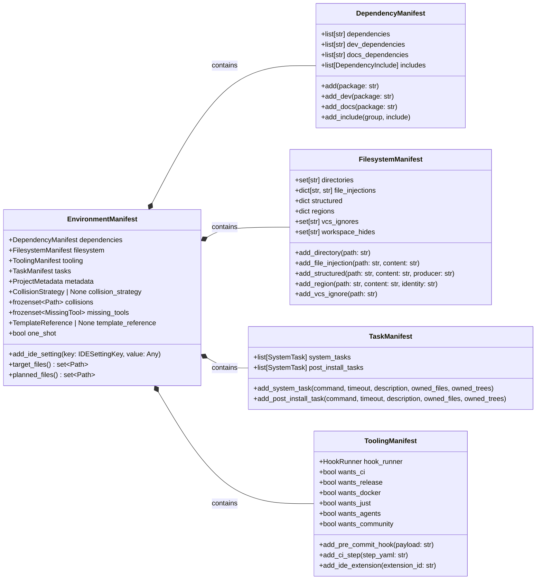

# API Reference

The engine keeps deciding apart from doing. The `Orchestrator` runs each enabled `BootstrapModule`, and every module declares what its tool needs into one shared object, the `EnvironmentManifest`. Nothing is written while modules build: the `SystemExecutor` applies the finished manifest afterwards, in one transaction.

The diagram shows the manifest's main parts and the methods modules call most; the class definitions below list everything.



## Class Definitions

!!! abstract "Diagnostics & Error Handling: `protostar.errors`"

    Strictly typed operational errors that halt the execution pipeline safely and return POSIX-compliant exit codes.

    ::: protostar.errors
        options:
            show_source: true
            show_bases: true
            show_root_heading: true
            show_root_toc_entry: true
            separate_signature: true
            members_order: source

!!! abstract "Core Interface: `BootstrapModule`"

    Each module's `build()` declares what its tool needs into the shared manifest, or raises a `ProtostarError` when the request can't be planned. It never writes a file or runs a command.

    ```mermaid
    flowchart LR
    M[BootstrapModule] --> B["build(manifest)"]
    B -->|Declares| EM[(EnvironmentManifest)]
    B -->|Can't be planned| E[ProtostarError]
    ```

    ::: protostar.modules.base.BootstrapModule
        options:
            show_source: true
            show_bases: true
            show_root_heading: true
            show_root_toc_entry: true
            separate_signature: true
