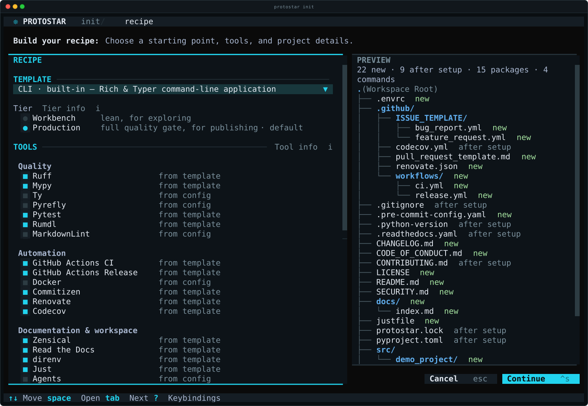
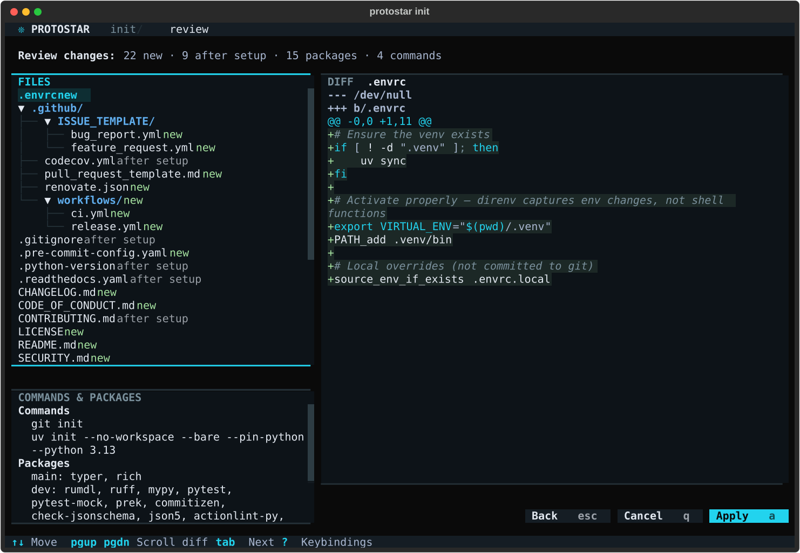
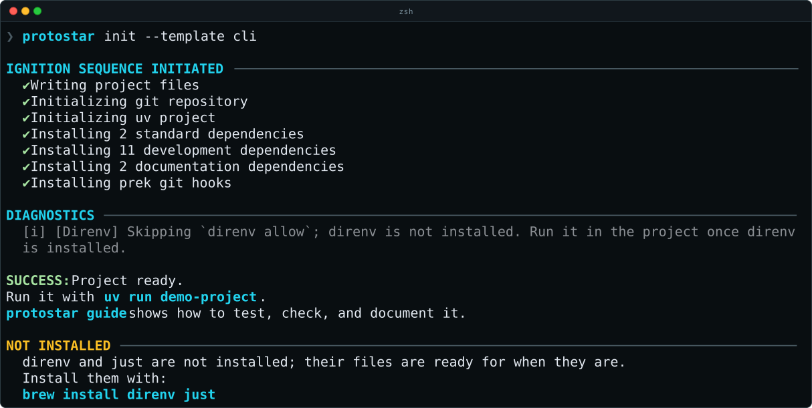
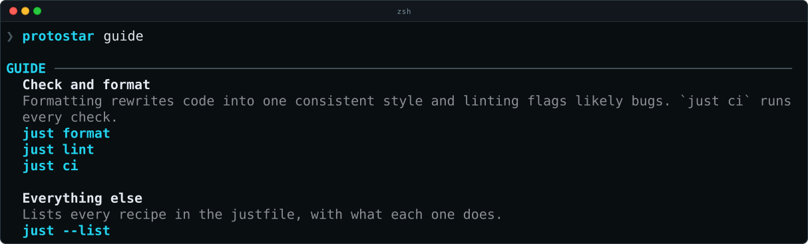

# Your First Project

This page takes you from nothing installed to a Python project you have run, changed, and checked. It assumes no Python experience beyond typing commands into a terminal, and takes about ten minutes, most of it spent downloading packages.

You'll build a small astronomy project with the `astro` template: it comes with Astropy, NumPy, and the other packages astronomers use, and starts with lean tooling suited to exploring.

## 1. Install Protostar

Follow [Installation](installation.md) for your platform, then check that Protostar, uv, and git are all found:

```bash
protostar --version
uv --version
git --version
```

## 2. Make a Folder for the Project

Protostar sets up a project in the folder you run it from, and names the project after that folder. Make an empty one and move into it:

```bash
mkdir moons
cd moons
```

## 3. Choose a Template and a Tier

Start Protostar:

```bash
protostar init
```

It opens the recipe editor: everything the project will be, on one screen, with a preview on the right of the files it will create. Nothing is written until you confirm. The keyboard does everything: `↑` and `↓` move, `Space` or `Enter` chooses, and `?` lists every key.



1. The **Template** picker has focus. Press `Enter` to open it, `↓` to highlight **Astro**, and `Enter` to choose it.
1. A **tier** appears under the template, with **workbench** chosen. A tier is how much tooling the project starts with: *workbench* is lean, for exploring and analyzing; *production* adds a full quality gate for code other people will install. Press `↓` to reach it, then `i` to see what production would add. Press `Esc` to close the explanation, and keep workbench.
1. Keep pressing `↓` until **Ruff** is highlighted under **Tools**, and press `i`. Every tool explains itself this way: what it does, what it adds to the project, and how you'll use it. Press `Esc` to close it. The checked tools are the template's choices; leave them as they are.
1. Under **Project details**, fill in your name and email if they're empty. Protostar takes them from git when git knows them. To save them for every future project, run [`protostar config`](usage/configuration.md) later.

Press `Ctrl+S` to continue.

## 4. Review and Apply

The change review lists every file Protostar will create, with its contents; press `s` for the commands and packages that follow. Use `↑` and `↓` to look through the files. Nothing has happened yet.



Press `a` to apply. Protostar writes the files and runs each step in turn:

```text
  ✔ Writing project files
  ✔ Initializing git repository
  ✔ Initializing uv project
  ✔ Installing 7 standard dependencies
  ✔ Installing 2 development dependencies
  ✔ Authorizing direnv workspace
  ✔ Running uv run nbdime config-git --enable
```

The packages go into the project's **virtual environment**: a folder named `.venv` inside the project that holds its own Python and packages, separate from every other project on your computer, so projects that need different versions never interfere. You never activate it by hand in this walkthrough: `uv run` runs a command inside it. If anything fails part-way, Protostar undoes everything it did (see [Automatic Rollback](usage/rollback.md)).

## 5. Read the Success Line

The run ends like this:

```text
SUCCESS: Project ready.
protostar guide shows how to test, check, and document it.
```

The template also turned on two tools that are separate programs, [direnv](https://direnv.net/) and [just](https://just.systems/). If you haven't installed them, the output ends with the commands that install both. This is what it looks like with Homebrew on macOS; on other platforms the command is the one your package manager uses:



Run the commands it shows you. The project is complete without them, so you can also skip this and use the longer commands the guide shows instead. direnv activates the project's virtual environment whenever you `cd` into the folder, once you have [hooked it into your shell](https://direnv.net/docs/hook.html) and run `direnv allow` in the project. See [Tool Binaries](usage/troubleshooting.md#tool-binaries-direnv-just) for other platforms.

## 6. Ask the Project How to Work on It

```bash
protostar guide
```

The guide lists the commands this project supports, each with what it does:



Without `just`, it shows the `uv run ruff …` commands those recipes run instead. The guide reads the project as it is now, so run it again whenever you change the project's tools. See [`protostar guide`](usage/cli-reference.md#protostar-guide).

## 7. Run the Project

A workbench project starts without code of its own: it's a place to analyze data. Check that its packages are installed by running Python inside the project's virtual environment:

```bash
uv run python -c "import astropy; print(astropy.__version__)"
```

It prints Astropy's version. The same command without `uv run` would use whichever Python your terminal finds first, which doesn't have the project's packages.

## 8. Make a Change

Create a file named `brightness.py` in the project's `src` folder, with any text editor, containing:

```python
"""Compare the brightness of two stars."""

import numpy as np

fluxes = np.array([1.0, 100.0])
magnitudes = -2.5 * np.log10(fluxes)
print(f"The second star is {magnitudes[0] - magnitudes[1]:.1f} magnitudes brighter.")
```

Run it:

```bash
uv run python src/brightness.py
```

```text
The second star is 5.0 magnitudes brighter.
```

## 9. Run the Checks

**Linting** reads your code without running it, and flags likely bugs and leftovers, such as a module imported but never used. The project's linter is [Ruff](https://docs.astral.sh/ruff/). Run the checks:

```bash
just lint
```

They pass. Now break one on purpose: add `import os` on its own line above `import numpy as np` in `src/brightness.py`, save, and run `just lint` again. It fails, and says where and why:

```text
F401 [*] `os` imported but unused
 --> src/brightness.py:3:8
  |
3 | import os
  |        ^^
  |
help: Remove unused import: `os`
```

Delete the `import os` line, save, and run `just lint` once more:

```text
All checks passed!
```

Many problems Ruff finds, including this one, `just format` fixes for you: it rewrites the code into one consistent style and removes what it safely can. `just ci` runs every check the project has.

## Where to Go Next

- **More tooling when you need it.** When the project turns into something other people will install, switch it to the production tier: `protostar sync --tier production`. It adds tests, type checking, CI, and a **pre-commit hook**: a check git runs each time you commit, which stops the commit if a check fails, so a mistake never enters the project's history. `sync` installs the hook for you. See [Templates](usage/templates.md#choosing-a-tier) and the [Tooling & Flags Matrix](usage/tooling-matrix.md).
- **Keep the project current.** `protostar sync` brings in updates to the template and tools without overwriting your edits. [How Protostar Tracks Your Files](usage/tracking.md) explains how it tells your edits from its own content, and [Project Lifecycle](usage/lifecycle.md) shows the commands.
- **Set your defaults once.** `protostar config` opens a form for your name, email, editor, Python version, and the tools new projects start with. See [Global Configuration](usage/configuration.md).
- **Everything `init` can do.** See [Environment Initialization](usage/init.md).
