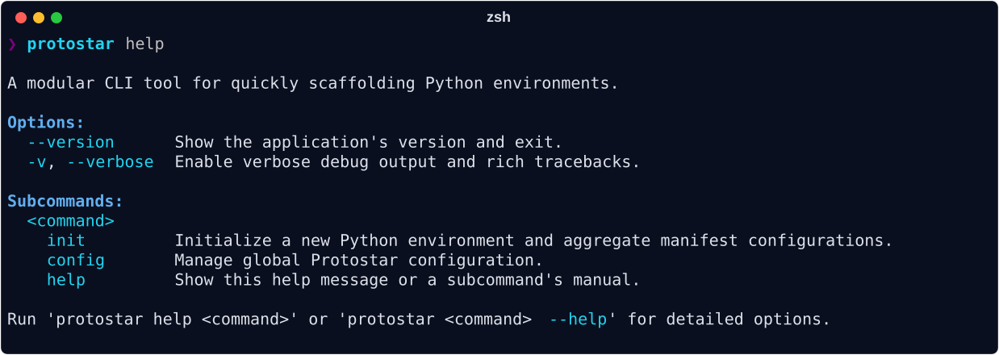

## Prerequisites

- **Python 3.12+**
- **Git** (Required for VCS ignore scaffolding)
- **uv** (Highly recommended for sub-second dependency resolution, though `pip` is supported as a fallback)

## Installation

Protostar is designed to be installed globally as a standalone CLI tool.

=== "macOS (Homebrew)"
    ```bash
    brew install jacksonfergusondev/tap/protostar
    ```
=== "Universal (uv)"
    ```bash
    uv tool install protostar
    ```
=== "Universal (pip)"
    ```bash
    pip install protostar
    ```

!!! warning "Dependency Isolation (ignore if using `brew` or `uv`)"
    If you install Protostar into an existing Python environment with `pip`, it will bring in `questionary` and `prompt_toolkit` for the interactive TUI wizard. In rare cases, this can conflict with other tools that strictly pin `prompt_toolkit` versions (e.g., specific IPython or Jupyter stacks). For guaranteed isolation, prefer `uv tool` or Homebrew.

`protostar init` is designed to be executed immediately after you `mkdir` a new project directory. It offers two distinct operational modes: an **interactive TUI** for discovery, and a **headless CLI** for speed.

## The Interactive Wizard

If you run `protostar init` without any arguments, it will launch an interactive Terminal User Interface (TUI). This wizard allows you to visually map out your languages, tools, and domain-specific presets using the spacebar—no CLI flag memorization required.

```bash
mkdir orbital-mechanics-sim
cd orbital-mechanics-sim
protostar init
```

{ width="700" }

## Headless Scaffolding

For rapid, repeatable initialization, you can bypass the TUI entirely by providing your desired environment matrix as CLI flags. Universal system workspace hygiene is automatically applied, and IDE settings are conditionally injected based on your global configuration and chosen language footprints.

```bash
protostar init --python --scientific --pytest --markdownlint
```

**What just happened?**
In a fraction of a second, Protostar:

- Initialized the repository and scaffolded the base directory structure (e.g., `src/`, `tests/`, `data/`).
- Resolved and injected the scientific computing stack (`numpy`, `scipy`, `pandas`, `matplotlib`) alongside `pytest` into your dependency manager (preferring `uv` if available).
- Generated a strictly typed `pyproject.toml`, injected a `.markdownlint.yaml` configuration, and safely deduplicated your `.gitignore` without overwriting existing entries.

{ width="700" }

## Generating Boilerplate

While `init` handles the global repository architecture, the `generate` command handles repetitive, discrete file scaffolding.

```bash
protostar generate cpp-class TelemetryIngestor
```

This safely drops a `TelemetryIngestor.hpp` and `TelemetryIngestor.cpp` into your working directory with standard include guards and empty constructors, aborting safely if the files already exist.

{ width="700" }

## Exploration & Help

Protostar is self-documenting. You can view the full capabilities matrix and subcommand details directly from your terminal at any time.



!!! tip "Command-Specific Help"
    You can also get localized help for specific subcommands by running:
    ```bash
    protostar help init
    # or
    protostar generate --help
    ```

## Shell Autocomplete & Aliasing

To speed up your workflow, you can enable CLI autocompletion and set up a shorter alias.

### 1. Enable Autocomplete

Protostar uses `argcomplete` for dynamic tab-completion. Install the CLI bindings globally matching the toolchain you used to install Protostar:

=== "macOS (Homebrew)"
    ```bash
    brew install argcomplete
    ```
=== "Universal (uv)"
    ```bash
    uv tool install argcomplete
    ```
=== "Universal (pip)"
    ```bash
    pip install argcomplete
    ```

!!! warning "Path Resolution for `uv`"
    If using `uv`, ensure `~/.local/bin` is exported in your system `$PATH` so your shell can resolve the `register-python-argcomplete` executable.

=== "Zsh"
    Ensure the bash compatibility layer is loaded by adding this to your `~/.zshrc`:

    ```bash
    autoload -U bashcompinit
    bashcompinit
    eval "$(register-python-argcomplete protostar)"
    ```

=== "Bash"
    Add the evaluation string directly to your `~/.bashrc`:

    ```bash
    eval "$(register-python-argcomplete protostar)"
    ```

### 2. Set an Alias (Optional)

Because `proto` is a common namespace, Protostar does not commandeer it by default. If you want the keystroke savings, map it manually in your `~/.zshrc` or `~/.bashrc`:

```bash
alias proto="protostar"
```

## Next Steps

With your accretion disk stabilized, you can dive deeper into Protostar's mechanics:

- **[Configuration](../2_usage/configuration.md):** Learn how to set up global defaults (like your preferred Python version, dev dependencies, or custom ruff configuration) so you don't have to specify them every time.
- **[The Flags Matrix](../3_flags/tooling.md):** Explore the full list of supported languages, tools, and domain presets.
- **[Architecture](../4_mechanics/orchestrator.md):** Read how the Orchestrator guarantees idempotent disk operations without corrupting your existing files.
