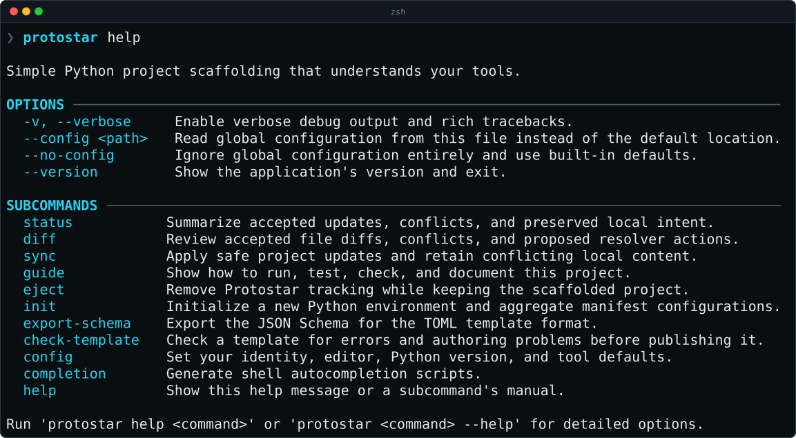

# Getting Started

## Installation

```bash
brew install jacksonfergusondev/tap/protostar   # macOS
uv tool install protostar                       # Linux and Windows
```

Protostar needs `uv` and `git`. [Installation](installation.md) covers both on each platform, for a machine with no Python setup. New to Python tooling? [Your First Project](first-project.md) walks through a project from start to finish.

`protostar init` is designed to be executed immediately after you `mkdir` a new project directory. It offers two distinct operational modes: an **interactive TUI** for discovery, and a **headless CLI** for speed.

## Interactive Setup

If you run `protostar init` without any arguments, it will launch an interactive Terminal User Interface (TUI). The recipe editor lets you visually map out your languages, tools, and built-in templates using the spacebar—no CLI flag memorization required.

```bash
mkdir orbital-mechanics-sim
cd orbital-mechanics-sim
protostar init
```

<div class="hs-terminal">
  <div class="hs-terminal-bar">
    <div class="hs-terminal-dots" aria-hidden="true">
      <span class="dot dot-close"></span>
      <span class="dot dot-minimize"></span>
      <span class="dot dot-maximize"></span>
    </div>
    <span class="hs-terminal-title">protostar init</span>
  </div>
  <div class="hs-terminal-screen" data-asciinema="../assets/demo_init_interactive.cast">
    <noscript>
      <a href="../assets/demo_init_interactive.cast">Download the Protostar terminal recording</a>
    </noscript>
  </div>
</div>

## Headless Scaffolding

For fast, repeatable initialization, you can bypass the TUI entirely and pass your options as CLI flags. Protostar automatically configures common ignore files (`.gitignore`, `.envrc`) and adds your preferred IDE settings.

```bash
mkdir hyperdrive-cli
cd hyperdrive-cli
protostar init --template cli
```

**What just happened?** In a fraction of a second, Protostar:

- **Scaffolded Application & Test Suites**: Created a modular package architecture with an executable Typer and Rich CLI application (`src/hyperdrive_cli/cli.py`, `__init__.py`) alongside a unit test suite (`tests/test_cli.py`).
- **Resolved Dependencies & Registered Entrypoints**: Injected runtime dependencies (`rich`, `typer`), wired the console script entrypoint in `pyproject.toml` (`[project.scripts]`), and populated development dependency groups.
- **Configured Static Analysis & Testing ASTs**: Generated strictly typed `[tool.mypy]` rules, configured `[tool.ruff]` and `[tool.rumdl]` linting and formatting opinions, and wired coverage-backed `[tool.pytest.ini_options]`.
- **Wired Automation & Pre-Commit Git Hooks**: Initialized `.pre-commit-config.yaml` with local toolchain hooks, configured Commitizen conventional commit checks (`CHANGELOG.md`), and scaffolded task automation in `justfile`.
- **Provisioned CI/CD & Documentation**: Scaffolded GitHub Actions workflows (`.github/workflows/ci.yml`, `release.yml`, `codecov.yml`, `renovate.json`) alongside a ready-to-publish Zensical documentation site (`zensical.toml`, `docs/index.md`, `.readthedocs.yaml`).
- **Applied Universal Workspace Hygiene**: Evaluated the virtual environment via `.envrc` (direnv), locked dependencies with `uv.lock`, and safely deduplicated `.gitignore` without overwriting existing entries.

<div class="hs-terminal">
  <div class="hs-terminal-bar">
    <div class="hs-terminal-dots" aria-hidden="true">
      <span class="dot dot-close"></span>
      <span class="dot dot-minimize"></span>
      <span class="dot dot-maximize"></span>
    </div>
    <span class="hs-terminal-title">protostar init --template cli</span>
  </div>
  <div class="hs-terminal-screen" data-asciinema="../assets/demo_init_headless.cast">
    <noscript>
      <a href="../assets/demo_init_headless.cast">Download the Protostar terminal recording</a>
    </noscript>
  </div>
</div>

## Exploration & Help

Protostar is self-documenting. You can view the full capabilities matrix and subcommand details directly from your terminal at any time.



!!! tip "Command-Specific Help"
    You can also get localized help for specific subcommands by running:
    ```bash
    protostar help init
    ```

## Shell Autocomplete & Aliasing

To speed up your workflow, you can enable CLI autocompletion and set up a shorter alias.

### 1. Enable Autocomplete

Protostar provides native dynamic completion script generation for **Zsh**, **Bash**, **Fish**, and **PowerShell** via `protostar completion`. No external packages or separate installations are required.

To guarantee zero impact on your terminal startup latency (0ms overhead), Protostar generates a static completion script that connects directly to the fast dynamic completer.

=== "Zsh (macOS / Linux)"
    Generate the static completion script and source it in `~/.zshrc`:

    ```bash
    protostar completion zsh > ~/.protostar-completion.zsh
    echo 'source ~/.protostar-completion.zsh' >> ~/.zshrc
    source ~/.zshrc
    ```

    !!! tip "Using Custom Completion Directories (`$fpath`)"
        If you manage completions via `~/.zsh/completions` and call `compinit`, you can save the file directly to your completions directory instead:
        ```bash
        protostar completion zsh > ~/.zsh/completions/_protostar
        ```

=== "Bash (Linux / macOS)"
    Generate the static completion script and source it in your bash profile (`~/.bashrc` on Linux, `~/.bash_profile` on macOS):

    ```bash
    protostar completion bash > ~/.protostar-completion.bash
    echo 'source ~/.protostar-completion.bash' >> ~/.bashrc
    source ~/.bashrc
    ```

=== "Fish (macOS / Linux)"
    Save the completion script to Fish's native completions directory for instant autoloading (no config edits required):

    ```fish
    mkdir -p ~/.config/fish/completions
    protostar completion fish > ~/.config/fish/completions/protostar.fish
    ```

=== "PowerShell (Windows / Cross-platform)"
    Save the completion script and source it in your PowerShell `$PROFILE`:

    ```powershell
    protostar completion powershell > "$HOME\protostar-completion.ps1"
    Add-Content -Path $PROFILE -Value '. "$HOME\protostar-completion.ps1"'
    . $PROFILE
    ```

    !!! tip "PowerShell Profile Setup"
        If your profile script does not exist yet, create it:
        ```powershell
        if (!(Test-Path -Path $PROFILE)) { New-Item -ItemType File -Path $PROFILE -Force }
        ```
        If script execution is restricted on Windows, allow signed local scripts by running:
        ```powershell
        Set-ExecutionPolicy -ExecutionPolicy RemoteSigned -Scope CurrentUser
        ```

### 2. Set an Alias (Optional)

Because `proto` is a common namespace, Protostar does not commandeer it by default. If you want the keystroke savings, map it manually in your `~/.zshrc` or `~/.bashrc`:

```bash
alias proto="protostar"
```

## Next Steps

Now that your environment is ready, explore the rest of Protostar's features:

- **[Configuration](./usage/configuration.md):** Learn how to set up global defaults (like your preferred Python version, dev dependencies, or custom ruff configuration) so you don't have to specify them every time.
- **[Tooling & Flags Matrix](./usage/tooling-matrix.md):** Explore the full list of supported languages, tools, and built-in templates.
- **[CLI Reference](./usage/cli-reference.md):** Comprehensive reference for all subcommands, global options, and POSIX exit codes.
- **[Troubleshooting & FAQ](./usage/troubleshooting.md):** Solutions for missing dependencies, workspace collisions, and IDE schema integration.
- **[Architecture](./mechanics/orchestrator.md):** Read how the Orchestrator guarantees idempotent disk operations without corrupting your existing files.
