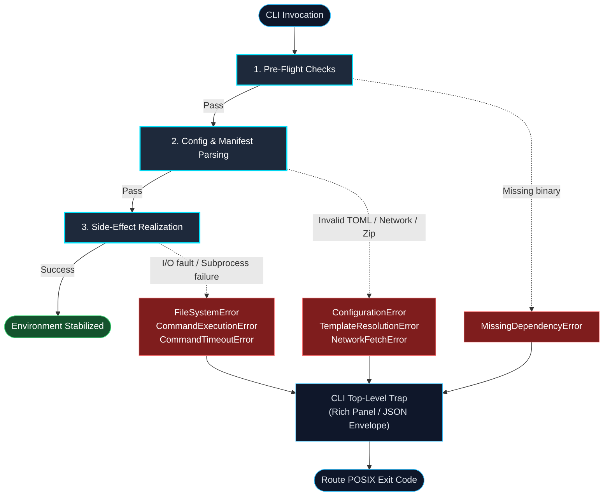

# Error Handling Architecture

Protostar handles errors predictably so that failed runs never leave your workspace broken or half-configured.

During standard CLI usage, operational errors are caught at the top level of the CLI, displayed in clean terminal panels with helpful installation hints, and routed to standard POSIX exit codes.

<div class="grid cards" markdown>

- :material-shield-alert-outline: __Fail-Fast Verification__

    System dependencies and configuration constraints are verified during the `pre_flight()` phase *before* any disk mutations occur. If a binary is missing, execution halts immediately with `MissingDependencyError` before creating files or directories.

- :material-console-line: __Rich Terminal Formatting__

    All operational failures inherit from `ProtostarError`. The CLI entry point traps these exceptions and renders them as styled Rich panels with explicit titles, captured subprocess output, and decoupled remediation hints.

- :material-code-json: __Subprocess Telemetry__

    Subprocess calls executed by `system.run_command` capture both `stdout` and `stderr`. On non-zero exits or timeouts, detailed output streams are preserved in `CommandExecutionError` or `CommandTimeoutError` without flattening diagnostic context.

- :material-numeric: __POSIX Exit Code Compliance__

    Protostar maps domain exception types directly to standard POSIX exit codes (e.g., `EX_CONFIG`, `EX_UNAVAILABLE`, `EX_IOERR`), ensuring seamless integration with CI/CD runners and shell scripts.

</div>

---

## How Errors Propagate

The flow below illustrates how errors propagate from deep pipeline operations (pre-flight checks, AST validation, shell subprocesses) up to the top-level CLI boundary in `cli.py`:



For the complete exit code mapping for each exception type, see the [POSIX Exit Code Matrix](#posix-exit-code-matrix) below.

---

## The Exception Hierarchy

All domain-modeled operational exceptions inherit from `ProtostarError` in `protostar.errors`.

```text
ProtostarError (Exception)
 ├── ConfigurationError
 ├── NetworkFetchError
 ├── TemplateResolutionError
 ├── WorkspaceCollisionError
 ├── MissingDependencyError
 ├── CommandExecutionError
 ├── CommandTimeoutError
 ├── FileSystemError
 ├── SecurityViolationError
 └── ExecutionAbortedError
      └── PartialExecutionAbortedError
```

### `ProtostarError`

Base exception for all expected operational failures in Protostar. Accepts a descriptive `message` and an optional `hint` parameter containing actionable installation or remediation instructions.

```python
class ProtostarError(Exception):
    def __init__(self, message: str, *, hint: str | None = None) -> None: ...
```

### `ConfigurationError`

Raised when a configuration file (such as `protostar.toml` or `pyproject.toml`) is malformed, invalid, or contains type/syntax mismatches. Also raised for invalid configuration flags or CLI parameter collisions.

### `NetworkFetchError`

Raised when remote configuration or template downloads fail due to network disconnection, SSL errors, or attempts to fetch resources across unencrypted `http://` protocols.

### `TemplateResolutionError`

Raised when a template target is found but cannot be parsed, extracted, or resolved. Triggers on corrupt archive structures, unsupported archive formats, missing `protostar.toml` files within archives, or unsatisfied template placeholder variables.

### `WorkspaceCollisionError`

Raised during the engine's `plan()` phase when existing workspace configuration markers (such as `pyproject.toml`) are detected and no explicit `--force-merge` or `--force-replace` flag is active. Exposes structured collision data via its `paths: frozenset[Path]` attribute.

### `MissingDependencyError`

Raised during pre-flight checks when a system-level binary (such as `uv`, `cargo`, `git`, `direnv`, or `just`) is missing from `$PATH`. Stores the missing dependency name, its operational purpose, and an installation hint.

### `CommandExecutionError`

Raised when a managed shell subprocess returns a non-zero exit code. Captures the command line list, return code, `stdout`, and `stderr`. Provides a display-ready `output_detail` property for terminal rendering.

### `CommandTimeoutError`

Raised when a subprocess exceeds its allotted execution window. Automatically attaches a remediation hint regarding network stalls or unresponsive package registries.

### `FileSystemError`

Raised when a local disk operation (read, write, directory creation, or serialization) fails due to an `OSError` or encoding exception. Preserves the operation name, target file path, and original cause.

### `SecurityViolationError`

Raised when a template or archive attempts an unauthorized filesystem operation (such as Zip Slip path traversal).

### `ExecutionAbortedError`

Raised when you explicitly abort execution via an interactive prompt.

### `PartialExecutionAbortedError`

Subclass of `ExecutionAbortedError`. Raised when execution is interrupted after disk mutations have begun, formatting and reporting all touched/scaffolded workspace paths via an immutable `frozenset[str]`.

---

## Machine-Readable Error Envelopes (`--json`)

When running in `--json` mode, Protostar suppresses all terminal UI formatting, spinners, and interactive prompts. Instead, exceptions are intercepted and emitted as structured single-line JSON envelopes to `stdout`:

```json
--8<-- "agent_payload_error.json"
```

The error envelope guarantees:

- __Clean Parsing:__ `stdout` contains only valid JSON. Debug traces and logs are routed exclusively to `stderr`.
- __Structured Fields:__ Error objects include `type`, `message`, and optional contextual helpers (`hint`, `docs_url`, and `paths` for collisions).
- __POSIX Status Codes:__ The process exits with the exact same POSIX exit code defined in the matrix below, allowing scripts to check either exit codes or the parsed JSON payload.

---

## POSIX Exit Code Matrix

Protostar routes operational exceptions to standard UNIX exit codes (defined in `os`), allowing automation tooling and CI pipelines to programmatically identify failure causes:

--8<-- "table_exit_codes.md"

---

## Crash Diagnostics and Telemetry

Protostar cleanly separates expected operational failures from unexpected internal crashes:

### Verbose Logging (`--verbose`)

By default, expected operational failures output a clean Rich error panel without stack trace noise. Running any command with `--verbose` enables full debug logging and displays the full Python traceback:

```bash
protostar init --verbose
```

### Automated Bug Reporting

When Protostar encounters an unhandled internal exception (an unexpected bug or crash), it captures the traceback, gathers basic system details (OS, Python version, command run), generates a pre-filled GitHub issue URL, and exits with `os.EX_SOFTWARE` (`70`). Clicking the link opens a pre-formatted issue so bugs can be reported instantly.

---

## API Reference

For detailed docstrings and class signatures, see the [Error Handling API Reference](../developer/api-reference.md#class-definitions).

---

## Related Guides & References

- __[Troubleshooting & FAQ](../usage/troubleshooting.md):__ Remediation steps for missing dependencies, collisions, and editor setups.
- __[Agent & Machine Interface](../usage/agent-interface.md):__ Learn how AI coding agents and CI runners parse machine error envelopes.
- __[The Orchestrator](./orchestrator.md):__ Understand the top-level exception trap and diagnostic telemetry gathering.
