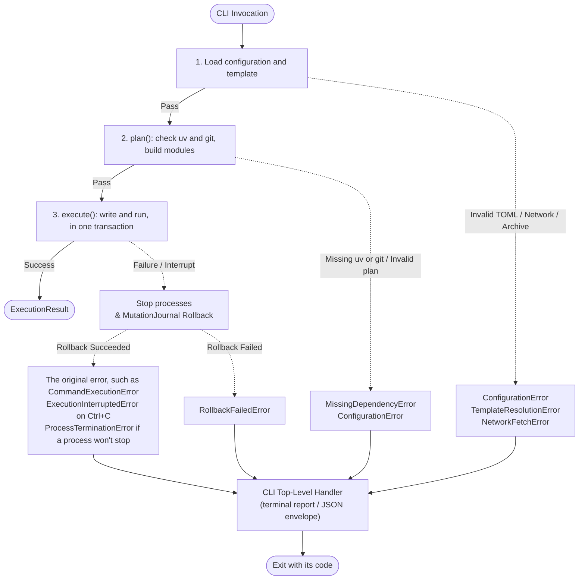

# Error Handling Architecture

A failed run never leaves a project half-configured: either the failure comes before anything is written, or the run rolls back.

Every expected failure is a `ProtostarError`. The CLI catches it at the top level, prints it with a hint that says how to fix it, and exits with a code that names the kind of failure.

<div class="grid cards" markdown>

- :material-shield-alert-outline: __Checked before anything is written__

    `plan()` checks the configuration and the programs Protostar runs before any change. If `uv` or `git` is missing, the run stops with `MissingDependencyError` before it creates a file. A program only a selected tool runs never stops it: it's reported in `missing_tools`.

- :material-console-line: __A message and a hint, no traceback__

    Every expected failure inherits from `ProtostarError`. The CLI entry point catches them and prints the error, a failed command's captured output, and the hint on its own line, without a traceback.

- :material-code-json: __A failed command shows its output__

    `ProcessRunner` captures each command's `stdout` and `stderr`. When a command fails or times out, `CommandExecutionError` or `CommandTimeoutError` carries both, unchanged.

- :material-numeric: __An Exit Code for Each Kind of Failure__

    Each domain exception maps to an exit code from BSD's `sysexits.h` (such as `EX_CONFIG`, `EX_UNAVAILABLE`, and `EX_IOERR`), so a CI job or shell script can tell a network failure from a broken configuration.

</div>

## How Errors Propagate

Errors rise from three stages, loading, planning, and execution, to the top-level handler in `protostar.cli.main`:


```mermaid
flowchart TD
    Start([CLI Invocation]) --> P1["1. Load configuration and template"]
    P1 -->|Pass| P2["2. plan(): check uv and git, build modules"]
    P2 -->|Pass| P3["3. execute(): write and run, in one transaction"]
    P3 -->|Success| End([ExecutionResult])

    P1 -.->|Invalid TOML / Network / Archive| E1["ConfigurationError<br/>TemplateResolutionError<br/>NetworkFetchError"]
    P2 -.->|Missing uv or git / Invalid plan| E2["MissingDependencyError<br/>ConfigurationError"]
    P3 -.->|Failure / Interrupt| RB["Stop processes<br/>& MutationJournal Rollback"]

    RB -.->|Rollback Succeeded| E3["The original error, such as CommandExecutionError<br/>ExecutionInterruptedError on Ctrl+C<br/>ProcessTerminationError if a process won't stop"]
    RB -.->|Rollback Failed| E4["RollbackFailedError"]

    E1 & E2 & E3 & E4 --> Trap["CLI Top-Level Handler<br/>(terminal report / JSON envelope)"]
    Trap --> Exit([Exit with its code])
```

For the complete exit code mapping for each exception type, see the [exit code matrix](#exit-code-matrix) below.

## The Exception Hierarchy

Every expected failure inherits from `ProtostarError` in `protostar.errors`.

```text
ProtostarError (Exception)
 ├── ConfigurationError
 │   ├── StaleReviewError
 │   ├── UnmatchedResolutionError
 │   ├── UnsupportedResolutionError
 │   ├── UnversionedTemplateError
 │   ├── OutdatedProtostarError
 │   └── InvalidOptionValueError
 ├── InvalidUsageError
 ├── NetworkFetchError
 ├── TemplateResolutionError
 │   ├── TemplateEncodingError
 │   ├── TemplateRefNotFoundError
 │   └── MissingTemplateVariablesError
 ├── MissingDependencyError
 ├── CommandExecutionError
 ├── CommandTimeoutError
 ├── ProcessTerminationError
 ├── FileSystemError
 ├── UnsupportedFilesystemNodeError
 ├── TransactionStateError
 ├── ExecutionAbortedError
 ├── ExecutionInterruptedError
 ├── WorkspaceCollisionError
 ├── SecurityViolationError
 │   └── SecretDetectedError
 └── RollbackFailedError
```

### `ProtostarError`

Base exception for all expected operational failures in Protostar. It takes a `message` saying what broke, an optional `hint` saying how to fix it, and optionally the documentation page (`docs_path`, and a `docs_anchor` within it) that the terminal and the JSON envelope link to as `docs_url`. A subclass with data an agent can act on returns it from `details()`.

```python
--8<-- "src/protostar/errors.py:protostar_error"
```

### `ConfigurationError`

Raised when a configuration file, such as `protostar.toml` or `pyproject.toml`, can't be parsed or holds a value of the wrong type. Also raised for flags that contradict each other.

### `StaleReviewError`

Raised when a file the change review read has changed by the time it is applied. Protostar never applies a review against inputs it did not show you, so the hint asks for a new review. It is a `ConfigurationError`.

### `UnmatchedResolutionError`

Raised when a `--resolve` selector names no conflict in the current review. A conflict's identity covers its content, so a conflict that changed since you reviewed it no longer matches. Carries every unmatched selector, in the order given, as `unmatched_resolutions` in the JSON envelope. See [Resolve Conflicts](../usage/lifecycle.md#resolve-conflicts).

### `UnsupportedResolutionError`

Raised when a conflict cannot be settled by the choice made for it, for example `both` on a conflict that has no overlapping lines. Carries the rejected `resolution` and the `choices` the conflict does offer, which is empty when it must be settled by hand.

### `UnversionedTemplateError`

Raised when a revision is requested for a template that has none. Only templates in a GitHub, GitLab, Bitbucket, Codeberg, or Sourcehut repository have versions: built-in templates follow the installed Protostar, and local templates follow their files.

### `OutdatedProtostarError`

Raised when the installed Protostar is older than the one that wrote `protostar.lock`. Built-in modules render whatever the installed release produces, so an older release would plan older output and accept it as an update. Carries `recorded_version` and `installed_version`; the hint is to upgrade.

### `InvalidOptionValueError`

Raised when a template option is given a value it does not offer, as `--option NAME=VALUE`. Carries the `option` and the `values` it offers. See [Template Options](../usage/authoring-templates.md#template-options).

### `InvalidUsageError`

Raised when the command line is unrecognized or invalid. Its documentation link points at the CLI reference.

### `NetworkFetchError`

Raised when a template or configuration can't be downloaded: the network is down, TLS fails, or the URL uses unencrypted `http://`.

### `TemplateResolutionError`

Raised when a template is found but can't be read: a corrupt or unsupported archive, an archive with no `protostar.toml`, or a placeholder with no value.

### `TemplateEncodingError`

Raised when a file in a template is not UTF-8 text. Protostar fills in placeholders in everything it reads from a template, so an undecodable file, such as an image, is a defect of the template itself rather than a failure to retrieve it. Carries the file's `path` within the template.

### `TemplateRefNotFoundError`

Raised when a remote template's repository has no tag, branch, or commit with the ref you named. The hint lists the repository's newest release tags, or says it has none.

### `MissingTemplateVariablesError`

Raised when a template is rendered without a value for one of its custom variables. The engine never prompts: the CLI prompts in an interactive terminal, and everywhere else, including `--json` and `sync`, this error names every missing variable at once through its `variables` attribute (`missing_variables` in the JSON envelope). See [Template variables](../usage/project-recipes.md#template-variables).

### `WorkspaceCollisionError`

Raised by `execute()`, before anything is written, when files the plan would write already exist and no collision strategy was chosen: neither `--force-merge` nor `--force-replace`, nor a choice in the recipe editor. `plan()` only records them in `manifest.collisions`, so the CLI can ask first. Exposes the paths as `paths: frozenset[Path]`.

### `MissingDependencyError`

Raised during planning when a binary Protostar itself runs (`uv` or `git`) is missing from `$PATH`. Its `missing` attribute lists every missing one, and its hint is a single command that installs them all with the platform's package manager: Homebrew where it is found, winget on Windows, and on other Linux systems uv's installer plus the detected package manager. A binary only a selected tool runs, such as `direnv` or `just`, never raises it; see `missing_tools` in the execution result.

### `CommandExecutionError`

Raised when a command exits non-zero. Carries the command, its exit code, `stdout`, and `stderr`, and an `output_detail` property ready to print.

### `CommandTimeoutError`

Raised when a command runs past its timeout. Its hint points at a stalled network or a package index that isn't answering.

### `ProcessTerminationError`

Raised when a managed process tree is still running after `ProcessRunner` asked it to stop and then forced it. Rollback still runs first, so the error arrives with the project restored and a `rollback_context`; it carries the `process_id`, and the hint asks you to stop that process before running the command again. See [When a Process Won't Stop](../usage/rollback.md#when-a-process-wont-stop-processterminationerror).

### `FileSystemError`

Raised when reading, writing, creating a directory, or serializing a file fails with an `OSError` or an encoding error. Carries the operation, the path, and the original error.

### `UnsupportedFilesystemNodeError`

Raised when a journaled write targets a symbolic link, FIFO, socket, or device file.

### `TransactionStateError`

Raised when a `MutationJournal` is used out of order, such as recording a change after it was committed or rolled back.

### `SecurityViolationError`

Raised when a template or archive would write outside the project (such as a Zip Slip path), or run a program that isn't on the safelist.

### `SecretDetectedError`

Raised during `init`, before anything renders, when a newly entered custom variable value matches a secret-detection rule. Values already recorded in the recipe are not checked. Carries one finding per flagged variable (the variable name and the gitleaks rule id) and never the values, so neither the terminal nor the JSON envelope can leak them. The user can keep a flagged value per variable with `--allow-secret NAME`; see [Variables Are Not Secrets](../usage/authoring-templates.md#variables-are-not-secrets).

The rules live in `protostar/_secret_rules.py`, generated by `scripts/sync_secret_rules.py` from the gitleaks tag pinned for the scaffolded pre-commit hook in `_fallbacks.py`. They are stored compressed rather than as text, because their patterns and allowlists quote token prefixes and publicly known keys that secret scanners would otherwise report; `python -m scripts.sync_secret_rules --dump` prints them. Regenerate them with `just sync-secret-rules` whenever that tag changes.

### `RollbackFailedError`

Raised when a run fails or is interrupted and rollback can't restore one or more paths. Carries those paths, and chains the original error. The JSON envelope lists them as `unrestored`, each with its `path` and `detail`, and any process that wouldn't stop as `unstopped`, each with its `process_id` and `detail`.

### `ExecutionAbortedError`

Raised when you cancel at a prompt or screen before anything runs.

### `ExecutionInterruptedError`

Raised when you press `Ctrl+C` after the run started changing the project, once rollback has restored every change. `touched_paths: frozenset[str]` lists the paths it restored.

## Machine-Readable Error Envelopes (`--json`)

With `--json`, Protostar prints no formatting, progress, or prompts. An error becomes a single-line JSON payload on `stdout`:

```json
--8<-- "agent_payload_error.json"
```

In the error payload:

- __Only JSON on `stdout`:__ debug traces and logs go to `stderr`.
- __Fields:__ the error has a `type` and `message`, an optional `hint` and `docs_url`, plus any error-specific fields from the exception's `details()`, such as `paths` for collisions, `findings` for detected secrets, `missing_variables` for template variables without a value, `unrestored` for paths a rollback couldn't put back, and `missing_executables` with `install_commands` for a missing `uv` or `git`.
- __Exit codes:__ the process exits with the same code as without `--json`, from the matrix below, so a script can check either.

## Exit Code Matrix

Each error maps to an exit code from BSD's `sysexits.h`, so a script or CI job can tell what kind of failure it was. Python's `os` module names these codes only on Unix; `ExitCode` in `protostar.errors` falls back to the same numbers on Windows:

--8<-- "table_exit_codes.md"

## Crash Diagnostics and Issue Reporting

Expected failures and bugs are reported differently:

### Verbose Logging (`--verbose`)

An expected failure prints the error and its hint without a traceback. `--verbose` adds debug logging and the full Python traceback:

```bash
protostar init --verbose
```

### Automated Bug Reporting

Any other exception is a bug. Protostar prints its traceback and a link that opens a GitHub issue filled in with your operating system, Python version, the command, and the traceback, then exits with `70` (`EX_SOFTWARE`). Nothing is sent until you submit the issue.

## API Reference

For detailed docstrings and class signatures, see the [Error Handling API Reference](../developer/api-reference.md#class-definitions).

## Related Pages

- __[Troubleshooting & FAQ<span class="hs-icon hs-icon-arrow-right" aria-hidden="true"></span>](../usage/troubleshooting.md):__ Fixes for missing programs, existing files, and editor setup.
- __[Agent & Machine Interface<span class="hs-icon hs-icon-arrow-right" aria-hidden="true"></span>](../usage/agent-interface.md):__ The error payload scripts and agents read.
- __[The Orchestrator<span class="hs-icon hs-icon-arrow-right" aria-hidden="true"></span>](./orchestrator.md):__ How planning and execution report what went wrong.
