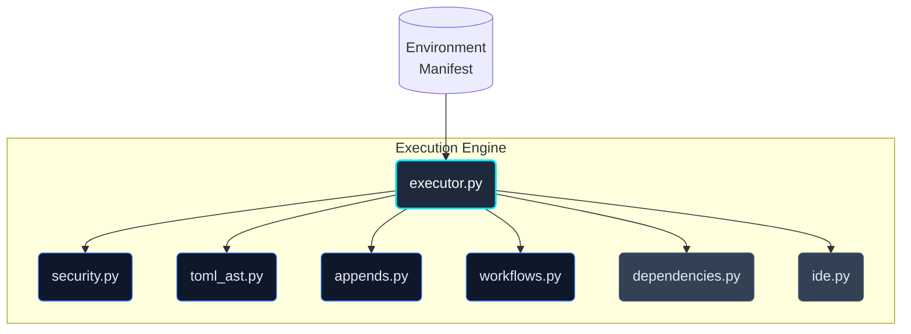
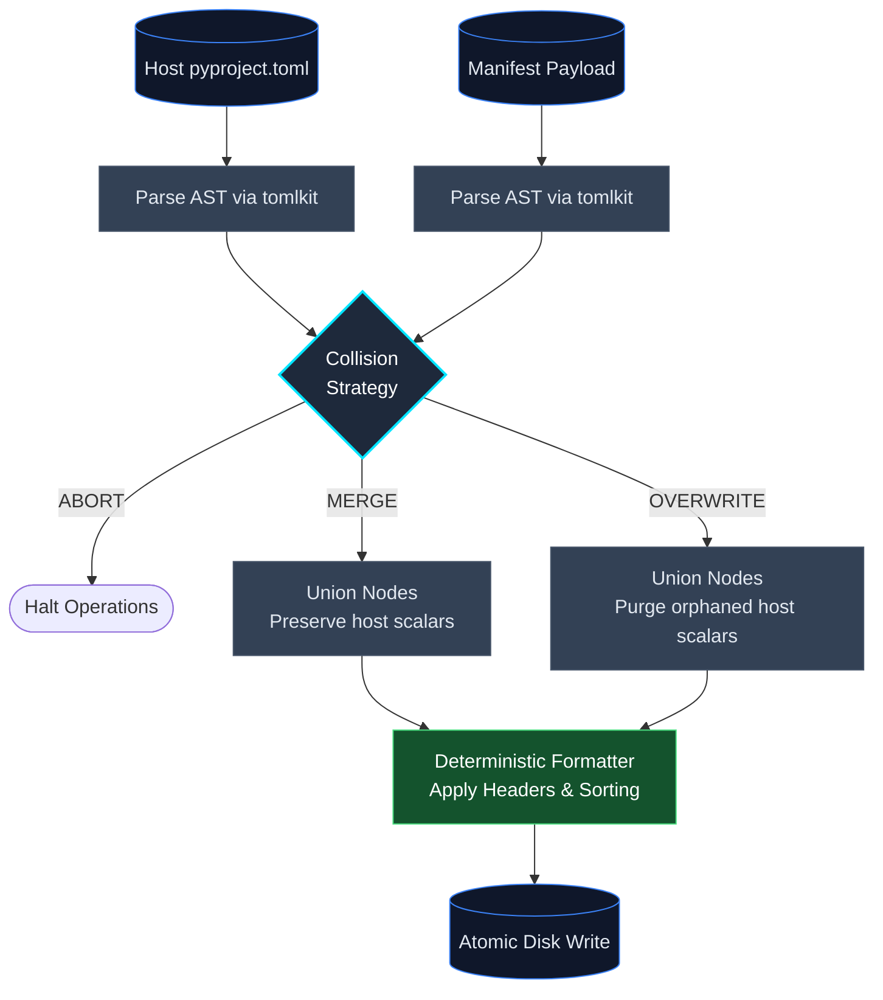

# The System Executor & Modular Execution Engine

If the Orchestrator is the state machine, the execution engine is the physical actuator that mutates the host. It is responsible for translating the declarative `EnvironmentManifest` into imperative disk operations and shell commands.

To ensure robustness, security, and testability, Protostar's execution logic is decomposed into seven strictly focused, single-responsibility modules. This architecture prevents the "god module" anti-pattern by explicitly separating **pure content generation** and **policy enforcement** from **stateful orchestration**.

---

## The 7-Module Architecture



### 1. The Thin Orchestrator (`executor.py`)

**Role:** Stateful execution sequencing and disk I/O.
The `SystemExecutor` class acts as a thin coordinator. It iterates over the manifest, gathers necessary parameters, invokes the pure content generators, and writes the output to disk using atomic operations. It strictly enforces the chronological order of execution to prevent race conditions (e.g., ensuring `uv init` completes before attempting to merge `pyproject.toml` payloads).

### 2. Pure Content Generation

These modules are mathematically pure functions: given the same inputs, they consistently return the same string or AST object without ever touching the disk or network.

- **`workflows.py`**: Handles string templating for CI/CD workflows, Justfiles, Dockerfiles, pre-commit configurations, and VCS ignores.
- **`appends.py`**: Resolves language-specific comment syntax and injects hash-delimited marker blocks into existing file strings.
- **`toml_ast.py`**: Parses TOML strings using `tomlkit` to manipulate the Abstract Syntax Tree (AST), performing deep merges, header formatting, and array-of-tables (AoT) conflict resolution while preserving user comments.

### 3. Policy & System Integration

These modules interact with external boundaries, but do so predictably.

- **`security.py`**: Enforces strict boundaries (Pure). Validates that no filesystem operations escape the workspace root (`enforce_path_jail`) and that no unauthorized shell commands are executed (`enforce_binary_safelist`).
- **`dependencies.py`**: Orchestrates `uv add` commands to resolve and install Python packages into their appropriate dependency groups (main, dev, docs).
- **`ide.py`**: Verifies the presence of recommended extensions via the IDE's CLI (e.g., `code --list-extensions`) and deep-merges telemetry diagnostics and settings into `.vscode/settings.json`.

---

## Security & Path Isolation

All disk writing and subprocess execution strictly pass through `security.py`'s invariants:

- **Path Jailing**: Before the executor writes any artifact, it asserts that the `target` path is physically bounded within `Path.cwd()`. This structurally prevents malicious blueprint templates from triggering directory traversal attacks (e.g., writing to `/etc/passwd`).
- **Binary Safelisting**: Before any shell task is executed (whether pre-install or post-install), the first segment of the command vector is verified against `ALLOWED_BINARIES` (e.g., `uv`, `git`, `npm`).

---

## AST Deep Merging & Collision Strategies

When merging configuration payloads into existing TOML files, Protostar utilizes `tomlkit` AST parsing rather than standard dictionary updates or destructive regular expressions.



The merge behavior is governed by the resolved `CollisionStrategy`:

- **Merge (Default):** The engine walks the AST, appending missing keys and extending tables. Existing scalar values or sibling tables that are not explicitly targeted by the payload are safely ignored and preserved.
- **Overwrite:** The engine aggressively prunes the target. If the payload defines a specific table (e.g., `[tool.ruff]`), any existing scalar keys within that table on the host that *do not* exist in the payload are purged, forcing strict parity with Protostar's baseline.

---

## Subprocess Telemetry

Directly calling `subprocess.run` in a CLI tool often leads to silent failures or messy interleaved terminal output. Protostar routes all system tasks and dependency resolutions through `protostar.system.execute_subprocess`.

This wrapper executes the command silently while capturing both `stdout` and `stderr`, and enforces granular task-level timeouts. If the process returns a non-zero exit code, the executor raises a strictly typed `CommandExecutionError`. These exceptions preserve the exact upstream streams, ensuring the Orchestrator can catch the failure and present the raw diagnostics to the user without destructively flattening the context.

!!! example "Simulated Subprocess Telemetry Output"
    When a shell execution fails, the captured streams are formatted to pinpoint the exact failure mechanism:

    ```text
    Command failed during setup: uv init --python 3.99

    Diagnostics:
    --- STDERR ---
    error: Failed to download python 3.99
    Caused by: No downloadable Python versions matching: 3.99
    ```

---

## API Reference

??? abstract "Core Interface: `SystemExecutor`"
    ::: protostar.executor.SystemExecutor
        options:
            show_source: true
            show_bases: true
            show_root_heading: true
            show_root_toc_entry: true
            separate_signature: true
            members_order: source

??? abstract "Core Interface: `execute_subprocess`"
    ::: protostar.system.execute_subprocess
        options:
            show_source: true
            show_bases: true
            show_root_heading: true
            show_root_toc_entry: true
            separate_signature: true
            members_order: source
