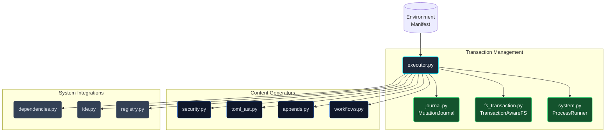
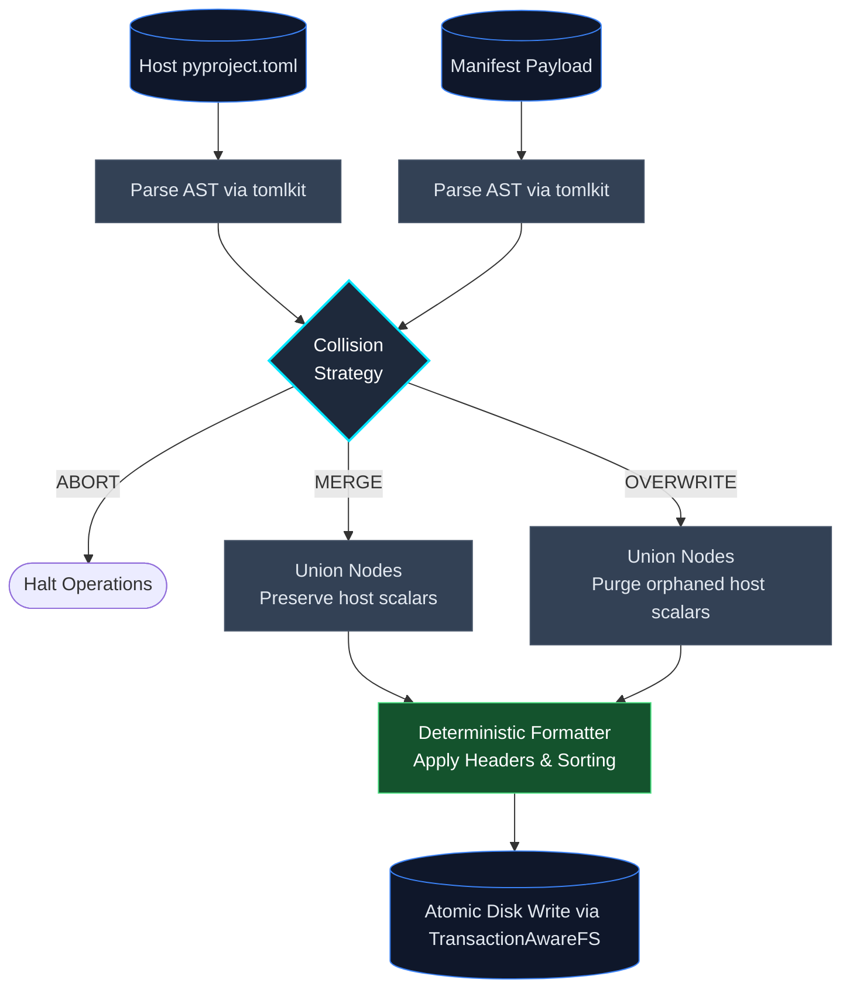

# The System Executor & Modular Execution Engine

While the Orchestrator plans the environment, the execution engine carries it out—writing files, updating configurations, and running shell commands under transactional rollback guarantees.

To keep the codebase maintainable, secure, and testable, Protostar separates **content generation** and **security checks** from **stateful transaction management** and **command execution**.

## Modular Architecture & Transactional Execution



### 1. The Execution Coordinator (`executor.py`)

**Role:** Stateful execution sequencing, transactional boundary management, and disk I/O.

The `SystemExecutor` class acts as the central coordinator. It owns the `MutationJournal`, wraps disk writes with `TransactionAwareFS`, manages subprocesses via `ProcessRunner`, and enforces a strict execution sequence:

```text
BEGIN
  1. Pre-flight Validation: Fast TOML syntax checks before writing to disk
  2. Directory Scaffolding & Base Injections: Transactionally created via TransactionAwareFS
  3. CI/CD & Configuration Artifacts: Workflows, pre-commit config, and Justfile
  4. System Tasks: Initial setup commands (e.g., git init) via ProcessRunner
  5. Dependency Resolution: Pre-journals pyproject.toml & uv.lock, runs uv add (fatal on failure)
  6. Configuration Reconciliation: ownership-aware TOML/YAML updates and hash-delimited marker blocks
  7. Ignores & Containers: .gitignore deduplication and Docker artifacts
  8. IDE Configuration: Writes .vscode settings and verifies extensions

SUCCESS
  Commit journal (releases backup state)
  Return ExecutionResult(created_paths, mutated_paths, diagnostics)

FAILURE / INTERRUPT
  Terminate and reap active managed subprocess tree
  Shield against subsequent SIGINT signals
  Roll back journaled paths in reverse order of mutation
  If rollback succeeds: re-raise original error (or ExecutionInterruptedError on Ctrl+C)
  If rollback partially fails: raise RollbackFailedError
```

### 2. Pure Content Generation

These modules contain pure functions: given the same inputs, they always return the same string or AST without touching the disk or network.

- **`workflows.py`**: Handles string templating for CI/CD workflows, Justfiles, Dockerfiles, pre-commit configurations, and VCS ignores.
- **`appends.py`**: Resolves language-specific comment syntax and injects hash-delimited marker blocks into existing file strings.
- **`toml_ast.py`**: Parses TOML strings using `tomlkit` to patch accepted, ownership-aware reconciliation decisions while preserving local comments and formatting.

### 3. Policy & System Integration

These modules interact with external boundaries, but do so predictably.

- **`security.py`**: Enforces strict boundaries (Pure). Validates that no filesystem operations escape the workspace root (`enforce_path_jail`) and that no unauthorized shell commands are executed (`enforce_binary_safelist`).
- **`dependencies.py`** (Stateful): Orchestrates `uv add` commands to resolve and install Python packages into their appropriate dependency groups (main, dev, docs).
- **`ide.py`** (Stateful): Verifies the presence of recommended extensions via the IDE's CLI (e.g., `code --list-extensions`) and deep-merges diagnostics and settings into `.vscode/settings.json`.
- **`registry.py`**: Interacts with the asynchronous static registry to fetch the latest pre-commit hook versions during the execution phase, falling back gracefully to a static mapping (`_fallbacks.py`) if network access is unavailable. These fallbacks are automatically kept in sync with the live edge CDN prior to every release via `scripts/sync_registry_fallbacks.py`.

## Pipeline Transactionality & Rollback

The `SystemExecutor` wraps the entire execution sequence in an explicit transaction. Every path Protostar touches is journaled before mutation, and any failure or `Ctrl+C` interrupt triggers automatic restoration of all journaled paths in reverse order.

!!! info "Dedicated rollback documentation"
    For the full breakdown of what is and isn't restored, the `MutationJournal` / `TransactionAwareFS` / `ProcessRunner` architecture, and design decisions like "Bytes Over Intent", see the dedicated [Rollback Internals](./rollback.md) page.

## Security & Path Isolation

All disk writes and subprocess calls pass through security checks in `security.py`:

- **Path Jailing**: Before the executor writes any artifact, it asserts that the `target` path is physically bounded within `Path.cwd()`. This structurally prevents malicious blueprint templates from triggering directory traversal attacks (e.g., writing to `/etc/passwd`).
- **Binary Safelisting**: Before any shell task is executed (whether pre-install or post-install), the executable command name is verified against `ALLOWED_BINARIES` (e.g., `uv`, `git`, `npm`).

## AST Deep Merging & Collision Strategies

When merging configuration payloads into existing TOML files, Protostar utilizes `tomlkit` AST parsing rather than standard dictionary updates or destructive regular expressions.



The merge behavior is governed by the resolved `CollisionStrategy`:

- **Merge (Default):** The engine walks the AST, appending missing keys and extending tables. Existing scalar values or sibling tables that are not explicitly targeted by the payload are safely ignored and preserved.
- **Overwrite:** The engine aggressively prunes the target. If the payload defines a specific table (e.g., `[tool.ruff]`), any existing scalar keys within that table on the host that *do not* exist in the payload are purged, forcing strict parity with Protostar's baseline.

## Subprocess Diagnostics & Process Ownership

Directly calling `subprocess.run` in a CLI tool often leads to silent failures, leaked background processes, or messy interleaved terminal output. Protostar routes all system tasks and dependency resolutions through `ProcessRunner` (`src/protostar/system.py`).

`ProcessRunner` provides:

- **Process Group Isolation:** Subprocesses are launched in their own session (`start_new_session=True` on POSIX, `CREATE_NEW_PROCESS_GROUP` on Windows) so child trees can be reliably signaled and reaped.
- **Two-Stage Graceful Termination:** When execution is interrupted or aborted, `ProcessRunner` sends `SIGTERM` (or `CTRL_BREAK_EVENT`), waits for a configurable grace period, and escalates to `SIGKILL` if the process tree fails to exit. If a process cannot be reaped, it raises `ProcessTerminationError`.
- **Environment Sanitization:** Strips active virtual environment variables (`VIRTUAL_ENV`, `PYTHONHOME`) to prevent ambient interpreter contamination while accepting explicit caller overrides.
- **Structured Diagnostic Capture:** Captures `stdout` and `stderr` silently during execution, attaching raw diagnostic streams to `CommandExecutionError` if a process returns a non-zero exit code.

!!! example "Simulated Subprocess Diagnostic Output"
    When a shell execution fails, the captured streams are formatted to pinpoint the exact failure mechanism:

    ```text
    Command failed during setup: uv init --python 3.99

    Diagnostics:
    --- STDERR ---
    error: Failed to download python 3.99
    Caused by: No downloadable Python versions matching: 3.99
    ```

For one-off isolated commands outside the main executor loop, `protostar.system.execute_subprocess` provides a convenience wrapper around `ProcessRunner().run(...)`.

## API Reference

??? abstract "Core Interface: `SystemExecutor`"
    ::: protostar.executor.SystemExecutor
        options:
            show_source: true
            show_bases: true
            show_root_heading: true
            show_root_toc_entry: true
            separate_signature: true
            members_order: source

## Related Mechanics & Guides

- **[The Orchestrator](./orchestrator.md):** See how the orchestrator coordinates the planning phase and passes the manifest to the executor.
- **[The Environment Manifest](./manifest.md):** Review the structured state container evaluated by the executor.
- **[The Module Architecture](./modules.md):** Explore the polymorphic modules that generate the requirements processed by the executor.
- **[Rollback Internals](./rollback.md):** Deep dive into `MutationJournal`, `TransactionAwareFS`, and `ProcessRunner` — the three-layer rollback stack.
- **[Error Handling Architecture](./error_handling.md):** Review how rollback errors and process failures are mapped to domain exceptions.
