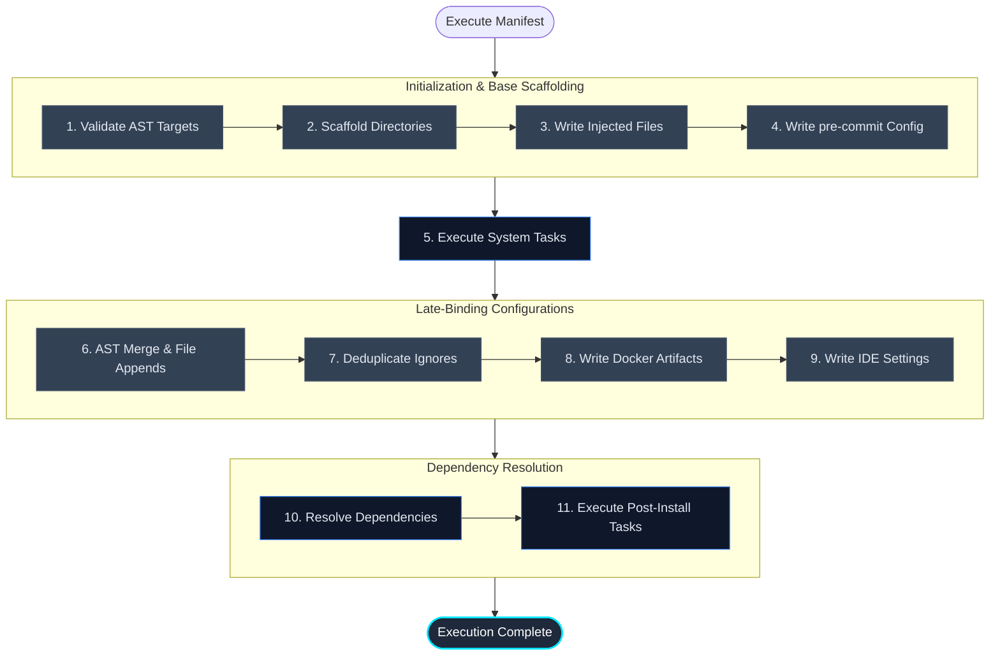

# The System Executor

If the Orchestrator is the state machine, the `SystemExecutor` is the engine that physically mutates the host. It is responsible for translating the declarative `EnvironmentManifest` into imperative disk operations and shell commands.

By strictly confining all physical mutations to this single class, Protostar ensures that partial failures (such as a missing dependency or a syntax error in an existing file) do not leave the workspace in a fragmented, irrecoverable state.

<div class="grid cards" markdown>

- :material-file-tree: __Abstract Syntax Tree (AST) Preservation__

    Configuration files (like `pyproject.toml`) are not blindly overwritten or manipulated via fragile regex. They are parsed into ASTs, deeply merged, and serialized back to disk, preserving all user comments and structural formatting.

- :material-shield-check: __Pre-Execution Validation__

    Before a single directory is created, the Executor validates the syntax of all target files. If a user has a malformed TOML file, execution halts immediately rather than failing halfway through the sequence.

- :material-console: __Subprocess Isolation__

    All shell executions (e.g., `uv add`, `git init`) are routed through a sandboxed wrapper. Standard output and error streams are captured, preventing silent failures and ensuring critical telemetry is preserved for debugging.

</div>

---

## The Execution Topology

The `SystemExecutor` processes the manifest sequentially. This exact chronological ordering is critical to prevent race conditions (e.g., attempting to append configurations to a `pyproject.toml` before `uv init` has generated it).



---

## AST Deep Merging

When merging arrays or configuration tables into existing TOML files, Protostar utilizes `tomlkit` to manipulate the Abstract Syntax Tree. This is handled by the recursive `_deep_merge_tomlkit()` method.

The merge behavior is governed by the orchestrator's resolved `CollisionStrategy`:

- __Merge (Default):__ The executor walks the AST, appending missing keys and extending `Array of Tables` (AoT). Existing scalar values or sibling tables that are not explicitly targeted by the payload are safely ignored and preserved.

- __Overwrite:__ The executor aggressively prunes the target. If the payload defines a specific table (e.g., `[tool.ruff]`), any existing scalar keys within that table on the host that *do not* exist in the payload are purged, forcing strict parity with Protostar's baseline.

!!! tip "Dynamic Python Version Resolution"
    During the file append phase, the executor dynamically resolves the target environment's Python version (scanning `pyproject.toml`, `.venv/pyvenv.cfg`, or the configuration fallback). Any `{{PYTHON_VERSION}}` tokens within the injected payloads are interpolated before the AST is evaluated.

---

## Subprocess Telemetry

Directly calling `subprocess.run` in a CLI tool often leads to silent failures or messy interleaved terminal output. Protostar routes all system tasks and dependency resolutions through `protostar.system.execute_subprocess`.

This wrapper executes the command silently while capturing both `stdout` and `stderr`, and enforces granular task-level timeouts to prevent the orchestrator from blocking indefinitely on stalled network requests. If the process returns a non-zero exit code or exceeds its execution timeout, the streams are concatenated and raised within a `RuntimeError`. This ensures the Orchestrator can catch the failure and present the raw diagnostics to the user without dropping context.

!!! example "Simulated Subprocess Telemetry Output"
    When a shell execution fails, the captured streams are formatted to pinpoint the exact failure mechanism:

    ```text
    Command failed during setup: uv init --python 3.99

    Diagnostics:
    --- STDERR ---
    error: Failed to download python 3.99
    Caused by: No downloadable Python versions matching: 3.99
    ```

---

## API Reference

??? abstract "Core Interface: `SystemExecutor`"
    ::: protostar.executor.SystemExecutor
        options:
            show_source: true
            show_bases: true
            show_root_heading: true
            show_root_toc_entry: true
            separate_signature: true
            members_order: source

??? abstract "Core Interface: `execute_subprocess`"
    ::: protostar.system.execute_subprocess
        options:
            show_source: true
            show_bases: true
            show_root_heading: true
            show_root_toc_entry: true
            separate_signature: true
            members_order: source
