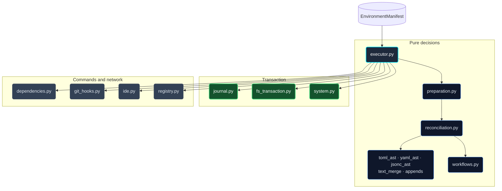

# The System Executor

The `SystemExecutor` (`src/protostar/executor.py`) is the only part of Protostar that writes files or runs commands. It takes the manifest `plan()` produced, applies the decisions prepared from it, and does so as one transaction it can roll back.

The executor decides nothing about content itself. What each file should hold, and which edits of the user's to keep, is decided by pure code it calls, so the change review and execution share every decision.

## How It Is Built

```mermaid
flowchart TD
    classDef coordinator fill:#1e293b,stroke:#00e5ff,stroke-width:2px,color:#fff;
    classDef pure fill:#0f172a,stroke:#3b82f6,stroke-width:1px,color:#e2e8f0;
    classDef transaction fill:#14532d,stroke:#4ade80,stroke-width:2px,color:#fff;
    classDef stateful fill:#334155,stroke:#475569,stroke-width:1px,color:#e2e8f0;

    M[(EnvironmentManifest)] --> E(executor.py):::coordinator

    subgraph Decisions ["Pure decisions"]
        E --> PR(preparation.py):::pure
        PR --> RC(reconciliation.py):::pure
        RC --> F(toml_ast · yaml_ast · jsonc_ast<br/>text_merge · appends):::pure
        RC --> G(workflows.py):::pure
    end

    subgraph Transaction ["Transaction"]
        E --> J(journal.py):::transaction
        E --> FS(fs_transaction.py):::transaction
        E --> P(system.py):::transaction
    end

    subgraph Integrations ["Commands and network"]
        E --> D(dependencies.py):::stateful
        E --> H(git_hooks.py):::stateful
        E --> I(ide.py):::stateful
        E --> R(registry.py):::stateful
    end
```

- **`preparation.py`** prepares a batch of decisions: the exact bytes each file gets, every conflict, proposed change, and kept edit, and the requests for the resolver. `prepare_review()` is the same code the change review and `status` call.
- **`reconciliation.py`** makes those decisions for each kind of file, through the format engines: `toml_ast.py`, `yaml_ast.py`, and `jsonc_ast.py` merge structured files key by key, `text_merge.py` merges free-form files line by line, and `appends.py` keeps named blocks between their `# region: protostar <tag>` markers. See [Format Engines](../developer/reconciliation/formats.md).
- **`workflows.py`** generates the files assembled from every module's declarations: the hook configuration, the CI workflow, the `justfile`, the `Dockerfile` and `.dockerignore`, and the managed blocks of `AGENTS.md` and `CONTRIBUTING.md`.
- **`journal.py`**, **`fs_transaction.py`**, and **`system.py`** are the transaction: every write goes through `TransactionAwareFS`, which records the path's original state in the `MutationJournal` first, and every command runs under `ProcessRunner`. See [Rollback Internals](./rollback.md).
- **`dependencies.py`** selects which dependencies to add and runs `uv add` or `uv lock`. **`git_hooks.py`** installs and removes git hooks. **`ide.py`** checks the editor's recommended extensions: the listing starts in the background as execution begins, and the executor collects it after the post-install commands, or cancels it if the run fails first. **`registry.py`** reads the latest hook versions from Protostar's hook registry, a JSON file a separate repository publishes, falling back to the versions in `_fallbacks.py` without the network; the change review takes one snapshot, and execution writes the same pins. The request starts on a background thread as the command begins, so it overlaps planning, and the snapshot waits for it.

## What Runs When

The executor prepares and applies its decisions in batches, between the commands whose output later batches read. [Execution Order](../developer/reconciliation/execution.md#execution-order) lists the batches for `init` and `sync`.

If anything fails, or the user presses `Ctrl+C`, the executor stops the running command and every process it started, shields the restore from a second `Ctrl+C`, and rolls the journal back. A successful restore re-raises the original error (`ExecutionInterruptedError` for `Ctrl+C`), or `ProcessTerminationError` when a process wouldn't stop; a failed one raises `RollbackFailedError`. See [Automatic Rollback](../usage/rollback.md) for what is and isn't restored.

## Security Checks

Two checks in `security.py` apply whatever the template:

- **The path jail.** Every path a run writes must be relative and inside the project: no absolute path, drive, or `..`. Nothing may be written to `protostar.lock`, `uv.lock`, or inside `.git/`.
- **The program safelist.** Every command's program must be one of `uv`, `git`, `npm`, `yarn`, `pnpm`, `pre-commit`, `prek`, `direnv`, or `just`. Programs are resolved through `system_deps.find_executable`, never from the working directory.

A template the user hasn't trusted also needs each command confirmed; see [Trusting a Template](../usage/templates.md#trusting-a-template).

## Merging Into Existing Files

When a project already has a file the plan writes, the run needs a collision strategy, merge or overwrite, before the executor writes anything; see [Collision Strategies](./manifest.md#collision-strategies).

## Subprocess Diagnostics & Process Ownership

Every command a run starts goes through `ProcessRunner` (`src/protostar/system.py`), so none can leak, outlive a failed run, or act on the wrong repository.

`ProcessRunner` provides:

- **Process Group Isolation:** Subprocesses are launched in their own session (`start_new_session=True` on POSIX, `CREATE_NEW_PROCESS_GROUP` on Windows) so child trees can be reliably signaled and reaped.
- **Two-Stage Graceful Termination:** When execution is interrupted or aborted, `ProcessRunner` sends `SIGTERM` (or `CTRL_BREAK_EVENT`), waits for a configurable grace period, and escalates to `SIGKILL` if the process tree fails to exit. If a process cannot be reaped, it raises `ProcessTerminationError`.
- **Environment Sanitization:** Strips active virtual environment variables (`VIRTUAL_ENV`, `PYTHONHOME`) to prevent ambient interpreter contamination, and git's repository-local variables (`GIT_DIR`, `GIT_WORK_TREE`, and the rest of `git rev-parse --local-env-vars`) so git always targets the project, while accepting explicit caller overrides.
- **Structured Diagnostic Capture:** Captures `stdout` and `stderr` silently during execution, attaching raw diagnostic streams to `CommandExecutionError` if a process returns a non-zero exit code.

For one-off isolated commands outside the main executor loop, `protostar.system.execute_subprocess` provides a convenience wrapper around `ProcessRunner().run(...)`.

## API Reference

??? abstract "Core Interface: `SystemExecutor`"
    ::: protostar.executor.SystemExecutor
        options:
            show_source: true
            show_bases: true
            show_root_heading: true
            show_root_toc_entry: true
            separate_signature: true
            members_order: source

## Related Mechanics & Guides

- **[The Orchestrator](./orchestrator.md):** See how the orchestrator coordinates the planning phase and passes the manifest to the executor.
- **[The Environment Manifest](./manifest.md):** Review the structured state container evaluated by the executor.
- **[The Module Architecture](./modules.md):** Explore the polymorphic modules that generate the requirements processed by the executor.
- **[Rollback Internals](./rollback.md):** Deep dive into `MutationJournal`, `TransactionAwareFS`, and `ProcessRunner` — the three-layer rollback stack.
- **[Error Handling Architecture](./error_handling.md):** Review how rollback errors and process failures are mapped to domain exceptions.
