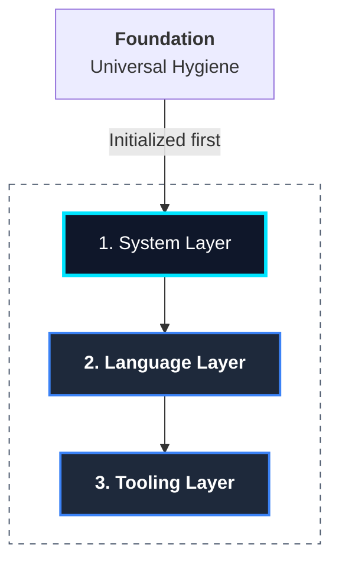

# The Module Architecture

At its core, Protostar is a polymorphic module resolution engine. The CLI parser translates a matrix of flags into an ordered array of instantiated module objects.

These modules act as autonomous, stateless plugins that interact strictly with the `EnvironmentManifest`. They do not inspect sibling modules, do not read the host filesystem, and do not execute system commands directly.

<div class="grid cards" markdown>

- :material-puzzle-outline: __Polymorphic Contracts__

    Every toolchain component inherits from `BootstrapModule`. This enforces a standardized API (`pre_flight` and `build`) that the Orchestrator iterates over.

- :material-layers-triple: __Topological Sequencing__

    Modules are loaded into the Orchestrator in a specific hierarchy (OS $\rightarrow$ Language $\rightarrow$ Tooling). This prevents race conditions during AST compilation.

- :material-link-variant-off: __Strict Decoupling__

    A module only declares intent. Because modules never execute their own side-effects, testing a new language implementation simply requires asserting the state of the manifest in-memory.

</div>

---

## The Layering Model

If multiple modules touch the same configuration space, the Orchestrator relies on sequence order to determine precedence.



The stack is resolved in the following strict order:

### 1. System Layer

Configures universal environment artifacts and workspace hygiene. The `SystemWorkspaceModule` ignores standard host artifacts (`.DS_Store`), IDE directories (`.idea/`, `.vscode/`), and credentials (`.env`).

### 2. Language Layer

The core runtime environment (`PythonCore`). Establishes the primary package manager (`uv`), initializes project metadata (`pyproject.toml`), and binds IDE settings.

### 3. Tooling Layer

Ancillary development tools. Tools like `ruff`, `mypy`, `pytest`, and `prek` evaluate the manifest to inject configuration blocks into the project files.

---

## The Module Contract

### `pre_flight()`

The fail-fast perimeter. If a module requires external binaries (e.g., `git`, `uv`), it verifies their presence in `$PATH`. If the check fails, an exception is raised before any filesystem mutation occurs.

### `build(manifest: EnvironmentManifest)`

The aggregation phase. Modules receive the mutable manifest object and register dependencies, directory structures, ignored files, and AST payloads.

```python
# Example: A simplified tool implementation
class MyPyModule(BootstrapModule):
    def build(self, manifest: EnvironmentManifest) -> None:
        # Register the dependency
        manifest.dependencies.add_dev("mypy")

        # Inject the AST payload for pyproject.toml
        manifest.filesystem.add_file_append("pyproject.toml", """
[tool.mypy]
strict = true
warn_return_any = true
        """)
```

## API Reference

??? abstract "Core Interface: `BootstrapModule`"
    ::: protostar.modules.base.BootstrapModule
        options:
            show_source: true
            show_bases: true
            show_root_heading: true
            show_root_toc_entry: true
            separate_signature: true
            members_order: source

---

## Next Steps & Developer Guides

- __[Extending Protostar](../developer/extending-protostar.md):__ Step-by-step guide to implementing your own custom `BootstrapModule`.
- __[The Environment Manifest](./manifest.md):__ Full breakdown of the manifest namespaces and mutation methods used during `build()`.
- __[Testing Architecture & Philosophy](../developer/testing.md):__ Learn how to test modules in-memory with strict subprocess mocking.
