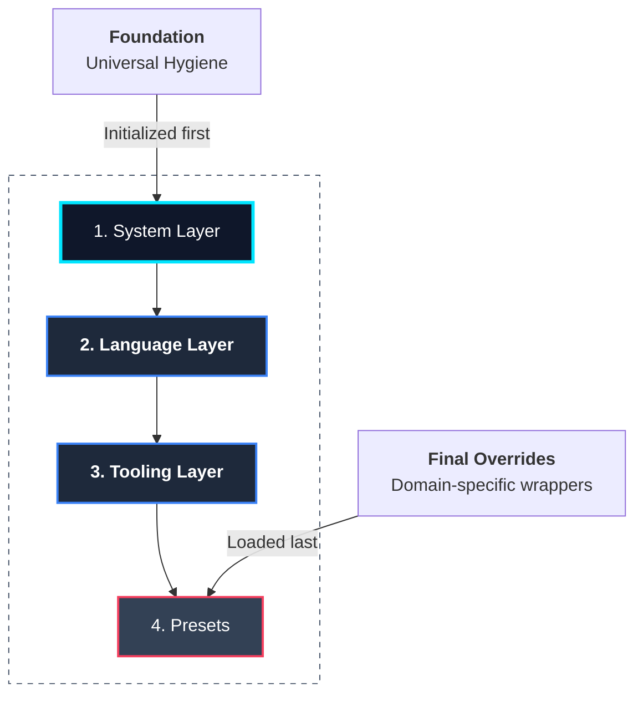

# The Module Architecture

At its core, Protostar is not a monolithic script; it is a polymorphic module resolution engine. The CLI parser's sole responsibility is translating a matrix of boolean flags (e.g., `--python --astro --ruff`) into an ordered array of instantiated module objects.

These modules act as autonomous, stateless plugins that interact strictly with the `EnvironmentManifest`. They do not know about each other, they do not read the host filesystem, and they do not execute system commands directly.

<div class="grid cards" markdown>

- :material-puzzle-outline: __Polymorphic Contracts__

    Every toolchain component inherits from a base abstract class (`BootstrapModule` or `PresetModule`). This enforces a standardized API (`pre_flight` and `build`) that the Orchestrator can blindly iterate over.

- :material-layers-triple: __Topological Sequencing__

    Modules are loaded into the Orchestrator in a highly specific layering hierarchy (OS $\rightarrow$ IDE $\rightarrow$ Language $\rightarrow$ Tooling $\rightarrow$ Presets). This prevents dependency race conditions during AST compilation.

- :material-link-variant-off: __Strict Decoupling__

    A module only declares intent. Because modules never execute their own side-effects, testing a new language implementation simply requires asserting the state of the manifest in-memory.

</div>

---

## The Layering Model

If multiple modules attempt to modify the same conceptual space (e.g., both the Python module and the Ruff module modifying IDE telemetry), the Orchestrator relies on sequence order to determine precedence.



The stack is resolved and executed in the following strict order:

### 1. System Layer

Configures universal environment artifacts and workspace hygiene. The deterministic `SystemWorkspaceModule` ignores standard host artifacts (`.DS_Store`), IDE directories (`.idea/`, `.vscode/`), and credentials (`.env`) across all initialized environments.

### 2. Language Layer

The core runtime environment (e.g., Python, C++, Node). This layer establishes the primary dependency managers (like `uv` or `pip`), injects the baseline project configuration files (like `pyproject.toml`), and conditionally evaluates the global configuration to inject IDE-specific setup (such as pointing VS Code to the generated Python interpreter).

### 3. Tooling Layer

Ancillary development tools that latch onto the language layer. Tools like `ruff`, `mypy`, or `pre-commit` evaluate the manifest to inject specific configuration blocks into the language layer's files.

### 4. Presets

Domain-specific wrappers. Presets are loaded last because they often act as "meta-modules," bundling libraries for specific use cases (like astrophysics data pipelines or machine learning environments) and overriding default tool configurations.

---

## The Module Contract

When extending Protostar, developers implement specific methods dictated by the base classes. The Orchestrator guarantees these methods are called at the correct execution boundary during the lifecycle.

### `pre_flight()`

The fail-fast perimeter. If a module requires external binaries (e.g., `git`, `uv`, `cargo`) to function, it must verify their presence in the system `$PATH` here. If the check fails, an exception is raised before any filesystem mutation occurs, protecting the workspace from partial scaffolding.

### `build(manifest: EnvironmentManifest)`

The aggregation phase. Modules receive the mutable manifest object and use its API to register dependencies, directory structures, ignored files, and AST payloads.

```python
# Example: A simplified tool implementation
class MyPyModule(BootstrapModule):

    def build(self, manifest: EnvironmentManifest) -> None:
        # Register the dependency
        manifest.add_dev_dependency("mypy")

        # Inject the AST payload for pyproject.toml
        manifest.add_file_append("pyproject.toml", """
[tool.mypy]
strict = true
warn_return_any = true
        """)
```

### `required_languages` (Optional Constraint)

To enforce strict topological boundaries, modules can declare a `required_languages` tuple mapping to the class names of supported footprints (e.g., `("PythonModule",)`). The Orchestrator evaluates this attribute during the *Collision Intercept* and *Manifest Aggregation* phases.

If a user explicitly requests a tool without its requisite language layer via the headless CLI (e.g., `protostar init --rust --ruff`), the Orchestrator intercepts the dependency graph mismatch, safely drops the conflicting tooling module, and surfaces a terminal warning to the standard output instead of polluting the workspace with inert configuration files. In interactive TUI runs, this vector is utilized to dynamically invalidate illegal combinations before execution begins.

## API Reference

??? abstract "Core Interface: `BootstrapModule`"
    ::: protostar.modules.base.BootstrapModule
        options:
            show_source: true
            show_bases: true
            show_root_heading: true
            show_root_toc_entry: true
            separate_signature: true
            members_order: source

??? abstract "Core Interface: `PresetModule`"
    ::: protostar.presets.base.PresetModule
        options:
            show_source: true
            show_bases: true
            show_root_heading: true
            show_root_toc_entry: true
            separate_signature: true
            members_order: source
