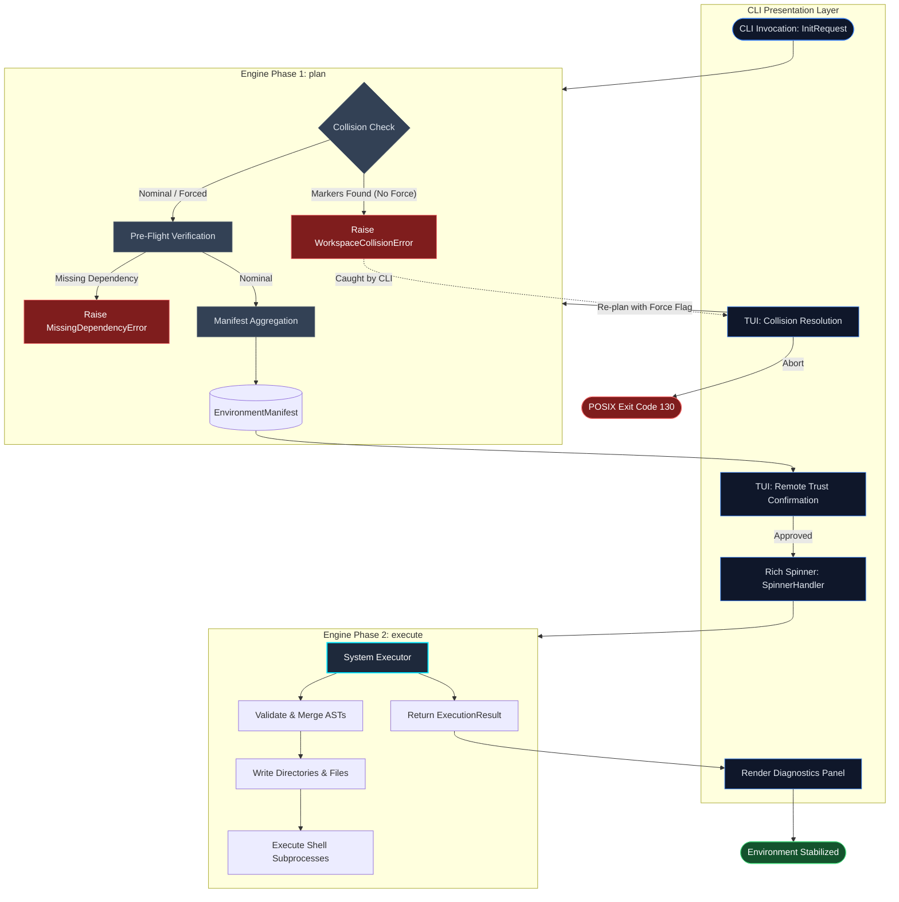

# The Orchestrator

The `Orchestrator` operates as the primary deterministic state machine for Protostar. It is responsible for bridging the gap between declarative module configurations and imperative disk/shell mutations, ensuring the local filesystem is manipulated safely and predictably.

To guarantee idempotency and prevent partial initialization states (e.g., half-written configuration files following a pre-flight failure), the Orchestrator enforces a strict, multi-phase execution topology.

<div class="grid cards" markdown>

- :material-arrow-decision-outline: __Idempotent Execution__

    Execution logic is strictly decoupled from state definition. Running the Orchestrator repeatedly yields the same mathematical environment baseline without corrupting existing user configurations.

- :material-sort-variant: __Deterministic Sequencing__

    Dependencies and tasks are not executed arbitrarily. The Orchestrator enforces a strict, statically defined execution sequence, ensuring that structural scaffolding and abstract syntax trees (like TOML payloads) are fully resolved and merged before any shell subprocesses attempt to read them.

- :material-satellite-uplink: __Telemetry & Triage__

    Acts as the top-level exception handler. Traps `sys.exit`, OS-level I/O constraints, and unhandled runtime exceptions to provide clean terminal exits or automated GitHub crash reports.

</div>

---

## Execution Topology (The Engine Bulkhead)

The `Orchestrator` implements a strict engine bulkhead separating read-only state aggregation from physical side effects. The core engine is purely headless: it ingests caller intent via an `InitRequest`, calculates the complete environment manifest via `plan()`, and mutates the workspace via `execute()`, returning an immutable `ExecutionResult`.

All terminal UI interaction (collision prompts, remote trust confirmations, progress spinners) is isolated in the CLI layer (`cli.py`).



---

## The Lifecycle Phases

=== "1. Planning (`plan()`)"
    The `plan()` phase calculates the target state without performing disk mutations:

    * **Collision Check:** Scans the workspace for existing configuration markers (e.g., `pyproject.toml`). If collisions exist and no force flag is active, raises `WorkspaceCollisionError(paths=...)`.
    * **Pre-Flight Verification:** Runs `pre_flight()` across all loaded modules to assert that required binaries (`uv`, `git`, etc.) exist in `$PATH`.
    * **Manifest Aggregation:** Evaluates language, tooling, and preset modules to populate an `EnvironmentManifest` with file injections, AST merge payloads, ignore patterns, and system tasks.

=== "2. Interactive Resolution (CLI Layer)"
    When `WorkspaceCollisionError` or untrusted external templates are encountered:

    * **Interactive TUI:** In interactive terminals, `cli.py` prompts the user to `Merge`, `Overwrite`, or `Abort`. If authorized, it generates a fresh `InitRequest` with updated force flags and calls `plan()` again.
    * **Headless Contexts:** In non-interactive environments (CI/CD), `cli.py` aborts safely with an error message instructing the user to supply `--force-merge` or `--force-replace`.

=== "3. Execution (`execute(manifest)`)"
    The `execute()` phase hands the calculated manifest to `SystemExecutor` to apply all side effects in a deterministic sequence:

    1. Validates existing TOML files for syntax errors.
    1. Creates directories and injects base files.
    1. Modifies configurations via AST deep-merging.
    1. Writes deduplicated ignore files and Docker artifacts.
    1. Writes local IDE settings.
    1. Executes sequential subprocesses (package resolution, git hooks).

    Interrupting this phase via `KeyboardInterrupt` raises `PartialExecutionAbortedError`, recording all paths modified so far.

---

## Telemetry & Crash Reporting

The CLI entry point traps all exceptions at the boundary to ensure clear, actionable terminal reporting.

### Diagnostic Telemetry

During planning and execution, non-fatal skips and warnings (e.g., missing optional binaries like `direnv`) are recorded into `ExecutionResult.diagnostics`. The CLI renders these events in a structured summary panel:


### Exception Handling & Triage

By trapping errors at the highest level, Protostar guarantees that users are never presented with a raw, unformatted Python stack trace unless explicitly requested via the `--verbose` flag.

- __Expected Anomalies:__ Domain-specific exceptions inheriting from `ProtostarError` (such as `FileSystemError` for I/O constraints, or `MissingDependencyError` for absent binaries) are caught and gracefully presented as a clean abort message in the terminal, alongside a decoupled remediation hint.
- __Critical Failures:__ If Protostar encounters an unhandled internal exception (a genuine bug or AST parsing collapse), it assumes the state is unstable. It traps the stack trace, collects a vector of the environment state, and outputs a URL-encoded link. Clicking this link instantly opens a pre-populated GitHub issue before exiting with `os.EX_SOFTWARE`.

!!! example "Simulated Critical Failure Payload"
    When a catastrophic failure occurs, the CLI encodes the following telemetry into the GitHub issue body:

    ### Environment

    - __OS__: Darwin 25.3.0
    - __Python__: 3.14.3
    - __Command__: `protostar init --astro --crash-test`

    ### Traceback

    ```python
    Traceback (most recent call last):
    File "/opt/homebrew/bin/protostar", line 8, in <module>
        sys.exit(main())
    File "/opt/homebrew/lib/python3.12/site-packages/protostar/cli.py", line 150, in handle_init
        _run_engine(engine, request)
    File "/opt/homebrew/lib/python3.12/site-packages/protostar/orchestrator.py", line 85, in plan
        raise TypeError("INTENTIONAL_CRASH")
    TypeError: INTENTIONAL_CRASH
    ```

---

## API Reference

??? abstract "Caller Intent: `InitRequest`"
    ::: protostar.models.InitRequest
        options:
            show_source: true
            show_bases: true
            show_root_heading: true
            show_root_toc_entry: true
            separate_signature: true
            members_order: source

??? abstract "Execution Outcome: `ExecutionResult`"
    ::: protostar.models.ExecutionResult
        options:
            show_source: true
            show_bases: true
            show_root_heading: true
            show_root_toc_entry: true
            separate_signature: true
            members_order: source

??? abstract "Core Interface: `Orchestrator`"
    ::: protostar.orchestrator.Orchestrator
        options:
            show_source: true
            show_bases: true
            show_root_heading: true
            show_root_toc_entry: true
            separate_signature: true
            members_order: source
