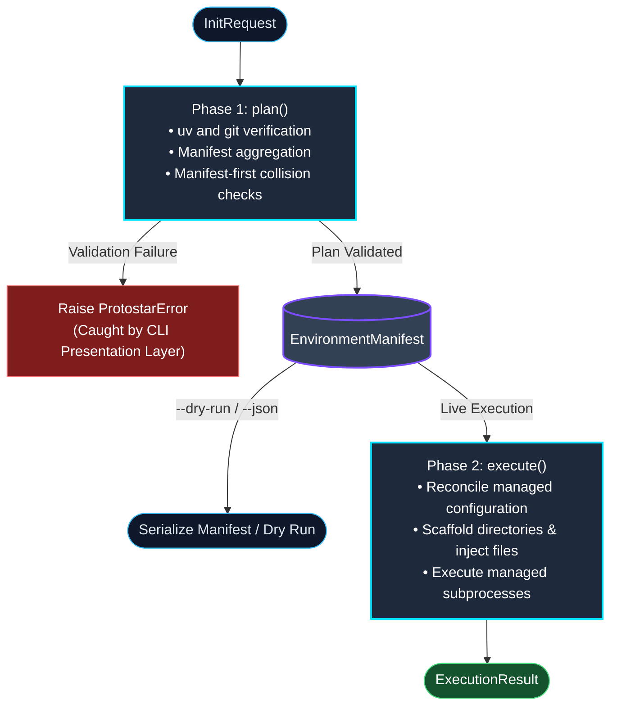
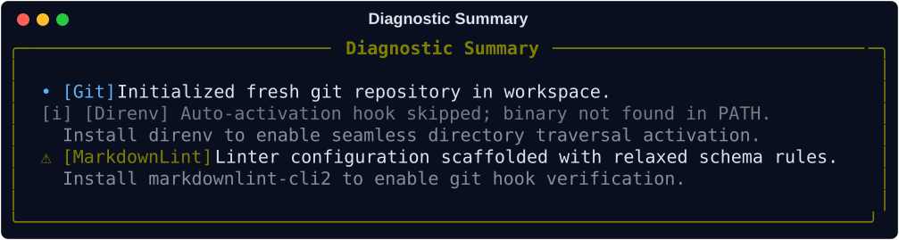

# The Orchestrator

The `Orchestrator` coordinates the two-phase execution lifecycle for Protostar. It is responsible for bridging the gap between declarative module configurations and imperative disk/shell mutations, ensuring the local filesystem is manipulated safely and predictably.

To guarantee idempotency and prevent partial initialization states (e.g., half-written configuration files following a pre-flight failure), the Orchestrator enforces a strict, multi-phase execution lifecycle.

## Execution Lifecycle

The `Orchestrator` enforces a strict separation between read-only state aggregation and physical side effects (the [Headless Core](../design-principles.md#the-headless-core)). The core engine is purely headless: it ingests caller intent via an `InitRequest`, calculates the complete environment manifest via `plan()`, and mutates the workspace via `execute()`, returning an immutable `ExecutionResult`.

All terminal interaction (collision prompts, remote trust confirmations, the progress trail) is isolated in the CLI presentation layer (`cli.py`).

## The Lifecycle Phases

=== "1. Planning (`plan()`)"
    The `plan()` phase calculates the target state and verifies safety without performing disk mutations:

    1. **Executable Check:** Asserts workspace accessibility and clean/git repository status, fails if a binary Protostar itself runs (`uv` or `git`) is missing from `$PATH`, and records each binary an enabled tool declares in `executables` but `$PATH` lacks in `manifest.missing_tools`.
    2. **Manifest Aggregation:** Evaluates language and tooling modules to populate an `EnvironmentManifest` with file injections, AST merge payloads, ignore patterns, and system tasks.
    3. **Blueprint Injection:** Injects any template blueprint files and configurations into the manifest with variable interpolation.
    4. **Manifest-First Collision Check:** Derives planned target files via `manifest.target_files()` and records existing targets in `manifest.collisions`. Planning returns the manifest even if a collision choice is pending.

=== "2. Interactive Resolution (CLI Layer)"
    When the manifest lists collisions or an external template has untrusted tasks:

    * **Interactive CLI:** In interactive terminals, the CLI prompts you to `Merge`, `Overwrite`, or `Abort`. If authorized, it updates the request's collision strategy and calls `plan()` again.
    * **Headless Contexts:** In non-interactive environments (CI/CD), `cli.py` aborts safely with an error message instructing you to supply `--force-merge` or `--force-replace`.

=== "3. Execution (`execute(manifest)`)"
    The `execute()` phase hands the calculated manifest to `SystemExecutor` to apply all side effects in a deterministic, transaction-managed sequence:

    Before creating the executor, it raises `WorkspaceCollisionError(paths=...)` if the manifest has collisions and no strategy.

    1. Validates existing TOML files for syntax errors.
    1. Scaffolds directories and writes files via `TransactionAwareFS`.
    1. Modifies configurations via AST deep-merging.
    1. Writes deduplicated ignore files and Docker artifacts.
    1. Pre-journals `pyproject.toml` and `uv.lock`, then resolves dependencies via `uv add` (failures are fatal).
    1. Writes local IDE settings.
    1. Executes system tasks and post-install subprocesses via `ProcessRunner`.
    1. Verifies IDE extensions and commits the transaction journal.

    The initial scaffold and every subprocess run inside a step of the optional `progress` hook passed to `execute()`, which the CLI renders as a persistent checklist. The engine only names each step; it never renders one.

    If an exception occurs or the user interrupts execution (`KeyboardInterrupt`), the executor automatically terminates managed subprocesses and rolls back all journaled workspace paths. See [Rollback Internals](./rollback.md) for the full guarantee model and failure semantics.

## Diagnostics & Crash Reporting

During planning and execution, non-fatal skips and warnings (e.g., missing optional binaries like `direnv` or skipped optional tasks) are recorded into `ExecutionResult.diagnostics`. The CLI presentation layer renders these events in a structured summary panel upon completion:

For unexpected internal exceptions or AST parsing failures, the runtime traps errors at the CLI boundary to generate pre-filled GitHub crash reports without corrupting the workspace. For complete details on the exception hierarchy, POSIX exit code mappings, and crash issue generation, see the [Error Handling Architecture](./error_handling.md#crash-diagnostics-and-issue-reporting).

## API Reference

??? abstract "Caller Intent: `InitRequest`"
    ::: protostar.models.InitRequest
        options:
            show_source: true
            show_bases: true
            show_root_heading: true
            show_root_toc_entry: true
            separate_signature: true
            members_order: source

??? abstract "Execution Outcome: `ExecutionResult`"
    ::: protostar.models.ExecutionResult
        options:
            show_source: true
            show_bases: true
            show_root_heading: true
            show_root_toc_entry: true
            separate_signature: true
            members_order: source

??? abstract "Core Interface: `Orchestrator`"
    ::: protostar.orchestrator.Orchestrator
        options:
            show_source: true
            show_bases: true
            show_root_heading: true
            show_root_toc_entry: true
            separate_signature: true
            members_order: source

## Related Mechanics & Guides

- __[The Environment Manifest](./manifest.md):__ Deep dive into the structured state container generated during the `plan()` phase.
- __[The System Executor](./executor.md):__ See how the executor applies atomic AST deep-merges, file injections, and subprocess execution.
- __[Error Handling Architecture](./error_handling.md):__ Learn how the orchestrator traps exceptions and routes them to POSIX exit codes and crash reports.
