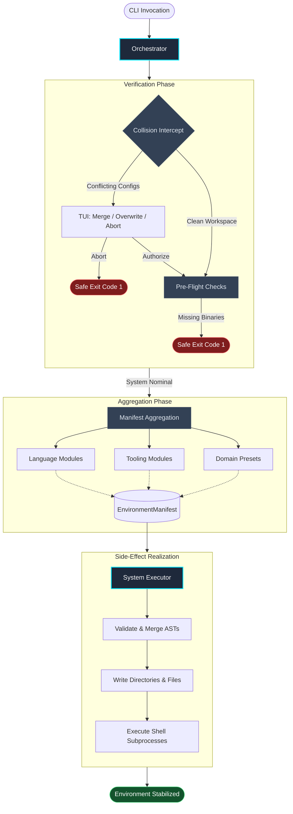

# The Orchestrator

The `Orchestrator` operates as the primary deterministic state machine for Protostar. It is responsible for bridging the gap between declarative module configurations and imperative disk/shell mutations, ensuring the local filesystem is manipulated safely and predictably.

To guarantee idempotency and prevent partial initialization states (e.g., half-written configuration files following a pre-flight failure), the Orchestrator enforces a strict, multi-phase execution topology.

<div class="grid cards" markdown>

- :material-arrow-decision-outline: __Idempotent Execution__

    Execution logic is strictly decoupled from state definition. Running the Orchestrator repeatedly yields the same mathematical environment baseline without corrupting existing user configurations.

- :material-sort-variant: __Deterministic Sequencing__

    Dependencies and tasks are not executed arbitrarily. The Orchestrator enforces a strict, statically defined execution sequence, ensuring that structural scaffolding and abstract syntax trees (like TOML payloads) are fully resolved and merged before any shell subprocesses attempt to read them.

- :material-satellite-uplink: __Telemetry & Triage__

    Acts as the top-level exception handler. Traps `sys.exit`, OS-level I/O constraints, and unhandled runtime exceptions to provide clean terminal exits or automated GitHub crash reports.

</div>

---

## Execution Topology

The Orchestrator processes the environment payload in a distinct lifecycle. State aggregation is strictly isolated from the side-effect phase, ensuring that execution only proceeds if the host system satisfies all required boundary conditions.



---

## The Lifecycle Phases

=== "1. Collision Intercept"
    Before a single byte of memory is allocated for the manifest payload, the Orchestrator scans the local directory for module-specific collision markers (e.g., an existing `pyproject.toml` or `Cargo.toml`).

    * **Interactive Environments:** Protostar halts and launches a TUI prompting the developer to `Merge`, `Overwrite`, or `Abort`.

    * **Headless Environments (CI/CD):** Protostar safely aborts with a non-zero exit code to prevent destructive mutations, unless the `-f / --force` flag is explicitly provided (which defaults to a safe `MERGE` strategy).

=== "2. Pre-Flight Verification"
    Every loaded module executes its `pre_flight()` method. This step guarantees that all required system binaries (like `uv`, `cargo`, `git`, or `direnv`) are installed and accessible in the system `$PATH`. If a dependency is missing, execution halts immediately before any disk I/O occurs.

=== "3. Manifest Aggregation"
    The Orchestrator iterates through the universal System Workspace, Language, Tooling, and Preset modules. Each module deterministically appends its required dependencies, ignores, and configuration payloads to the `EnvironmentManifest`. Global configuration injections (e.g., custom PyPI dependencies) are appended last to ensure they override module defaults.

=== "4. Execution & Realization"
    The Orchestrator hands the fully resolved manifest to the `SystemExecutor`. The executor flushes the state to disk in a highly specific topological order:

    1. Validates existing TOML files for syntax errors.
    1. Creates directories and injects base files.
    1. Modifies configurations via AST deep-merging.
    1. Writes deduplicated ignore files and Docker artifacts.
    1. Writes local IDE settings.
    1. Executes sequential subprocesses (package resolution, git hooks).

---

## Telemetry & Crash Reporting

The Orchestrator serves as the absolute boundary for exception propagation. By trapping errors at the highest level, it guarantees that users are never presented with a raw, unformatted Python stack trace unless explicitly requested via the `--verbose` flag.

- __Expected Anomalies:__ Domain-specific exceptions inheriting from `ProtostarError` (such as `FileSystemError` for I/O constraints, or `MissingDependencyError` for absent binaries) are caught and gracefully presented as a clean abort message in the terminal, alongside a decoupled remediation hint. The Orchestrator routes these expected operational failures to their appropriate UNIX standard exit codes (e.g., `os.EX_IOERR`, `os.EX_UNAVAILABLE`).

- __Critical Failures:__ If Protostar encounters an unhandled internal exception (a genuine bug or AST parsing collapse), it assumes the state is unstable. It traps the stack trace, collects a vector of the environment state, and outputs a URL-encoded link. Clicking this link instantly opens a pre-populated GitHub issue so the telemetry isn't lost to the void, before exiting with `os.EX_SOFTWARE`.

!!! example "Simulated Critical Failure Payload"
    When a catastrophic failure occurs, the Orchestrator encodes the following telemetry into the GitHub issue body:

    ### Environment

    - __OS__: Darwin 25.3.0
    - __Python__: 3.14.3
    - __Command__: `protostar init --astro --crash-test`

    ### Traceback

    ```python
    Traceback (most recent call last):
    File "/opt/homebrew/bin/protostar", line 8, in <module>
        sys.exit(main())
    File "/opt/homebrew/lib/python3.12/site-packages/protostar/cli.py", line 150, in handle_init
        engine.run()
    File "/opt/homebrew/lib/python3.12/site-packages/protostar/orchestrator.py", line 105, in run
        raise TypeError("INTENTIONAL_CRASH")
    TypeError: INTENTIONAL_CRASH
    ```

---

## API Reference

??? abstract "Core Interface: `Orchestrator`"
    ::: protostar.orchestrator.Orchestrator
        options:
            show_source: true
            show_bases: true
            show_root_heading: true
            show_root_toc_entry: true
            separate_signature: true
            members_order: source
