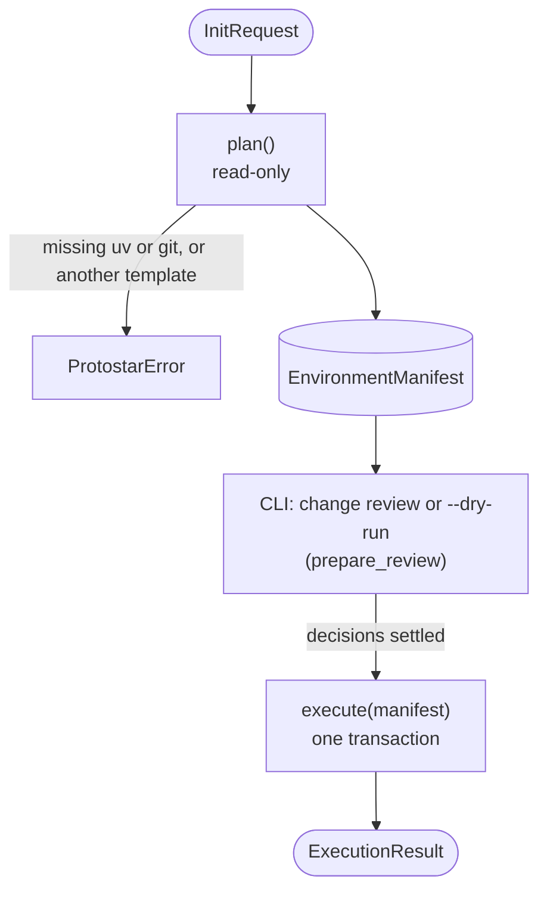

# The Orchestrator

The `Orchestrator` (`src/protostar/orchestrator.py`) turns a request into a plan and a plan into changes, in two phases that never mix: `plan()` reads and decides, and `execute()` writes. It is headless: it takes an `InitRequest`, returns an `EnvironmentManifest` and then an `ExecutionResult`, and never prompts or prints. Everything a person sees (the recipe editor, the change review, the progress trail) lives in the `protostar.cli` package; see [The Headless Core](../design-principles.md#the-engine-never-touches-the-terminal).

```mermaid
flowchart TD
    Req([InitRequest]) --> Plan["plan()<br/>read-only"]
    Plan -->|missing uv or git, or another template| Err["ProtostarError"]
    Plan --> Manifest[(EnvironmentManifest)]
    Manifest --> Review["CLI: change review or --dry-run<br/>(prepare_review)"]
    Review -->|decisions settled| Exec["execute(manifest)<br/>one transaction"]
    Exec --> Result([ExecutionResult])
```

## Planning

`plan()` writes nothing and runs no process, so the CLI can call it as often as it likes: the recipe editor plans again on every change to draw its preview. Each call starts from a fresh manifest:

1. **Checks that need no plan.** A one-shot run requires an untracked project, and a tracked project must name the template it records: a project never switches template, so this fails before anything asks the user a question.
1. **Tool selection.** The recipe, the template's tier and opinions, and the captured defaults decide which tool modules run; see [which choice wins](../usage/project-recipes.md#which-choice-wins). Planning fails if `uv` or `git` is missing (unless the caller only reviews), and records each enabled tool's missing program in `manifest.missing_tools`.
1. **Module builds.** Each enabled module's `build()` declares its files, settings, dependencies, and commands. Every declaration is attributed to the module and its tool, which is how a review names who wants a change.
1. **Derived documents.** Files assembled from every module's declarations, such as the hook configuration, the CI workflow, the `justfile`, and the managed blocks of `AGENTS.md` and `CONTRIBUTING.md`, are rendered after all modules build, so no module needs to inspect another.
1. **The template.** The template's directories, dependencies, files, payloads, append regions, and commands are added, filtered by its options and `requires` conditions.
1. **Collisions.** Existing files the plan would write are recorded in `manifest.collisions`, for the caller to settle by choosing to merge or overwrite.

## Reviewing

Between the phases, the CLI prepares a review of the plan with `prepare_review()`: the exact bytes each file would get, and every conflict, proposed change, and kept edit. That review is the change review `init` shows, the output of `init --dry-run`, and what `status`, `diff`, and `sync` show and apply. It runs no command and writes only to memory. The decisions a person makes there travel to `execute()` as resolutions keyed by each decision's `id`; see [Execution and Review](../developer/reconciliation/execution.md#shared-preparation).

## Execution

`execute()` refuses a manifest with collisions and no collision strategy (`WorkspaceCollisionError`), then hands the manifest to the `SystemExecutor`, which applies it as one transaction. [Execution Order](../developer/reconciliation/execution.md#execution-order) lists what runs when, for `init` and for `sync`.

The executor names each step it starts through the optional `progress` hook, which the CLI draws as a checklist; the engine never draws it. If a step fails or the user presses `Ctrl+C`, the executor stops the running process and rolls back every recorded change; see [Rollback Internals](./rollback.md).

Non-fatal outcomes, such as a step skipped because its program is missing, are collected in `ExecutionResult.diagnostics`, which the CLI shows at the end of a run:

## API Reference

??? abstract "Caller Intent: `InitRequest`"
    ::: protostar.models.InitRequest
        options:
            show_source: true
            show_bases: true
            show_root_heading: true
            show_root_toc_entry: true
            separate_signature: true
            members_order: source

??? abstract "Execution Outcome: `ExecutionResult`"
    ::: protostar.models.ExecutionResult
        options:
            show_source: true
            show_bases: true
            show_root_heading: true
            show_root_toc_entry: true
            separate_signature: true
            members_order: source

??? abstract "Core Interface: `Orchestrator`"
    ::: protostar.orchestrator.Orchestrator
        options:
            show_source: true
            show_bases: true
            show_root_heading: true
            show_root_toc_entry: true
            separate_signature: true
            members_order: source

## Related Mechanics & Guides

- **[The Environment Manifest](./manifest.md):** Deep dive into the structured state container generated during the `plan()` phase.
- **[The System Executor](./executor.md):** How the executor applies a plan as one transaction.
- **[Error Handling Architecture](./error_handling.md):** How errors reach the CLI, and the exit code each one returns.
