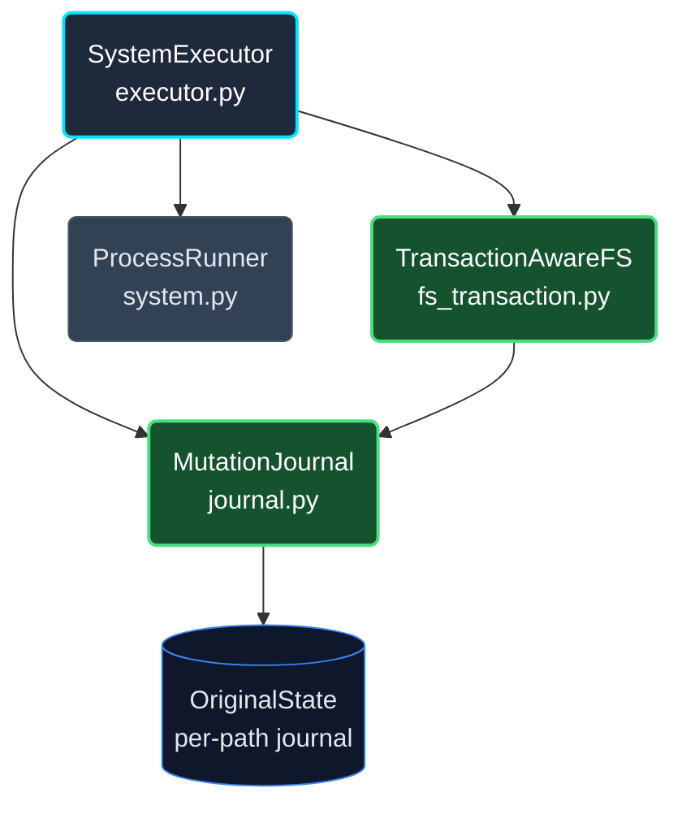
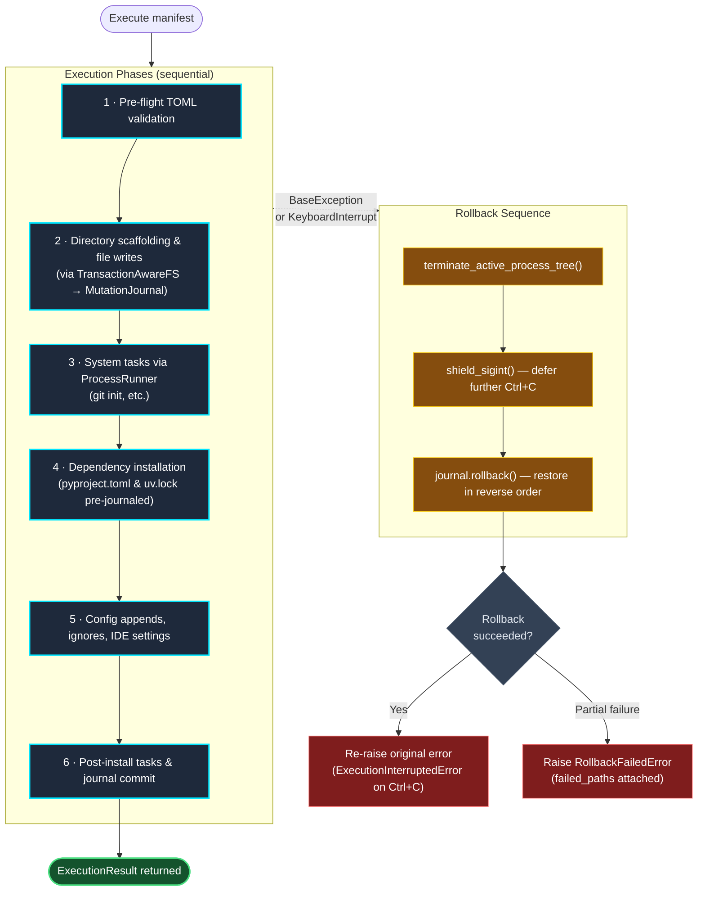

# Rollback Internals

Protostar's automatic rollback is implemented as a three-layer stack that collaborates to guarantee byte-accurate workspace restoration on any failure or interruption. This page documents the architecture, design decisions, and precise mechanics for contributors and maintainers.

For the user-facing guide covering what rollback restores, what it doesn't, and how to remediate failures, see [Automatic Rollback](../usage/rollback.md).

## The Three-Layer Stack



- **`MutationJournal`** is the ledger. Before Protostar writes or modifies any path, it records that path's original state (bytes, mode, or absence). On rollback, it replays the journal in reverse, restoring each entry.
- **`TransactionAwareFS`** is the gated write interface. All filesystem mutations in the execution phase route through this class, which calls into the journal before performing any disk operation.
- **`ProcessRunner`** owns the active subprocess. When an error or interrupt fires, the executor calls `terminate_active_process_tree()` first — before touching the journal — ensuring no process is still writing to disk while rollback is in progress.

## Transactional Execution Flow



## `MutationJournal`

`MutationJournal` (`src/protostar/journal.py`) is the core rollback ledger. It operates on a simple invariant: **record before mutate, restore in reverse**.

### Recording

Every path that Protostar will touch is passed to `record_mutation()` (or `record_tree_creation()` for `git init`-style subtrees) *before* the disk operation occurs. The journal captures the path's `OriginalState`:

| Original condition | Recorded `NodeKind` | What's captured |
|---|---|---|
| Path does not exist | `ABSENT` | Nothing (path is new) |
| Existing regular file | `REGULAR_FILE` | Full file bytes + POSIX mode |
| Existing directory | `DIRECTORY` | POSIX mode |

Symbolic links, FIFOs, sockets, and device files are **rejected** at this point with `UnsupportedFilesystemNodeError` — they cannot be safely journaled or restored.

If a path is submitted for journaling a second time within the same transaction, the call is silently ignored: the original pre-transaction state, captured on the first write, is what matters for restoration.

### Lifecycle States

`MutationJournal` moves through three `TransactionState` values:

```text
ACTIVE → (mutations recorded freely)
  ├── commit()    → COMMITTED  (journal cleared; no rollback possible)
  └── rollback()  → ROLLED_BACK (journal entries replayed in reverse; cleared)
```

Calling `commit()` on a successfully completed run discards the journal — there is nothing to restore. Calling `rollback()` on a `COMMITTED` journal raises `TransactionStateError` (the transaction is already done).

### Rollback Replay

`rollback()` iterates the journal in **reverse insertion order** — last mutation is undone first. For each entry:

- **`ABSENT` (created file):** `path.unlink()` removes it.
- **`ABSENT` (created tree, e.g., from `record_tree_creation`):** `shutil.rmtree()` removes the entire subtree. This is used for paths declared as atomically-created trees by system tasks.
- **`ABSENT` (directory created normally):** `path.rmdir()` — only succeeds if the directory is empty. If it contains unrelated files, an `OSError` is caught, a `RollbackFailure` is recorded, and rollback continues with the remaining paths.
- **`REGULAR_FILE`:** `atomic_write_bytes(path, original_bytes, mode=original_mode)` overwrites the current content with the captured snapshot.
- **`DIRECTORY`:** Restores the original POSIX mode.

Any path that cannot be restored is collected into a `RollbackFailure` tuple. If any failures occurred, `rollback()` returns `RollbackResult(succeeded=False, failed_paths=(...))`, which triggers `RollbackFailedError` in the executor.

### Path Normalization & Security

Before recording any path, `normalize_path()` resolves it to an absolute path **without dereferencing its final component** (so symlinks are caught rather than followed). It then asserts the resolved path is within `workspace_root`, preventing any transaction-managed operation from escaping the workspace boundary.

## `TransactionAwareFS`

`TransactionAwareFS` (`src/protostar/fs_transaction.py`) is the gated write interface. The executor never calls `Path.write_text()` or `Path.mkdir()` directly — all filesystem mutations flow through this class, which calls into the `MutationJournal` first.

### Write Operations

| Method | What it journals | What it does |
|---|---|---|
| `ensure_directory(path)` | `record_mutation(path)` for the directory, plus any missing implicit parents | `path.mkdir(parents=True, exist_ok=True)` |
| `write_bytes(path, content)` | `record_mutation(path)` + implicit parents | `atomic_write_bytes(path, content)` |
| `write_text(path, content)` | delegates to `write_bytes` | encodes then delegates |
| `remove_file(path)` | `record_mutation(path)` | `path.unlink()` |

### Implicit Parent Tracking

When writing a file at a path like `src/myproject/__init__.py`, any parent directories that don't yet exist (`src/`, `src/myproject/`) are also recorded in the journal before `mkdir -p` creates them. This ensures that a partially-created directory tree is correctly removed on rollback — in reverse order, deepest first.

## `ProcessRunner` & Subprocess Termination

`ProcessRunner` (`src/protostar/system.py`) owns the single active subprocess at any moment. It launches subprocesses in **isolated process groups** (`start_new_session=True` on POSIX, `CREATE_NEW_PROCESS_GROUP` on Windows) so the entire child process tree can be signalled atomically.

### Two-Stage Termination

`terminate_active_process_tree()` is the first thing called when an error or interrupt fires, before `journal.rollback()`:

```text
1. Send SIGTERM to the process group (or CTRL_BREAK_EVENT on Windows)
2. Wait up to `termination_grace_seconds` (default: 2s)
3. If still alive: escalate to SIGKILL (or process.kill() on Windows)
4. Wait up to `termination_grace_seconds` again
5. If still alive: raise ProcessTerminationError
```

This sequence ensures no subprocess is still writing to disk while rollback is in progress. If a process cannot be reaped within the grace window, `ProcessTerminationError` propagates up through the executor's exception handler, which still attempts rollback before re-raising.

### Environment Sanitization

`ProcessRunner.run()` strips `VIRTUAL_ENV` and `PYTHONHOME` from the inherited environment before launching any subprocess. This prevents an ambient Python virtual environment from contaminating the subprocess's interpreter resolution (e.g., `uv` resolving the wrong Python).

It also strips git's repository-local variables, the set `git rev-parse --local-env-vars` lists (`GIT_DIR`, `GIT_WORK_TREE`, `GIT_INDEX_FILE`, `GIT_COMMON_DIR`, and the rest). Git exports these to hooks and aliases, and a linked worktree's hooks point `GIT_DIR` into the parent repository. Inherited, they would make `git init` or hook installation act on the caller's repository instead of the project, outside the declared `.git/` tree and therefore outside rollback. Git configuration (`GIT_CONFIG_GLOBAL`) and identity variables are kept.

## `shield_sigint`

Rollback itself is wrapped in the `shield_sigint()` context manager (`src/protostar/system.py`). This temporarily replaces the `SIGINT` handler with a no-op for the duration of `journal.rollback()`.

**Why this is necessary:** If the user presses `Ctrl+C` a second time while the journal is replaying, an unshielded `KeyboardInterrupt` would interrupt the rollback mid-stream — potentially leaving the workspace in a partially-restored state that is worse than the original failure. Shielding defers the second interrupt until cleanup finishes, then reinstates the original handler.

## Design Decisions

### Bytes Over Intent

For regular files, rollback restores the **exact original bytes and POSIX file mode** captured before the first mutation — it does not attempt to semantically undo changes. For example, after an AST merge into `pyproject.toml`, rollback does not attempt to reverse the TOML merge at the AST level; it simply overwrites the file with the raw bytes that were read before the first write.

This is deliberate: byte restoration is deterministic, instantaneous, and auditable. Semantic undo would require understanding the inverse of every possible content transformation Protostar applies — an unbounded and fragile problem.

### Empty-Directory-Only Removal

Directories created during a transaction are removed on rollback with `path.rmdir()`, which only succeeds if the directory is empty. If an external process has deposited files into a Protostar-generated directory during the run, Protostar refuses to delete it and records a `RollbackFailure` instead.

This is a deliberate safety trade-off: risking a non-empty directory being left behind is far preferable to silently deleting user files with `shutil.rmtree()`.

### Fatal Dependency Policy

`uv add` is not treated as a best-effort step. If dependency installation fails or times out, the error (`CommandExecutionError` or `CommandTimeoutError`) propagates immediately to the executor's exception handler, which triggers full rollback of all journaled paths including the pre-journaled `pyproject.toml` and `uv.lock`. Dependency failures are never downgraded to diagnostic warnings.

## API Reference

??? abstract "Transaction Journal: `MutationJournal`"
    ::: protostar.journal.MutationJournal
        options:
            show_source: true
            show_bases: true
            show_root_heading: true
            show_root_toc_entry: true
            separate_signature: true
            members_order: source

??? abstract "Transactional Filesystem: `TransactionAwareFS`"
    ::: protostar.fs_transaction.TransactionAwareFS
        options:
            show_source: true
            show_bases: true
            show_root_heading: true
            show_root_toc_entry: true
            separate_signature: true
            members_order: source

??? abstract "Process Runner: `ProcessRunner`"
    ::: protostar.system.ProcessRunner
        options:
            show_source: true
            show_bases: true
            show_root_heading: true
            show_root_toc_entry: true
            separate_signature: true
            members_order: source

## Related Pages

- **[Automatic Rollback](../usage/rollback.md):** User-facing guide — what gets restored, what might remain, and how to remediate failures.
- **[The System Executor](./executor.md):** How `SystemExecutor` sequences the execution phases and invokes the rollback stack.
- **[Error Handling Architecture](./error_handling.md):** How `RollbackFailedError`, `ExecutionInterruptedError`, and `ProcessTerminationError` propagate and map to POSIX exit codes.
