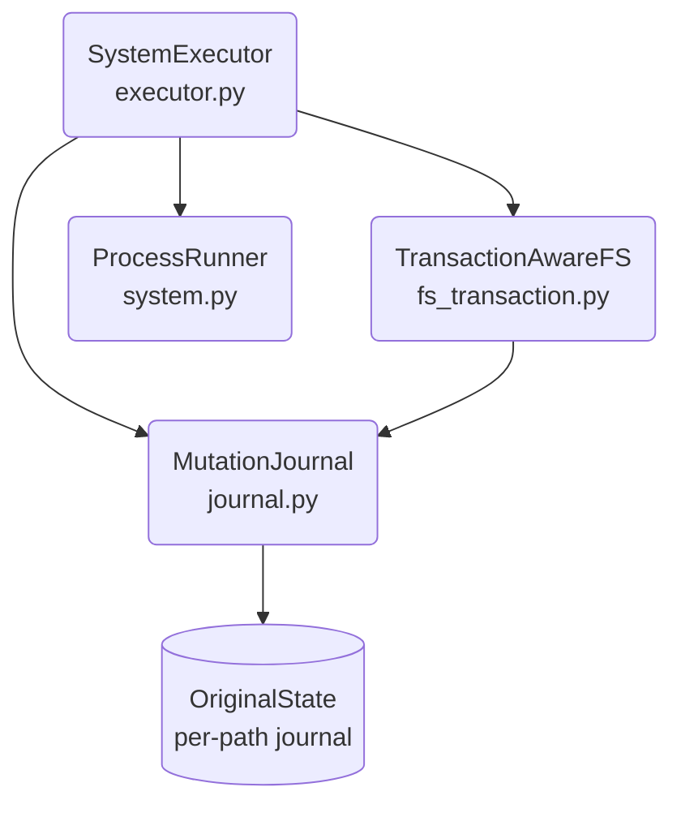
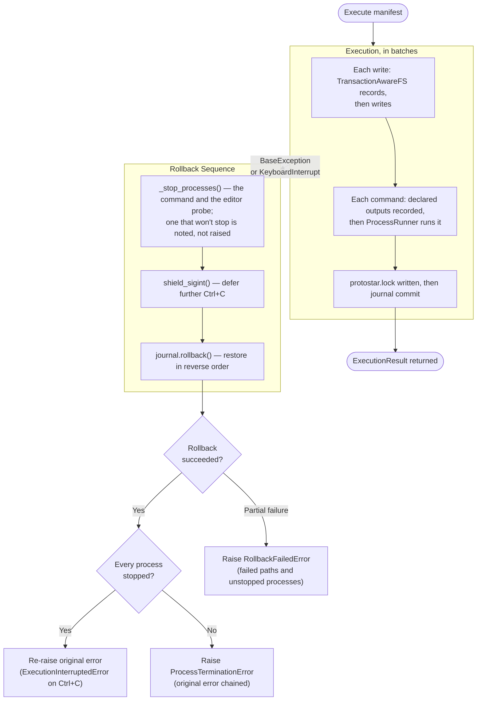

# Rollback Internals

Rollback is built from three layers. A journal records each path before Protostar first changes it, a filesystem wrapper makes every write go through that journal, and a process runner stops any running command before the journal replays. This page covers how each layer works and why, for contributors.

[Automatic Rollback](../usage/rollback.md) is the user guide: what rollback restores, what it doesn't, and what to do when a restore fails.

The [published rollback results](https://protostar.jacksonferguson.me/metrics/#rollback) show how many injected faults the nightly suite restored, split by template and operating system. When you change these layers, the [fault-injection harness](../developer/testing.md#rollback-fault-injection) fails each new site for you; the published count grows as the suite covers more.

## The Three-Layer Stack


```mermaid
flowchart TD
    E(SystemExecutor\nexecutor.py)

    E --> J(MutationJournal\njournal.py)
    E --> FS(TransactionAwareFS\nfs_transaction.py)
    E --> P(ProcessRunner\nsystem.py)

    FS --> J

    J --> Store[(OriginalState\nper-path journal)]
```

- **`MutationJournal`** records. Before Protostar first changes a path, the journal records its original state: its bytes and mode, or that it didn't exist. Rollback replays the journal in reverse.
- **`TransactionAwareFS`** is the only way execution writes. Every write, directory, and removal goes through it, and it records the path in the journal first.
- **`ProcessRunner`** owns the active subprocess. When an error or interrupt fires, the executor stops it, and the editor-extension listing that may be running beside it, before touching the journal, so no process is still writing to disk while rollback is in progress.

## Transactional Execution Flow

The batches themselves are listed in [Execution Order](../developer/reconciliation/execution.md#execution-order). Whatever the batch, every write and every command follows the same rule: record first, then act.


```mermaid
flowchart TD
    Start([Execute manifest]) --> Steps

    subgraph Steps ["Execution, in batches"]
        direction TB
        S1["Each write: TransactionAwareFS records,<br/>then writes"]
        S2["Each command: declared outputs recorded,<br/>then ProcessRunner runs it"]
        S3["protostar.lock written, then journal commit"]
        S1 --> S2 --> S3
    end

    S3 --> Done([ExecutionResult returned])

    Steps -. "BaseException\nor KeyboardInterrupt" .-> RB

    subgraph RB ["Rollback Sequence"]
        direction TB
        R1["_stop_processes() — the command and the editor probe;<br/>one that won't stop is noted, not raised"]
        R2["shield_sigint() — defer further Ctrl+C"]
        R3["journal.rollback() — restore in reverse order"]
        R1 --> R2 --> R3
    end

    R3 --> Check{Rollback\nsucceeded?}
    Check -- "Yes" --> Stopped{Every process\nstopped?}
    Stopped -- "Yes" --> ReRaise["Re-raise original error\n(ExecutionInterruptedError on Ctrl+C)"]
    Stopped -- "No" --> PTE["Raise ProcessTerminationError\n(original error chained)"]
    Check -- "Partial failure" --> RFE["Raise RollbackFailedError\n(failed paths and unstopped processes)"]
```

## `MutationJournal`

`MutationJournal` (`src/protostar/journal.py`) follows one rule: record before changing, restore in reverse.

### Recording

Each path is passed to `record_mutation()` before Protostar changes it, or to `record_tree_creation()` for a whole tree a command creates, such as `.git/` from `git init`. The journal captures the path's `OriginalState`:

| Original condition | Recorded `NodeKind` | What's captured |
|---|---|---|
| Path does not exist | `ABSENT` | Nothing (path is new) |
| Existing regular file | `REGULAR_FILE` | Full file bytes + POSIX mode |
| Existing directory | `DIRECTORY` | POSIX mode |

Symbolic links, FIFOs, sockets, and device files are rejected here with `UnsupportedFilesystemNodeError`, because they can't be journaled or restored safely.

Recording the same path again in one transaction does nothing: rollback restores the state from before the first change.

### Lifecycle States

`MutationJournal` moves through three `TransactionState` values:

```text
ACTIVE → (mutations recorded freely)
  ├── commit()    → COMMITTED  (journal cleared; no rollback possible)
  └── rollback()  → ROLLED_BACK (journal entries replayed in reverse; cleared)
```

Calling `commit()` on a successfully completed run discards the journal, since there is nothing to restore. Calling `rollback()` on a `COMMITTED` journal raises `TransactionStateError` (the transaction is already done).

The commit is the run's last step, so an interrupt can still arrive after it. The executor checks the journal's state first: once it is `COMMITTED`, the interrupt passes through untouched and the finished run stands. The CLI reports a plain interrupt (exit code `130`) without `ExecutionInterruptedError`, because nothing was rolled back.

### Rollback Replay

`rollback()` walks the journal in reverse, so the last change is undone first. For each entry:

- **`ABSENT` (created file):** `path.unlink()` removes it.
- **`ABSENT` (created tree, e.g., from `record_tree_creation`):** `shutil.rmtree()` removes the entire subtree. Commands declare these, such as `.git/` from `git init`.
- **`ABSENT` (directory created normally):** `path.rmdir()`, which only succeeds if the directory is empty. If it contains unrelated files, an `OSError` is caught, a `RollbackFailure` is recorded, and rollback continues with the remaining paths.
- **`REGULAR_FILE`:** `atomic_write_bytes(path, original_bytes, mode=original_mode)` overwrites the current content with the captured snapshot.
- **`DIRECTORY`:** Restores the original POSIX mode.

Any path that cannot be restored is collected into a `RollbackFailure` tuple. If any failures occurred, `rollback()` returns `RollbackResult(succeeded=False, failed_paths=(...))`, which triggers `RollbackFailedError` in the executor.

### Path Normalization & Security

Before recording a path, `normalize_path()` makes it absolute without following its last component, so a symbolic link is caught rather than followed. It then checks that the path is inside `workspace_root`, so no journaled change can reach outside the project.

## `TransactionAwareFS`

`TransactionAwareFS` (`src/protostar/fs_transaction.py`) is the only way execution writes. The executor never calls `Path.write_text()` or `Path.mkdir()` directly. Every filesystem mutation goes through this class, which calls into the `MutationJournal` first.

### Write Operations

| Method | What it journals | What it does |
|---|---|---|
| `ensure_directory(path)` | `record_mutation(path)` for the directory, plus any missing implicit parents | `path.mkdir(parents=True, exist_ok=True)` |
| `write_bytes(path, content)` | `record_mutation(path)` + implicit parents | `atomic_write_bytes(path, content)` |
| `write_text(path, content)` | delegates to `write_bytes` | encodes then delegates |
| `remove_file(path)` | `record_mutation(path)` | `path.unlink()` |

### Implicit Parent Tracking

When writing a file at a path like `src/myproject/__init__.py`, any parent directories that don't yet exist (`src/`, `src/myproject/`) are also recorded in the journal before `mkdir -p` creates them. So a partly created tree is removed on rollback, deepest folder first.

## `ProcessRunner` & Subprocess Termination

`ProcessRunner` (`src/protostar/system.py`) owns one active subprocess at a time. The executor's runner runs the run's commands; the editor-extension listing, which overlaps the run, has a runner of its own. It starts each command in its own process group (`start_new_session=True` on POSIX, `CREATE_NEW_PROCESS_GROUP` on Windows), so one signal reaches the command and every process it started.

### Two-Stage Termination

`terminate_active_process_tree()` is called for the run's command when an error or interrupt fires, before `journal.rollback()`, and the editor-extension listing is cancelled the same way:

```text
1. Send SIGTERM to the process group (or CTRL_BREAK_EVENT on Windows)
2. Wait up to `termination_grace_seconds` (default: 2s)
3. If still alive: escalate to SIGKILL (or process.kill() on Windows)
4. Wait up to `termination_grace_seconds` again
5. If still alive: raise ProcessTerminationError
```

So no command is still writing while rollback runs. A process that survives it never stops the restore: after `SIGKILL` it runs none of its own code, and the editor-extension listing only reads. The executor tries to stop both processes, collects each `ProcessTerminationError`, rolls back, and then raises the first of them, chained to the original error. If rollback also fails, `RollbackFailedError` lists them as `unstopped` beside the paths it couldn't restore.

### Environment Sanitization

`ProcessRunner.run()` strips `VIRTUAL_ENV` and `PYTHONHOME` from the inherited environment before launching any subprocess. Otherwise a virtual environment active in your shell could make a command, such as `uv`, pick the wrong Python.

It also strips git's repository-local variables, the set `git rev-parse --local-env-vars` lists (`GIT_DIR`, `GIT_WORK_TREE`, `GIT_INDEX_FILE`, `GIT_COMMON_DIR`, and the rest). Git exports these to hooks and aliases, and a linked worktree's hooks point `GIT_DIR` into the parent repository. Inherited, they would make `git init` or hook installation act on the caller's repository instead of the project, outside the declared `.git/` tree and therefore outside rollback. Git configuration (`GIT_CONFIG_GLOBAL`) and identity variables are kept.

## `shield_sigint`

Rollback runs inside the `shield_sigint()` context manager (`src/protostar/system.py`), which ignores `SIGINT` while `journal.rollback()` runs.

Without it, a second `Ctrl+C` while the journal is replaying would raise `KeyboardInterrupt` part-way and could leave the project partly restored, which is worse than the original failure. The shield holds the second interrupt until rollback finishes, then puts the original handler back.

## Design Decisions

### Bytes Over Intent

For regular files, rollback restores the exact bytes and POSIX mode recorded before the first change. It doesn't try to undo changes by meaning. After a merge into `pyproject.toml`, for example, rollback doesn't reverse the merge; it writes back the bytes that were there before.

Writing back bytes always gives the same result, takes no time, and is easy to check. Undoing by meaning would need the inverse of every content transformation Protostar applies, an open-ended and fragile problem.

### Empty-Directory-Only Removal

Directories created during a transaction are removed on rollback with `path.rmdir()`, which only succeeds if the directory is empty. If another program put files into a directory Protostar created during the run, Protostar leaves the directory and records a `RollbackFailure`.

Leaving a directory behind is better than deleting someone's files with `shutil.rmtree()`.

### Fatal Dependency Policy

A failed `uv add` fails the run. If installing dependencies fails or times out, the error (`CommandExecutionError` or `CommandTimeoutError`) reaches the executor at once, and every journaled path rolls back, including `pyproject.toml` and `uv.lock`, which were recorded before uv ran. A dependency failure is never reduced to a warning.

## API Reference

??? abstract "Transaction Journal: `MutationJournal`"
    ::: protostar.journal.MutationJournal
        options:
            show_source: true
            show_bases: true
            show_root_heading: true
            show_root_toc_entry: true
            separate_signature: true
            members_order: source

??? abstract "Transactional Filesystem: `TransactionAwareFS`"
    ::: protostar.fs_transaction.TransactionAwareFS
        options:
            show_source: true
            show_bases: true
            show_root_heading: true
            show_root_toc_entry: true
            separate_signature: true
            members_order: source

??? abstract "Process Runner: `ProcessRunner`"
    ::: protostar.system.ProcessRunner
        options:
            show_source: true
            show_bases: true
            show_root_heading: true
            show_root_toc_entry: true
            separate_signature: true
            members_order: source

## Related Pages

- **[Automatic Rollback<span class="hs-icon hs-icon-arrow-right" aria-hidden="true"></span>](../usage/rollback.md):** The user guide: what gets restored, what might remain, and what to do when a restore fails.
- **[The System Executor<span class="hs-icon hs-icon-arrow-right" aria-hidden="true"></span>](./executor.md):** How `SystemExecutor` orders its steps and starts rollback.
- **[Error Handling Architecture<span class="hs-icon hs-icon-arrow-right" aria-hidden="true"></span>](./error_handling.md):** How `RollbackFailedError`, `ExecutionInterruptedError`, and `ProcessTerminationError` propagate and map to exit codes.
