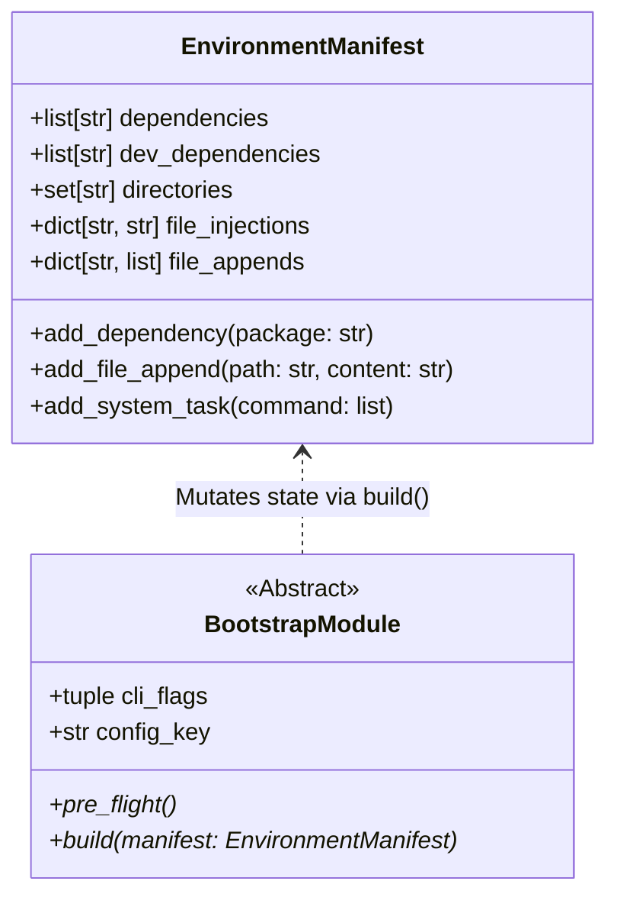

# API Reference

The engine strictly isolates state definition from imperative execution. Rather than executing disjointed setup scripts, the Orchestrator evaluates a polymorphic array of `BootstrapModule` objects interacting exclusively with a centralized state object: the `EnvironmentManifest`.

Think of the `EnvironmentManifest` as the nucleus of the scaffolding process. All modules revolve around this state object, mutating its properties and injecting AST payloads during their respective `build()` phases.

## Class Definitions

!!! abstract "Telemetry & Error Handling: `protostar.errors`"

    Strictly typed operational errors that halt the execution pipeline safely and return POSIX-compliant exit codes.

    ::: protostar.errors.ProtostarError
        options:
            show_source: true
            show_bases: true
            show_root_heading: true
            show_root_toc_entry: true
            separate_signature: true

    ::: protostar.errors.ConfigurationError
        options:
            show_source: true
            show_bases: true
            show_root_heading: true
            show_root_toc_entry: true
            separate_signature: true

    ::: protostar.errors.MissingDependencyError
        options:
            show_source: true
            show_bases: true
            show_root_heading: true
            show_root_toc_entry: true
            separate_signature: true

    ::: protostar.errors.CommandExecutionError
        options:
            show_source: true
            show_bases: true
            show_root_heading: true
            show_root_toc_entry: true
            separate_signature: true

    ::: protostar.errors.CommandTimeoutError
        options:
            show_source: true
            show_bases: true
            show_root_heading: true
            show_root_toc_entry: true
            separate_signature: true

    ::: protostar.errors.FileSystemError
        options:
            show_source: true
            show_bases: true
            show_root_heading: true
            show_root_toc_entry: true
            separate_signature: true

!!! abstract "Core Interface: `BootstrapModule`"

    ::: protostar.modules.base.BootstrapModule
        options:
            show_source: true
            show_bases: true
            show_root_heading: true
            show_root_toc_entry: true
            separate_signature: true
