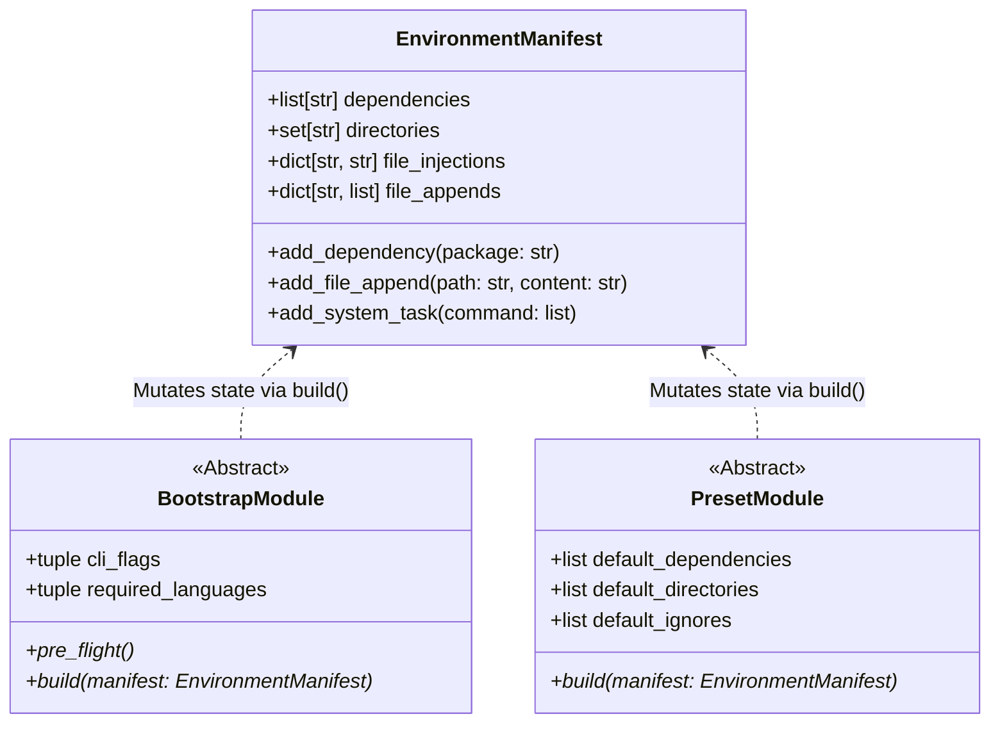

# API Reference

Before diving into the raw interface signatures, it is helpful to visualize the architectural boundaries of Protostar.

The engine strictly isolates state definition from imperative execution. Rather than executing disjointed setup scripts, the Orchestrator evaluates a polymorphic array of module objects. These modules—whether core foundational layers (`BootstrapModule`) or domain-specific macros (`PresetModule`)—interact exclusively with a centralized state object, the `EnvironmentManifest`.

Think of the `EnvironmentManifest` as the nucleus of the scaffolding process. All modules revolve around this singular state object, mutating its properties and injecting AST payloads during their respective `build()` phases. Because modules never execute their own side-effects, the manifest safely aggregates the net declarative intent before the executor flushes it to disk.

## Class Definitions

!!! abstract "Telemetry & Error Handling: `ProtostarError`"

    Strictly typed operational errors that halt the execution pipeline safely and return POSIX-compliant exit codes.

    ::: protostar.errors.ProtostarError
        options:
            show_source: true
            show_bases: true
            show_root_heading: true
            show_root_toc_entry: true
            separate_signature: true

!!! abstract "Core Interface: Define the foundational environment footprint (languages, core tooling). Evaluated during `protostar init`."

    ::: protostar.modules.base.BootstrapModule
        options:
            show_source: true
            show_bases: true
            show_root_heading: true
            show_root_toc_entry: true
            separate_signature: true

!!! abstract "Domain-Specific Dependencies: `PresetModule`"

    Lighter wrappers that inject domain-specific dependencies and directories onto a bootstrap foundation.

    ::: protostar.presets.base.PresetModule
        options:
            show_source: true
            show_bases: true
            show_root_heading: true
            show_root_toc_entry: true
            separate_signature: true
