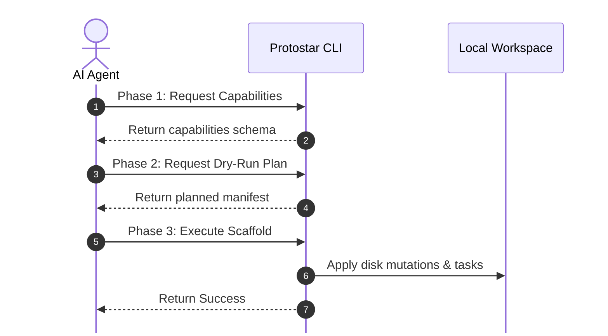

# Agent & Machine Interface

Protostar features an experimental, machine-readable command-line interface designed specifically for AI coding agents, CI/CD pipelines, and automated developer tooling.

By passing the position-independent `--json` flag and utilizing the `--dry-run` phase, external agents can programmatically inspect Protostar's capabilities, simulate environment scaffolding without side-effects, automatically handle collisions, and safely execute operations.

<div class="grid cards" markdown>

- :material-code-json: __Operational Strictness__

    `stdout` is strictly reserved for the machine-readable JSON payload. All human-readable logging, diagnostic summaries, and tracebacks are routed exclusively to `stderr`. Agents can safely ignore `stderr` and parse `stdout` directly.

- :material-shield-sync: __Zero Interactive Blocking__

    In `--json` mode, interactive TUI prompts (such as collision prompts or security trust dialogs) are bypassed. Untrusted templates raise immediate error payloads, and existing workspace collisions return structured collision paths.

- :material-play-speed: __Deterministic Simulation (`--dry-run`)__

    The `--dry-run` flag executes the headless `plan()` phase without writing files or running shell subprocesses, returning the full `EnvironmentManifest` as a structured dictionary.

- :material-file-code: __Template Schema Validation__

    The `export-schema` subcommand exports the official JSON Schema for TOML templates, allowing agents to validate dynamically generated template files ahead of execution.

</div>

## The Machine Protocol

Protostar marks its machine interface with an explicit `api_version` field in all JSON payloads (`"api_version": 1` during the experimental phase).

The CLI uses a position-independent `--json` flag that can appear anywhere in the argument list (e.g., `protostar --json`, `protostar init --template cli --json`, or `protostar --json init`).

### Protocol States

Every JSON response emitted to `stdout` follows one of three structured envelopes:

=== "1. Planned (`status: "planned"`)"
    Emitted when running `protostar init --dry-run --json`. Returns the complete planned `manifest`.

    ```json
    --8<-- "agent_payload_planned.json"
    ```

=== "2. Success (`status: "success"`)"
    Emitted upon successful environment execution via `protostar init --json` or discovery via `protostar --json`.

    ```json
    --8<-- "agent_payload_success.json"
    ```

=== "3. Error (`status: "error"`)"
    Emitted when a domain validation or runtime error occurs. Standard POSIX exit codes are maintained.

    ```json
    --8<-- "agent_payload_error.json"
    ```

## The Agent Scaffolding Lifecycle

AI agents can interact with Protostar using a predictable three-phase lifecycle:



### 1. Capabilities Discovery

An agent can interrogate the CLI to discover available commands, flags, and built-in templates:

```bash
protostar --json
```

Or inspect a specific command's arguments:

```bash
protostar init --help --json
```

### 2. Dry-Run Planning

Before touching the filesystem, an agent should run with `--dry-run --json` to inspect the planned changes:

```bash
protostar init --template astro --dry-run --json
```

The resulting payload exposes all directories, injected file contents, dependencies, and shell commands that Protostar plans to execute.

#### Collision Handling & Recovery

If the target workspace already contains files (such as an existing `pyproject.toml` or `README.md`), Protostar will not prompt interactively in JSON mode. Instead, it exits with an error payload:

```json
--8<-- "agent_payload_error.json"
```

The agent can parse the `"paths"` array and choose how to proceed:

- Pass `--force-merge` to reconcile previously managed configuration without
  adopting existing content, and append missing ignore rules.
- Pass `--force-replace` to overwrite existing configuration files.

### 3. Headless Execution

Once the plan is verified, the agent executes initialization:

```bash
protostar init --template astro --force-merge --json
```

Upon completion, the agent receives deterministic `created_paths` and `mutated_paths`
lists. The `touched_paths` list is their derived union.

If execution is interrupted or fails, Protostar automatically rolls back all tracked workspace changes. See [Automatic Rollback](./rollback.md) for the full guarantee model.

## Template Schema Export

When agents generate custom Protostar template TOML files dynamically, they can validate their syntax against the official schema.

Run `protostar export-schema` to export the JSON Schema:

```bash
# Pretty-printed, syntax-highlighted for human review:
protostar export-schema

# Compact JSON for machine validation:
protostar export-schema --json > protostar-template.schema.json
```

Agents can use standard JSON Schema validators (e.g., `jsonschema` in Python or `ajv` in JavaScript) to verify their generated blueprints before invoking `protostar init --from <file>`.

## Related Architecture & Next Steps

- __[The Environment Manifest](../mechanics/manifest.md):__ Detailed structure and domain slices of the in-memory state object serialized during `--dry-run --json`.
- __[Error Handling Architecture](../mechanics/error_handling.md):__ Deep dive into machine error envelopes, collision paths, and POSIX exit code mappings.
- __[CLI Reference](./cli-reference.md):__ Full list of subcommands, global flags, and exit status codes.

## Project review envelopes

`protostar status --json` and `protostar diff --json` return the same deterministic
review envelope with `status: "reviewed"`, `pending`, `review`, and accepted `diffs`.
Discover its JSON Schema through `protostar help status --json` in
`capabilities.review_schema`. The generated schema is included below.

```json
--8<-- "review_schema.json"
```

Both commands exit `0` for a valid review, including conflicts. Domain failures use
the existing error envelope and domain exit code. Resolver output is explicitly
unknown; review never runs package managers. Diffs contain project content and
are not a secret-redaction system.

## Lifecycle review and check examples

These examples are generated by the shared preparation path. Safe file creation
appears in `diffs`; conflicting local content appears separately in
`review.conflicts`. Resolver output is never simulated.

```json
--8<-- "agent_payload_reviewed.json"
```

`sync --check --json` uses the same review and adds `check_passed`. This pending
example exits `1` without applying anything:

```json
--8<-- "agent_payload_check.json"
```

`sync --json` returns `status: "success"` or `"partial"`, `review`, and `result`.
Partial application exits `1` after committing safe updates; fatal failures use
the error envelope with rollback context when available. Discover the application
schema through `protostar help sync --json` in `capabilities.application_schema`.

```json
--8<-- "application_schema.json"
```

See the [lifecycle walkthrough](lifecycle.md) for check outcomes, recipe edits,
enrollment, and security and rollback boundaries.
