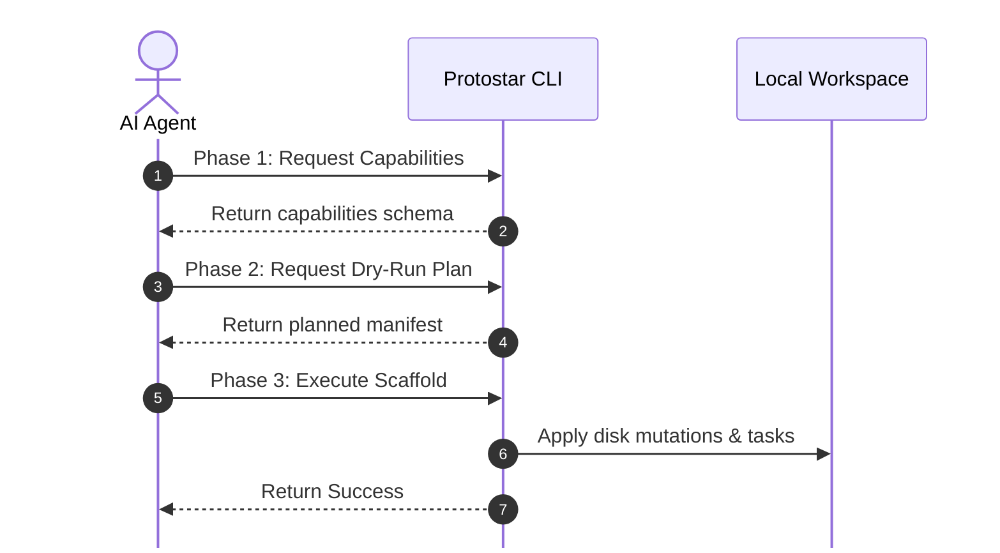

# Agent & Machine Interface

Protostar features an experimental, machine-readable command-line interface designed specifically for AI coding agents, CI/CD pipelines, and automated developer tooling.

By passing the position-independent `--json` flag and utilizing the `--dry-run` phase, external agents can programmatically inspect Protostar's capabilities, simulate environment scaffolding without side-effects, automatically handle collisions, and safely execute operations.

<div class="grid cards" markdown>

- :material-code-json: __Operational Strictness__

    `stdout` is strictly reserved for the machine-readable JSON payload. All human-readable logging, diagnostic summaries, and tracebacks are routed exclusively to `stderr`. Agents can safely ignore `stderr` and parse `stdout` directly.

- :material-shield-sync: __Zero Interactive Blocking__

    In `--json` mode, interactive TUI prompts (such as collision prompts or security trust dialogs) are bypassed. Untrusted templates raise immediate error payloads, and existing workspace collisions return structured collision paths.

- :material-play-speed: __Deterministic Simulation (`--dry-run`)__

    The `--dry-run` flag executes the headless `plan()` phase without writing files or running shell subprocesses, returning the full `EnvironmentManifest` as a structured dictionary.

- :material-file-code: __Template Schema Validation__

    The `export-schema` subcommand exports the official JSON Schema for TOML templates, allowing agents to validate dynamically generated template files ahead of execution.

</div>

---

## The Machine Protocol

Protostar marks its machine interface with an explicit `api_version` field in all JSON payloads (`"api_version": 0` during the experimental phase).

The CLI uses a position-independent `--json` flag that can appear anywhere in the argument list (e.g., `protostar --json`, `protostar init --template cli --json`, or `protostar --json init`).

### Protocol States

Every JSON response emitted to `stdout` follows one of three structured envelopes:

=== "1. Planned (`status: "planned"`)"
    Emitted when running `protostar init --dry-run --json`. Returns the complete planned `manifest`.

    ```json
    {
      "api_version": 0,
      "status": "planned",
      "manifest": {
        "metadata": {
          "package_name": "my_app",
          "project_name": "my-app",
          "python_version": "3.13"
        },
        "dependencies": {
          "dependencies": ["typer", "rich"],
          "dev_dependencies": ["ruff", "mypy", "pytest"],
          "docs_dependencies": ["mkdocs"]
        },
        "filesystem": {
          "directories": ["src/my_app", "tests"],
          "file_injections": {
            "pyproject.toml": "[project]\nname = \"my-app\"..."
          },
          "file_appends": {},
          "vcs_ignores": [".venv", "__pycache__"],
          "workspace_hides": [".venv"]
        },
        "tooling": {
          "ci_flags": ["ruff", "mypy", "pytest"],
          "ci_steps": [],
          "ide_extensions": ["charliermarsh.ruff", "matangover.mypy"],
          "pre_commit_hooks": [],
          "pre_commit_local_hooks": []
        },
        "tasks": {
          "system_tasks": [
            {
              "command": ["git", "init"],
              "description": "Initializing git repository",
              "timeout": 30
            }
          ],
          "post_install_tasks": []
        },
        "collision_strategy": "merge"
      }
    }
    ```

=== "2. Success (`status: "success"`)"
    Emitted upon successful environment execution via `protostar init --json` or discovery via `protostar --json`.

    ```json
    {
      "api_version": 0,
      "status": "success",
      "result": {
        "touched_paths": [
          ".gitignore",
          "pyproject.toml",
          "src/my_app/__init__.py",
          "tests/test_cli.py"
        ],
        "diagnostics": []
      }
    }
    ```

=== "3. Error (`status: "error"`)"
    Emitted when a domain validation or runtime error occurs. Standard POSIX exit codes are maintained.

    ```json
    {
      "api_version": 0,
      "status": "error",
      "error": {
        "type": "WorkspaceCollisionError",
        "message": "Workspace contains existing files that collide with the planned scaffold.",
        "hint": "Pass --force-merge to merge configs safely, or --force-replace to overwrite.",
        "docs_url": "https://protostar.readthedocs.io/en/stable/usage/init/#progressive-scaffolding-collisions",
        "paths": [
          "pyproject.toml"
        ]
      }
    }
    ```

---

## The Agent Scaffolding Lifecycle

AI agents can interact with Protostar using a predictable three-phase lifecycle:



### 1. Capabilities Discovery

An agent can interrogate the CLI to discover available commands, flags, and built-in templates:

```bash
protostar --json
```

Or inspect a specific command's arguments:

```bash
protostar init --help --json
```

### 2. Dry-Run Planning

Before touching the filesystem, an agent should run with `--dry-run --json` to inspect the planned changes:

```bash
protostar init --template astro --dry-run --json
```

The resulting payload exposes all directories, injected file contents, dependencies, and shell commands that Protostar plans to execute.

#### Collision Handling & Recovery

If the target workspace already contains files (such as an existing `pyproject.toml` or `README.md`), Protostar will not prompt interactively in JSON mode. Instead, it exits with an error payload:

```json
{
  "api_version": 0,
  "status": "error",
  "error": {
    "type": "WorkspaceCollisionError",
    "message": "Gravitational Anomaly: Protostar detected existing configuration files in the workspace.",
    "paths": ["pyproject.toml"]
  }
}
```

The agent can parse the `"paths"` array and choose how to proceed:

- Pass `--force-merge` to safely deep-merge configurations and append ignore rules.
- Pass `--force-replace` to overwrite existing configuration files.

### 3. Headless Execution

Once the plan is verified, the agent executes initialization:

```bash
protostar init --template astro --force-merge --json
```

Upon completion, the agent receives a list of all `touched_paths` that were created or modified on disk.

---

## Template Schema Export

When agents generate custom Protostar template TOML files dynamically, they can validate their syntax against the official schema.

Run `protostar export-schema` to export the JSON Schema:

```bash
# Pretty-printed, syntax-highlighted for human review:
protostar export-schema

# Compact JSON for machine validation:
protostar export-schema --json > protostar-template.schema.json
```

Agents can use standard JSON Schema validators (e.g., `jsonschema` in Python or `ajv` in JavaScript) to verify their generated blueprints before invoking `protostar init --from <file>`.
