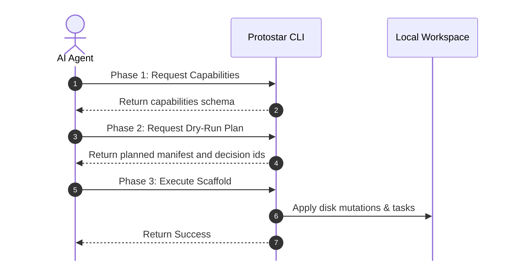

# Agent & Machine Interface

Every Protostar command can answer in JSON, for coding agents, CI, and scripts. The interface is still experimental: its `api_version` changes when a payload does.

Pass `--json` anywhere on the command line, and Protostar prints one JSON payload on `stdout` and never prompts. Add `--dry-run` to see exactly what a run would do without writing a file or running a command, then run it for real with the decisions you chose.

<div class="grid cards" markdown>

- :material-code-json: __Operational Strictness__

    `stdout` is strictly reserved for the machine-readable JSON payload. All human-readable logging, diagnostic summaries, and tracebacks are routed exclusively to `stderr`. Agents can safely ignore `stderr` and parse `stdout` directly.

- :material-shield-sync: __Zero Interactive Blocking__

    In `--json` mode, interactive TUI prompts (such as collision prompts or security trust dialogs) are bypassed. Untrusted templates raise immediate error payloads, and existing workspace collisions return structured collision paths.

- :material-play-speed: __Deterministic Simulation (`--dry-run`)__

    The `--dry-run` flag plans the run and prepares its review without writing files or running shell subprocesses, returning the full `EnvironmentManifest`, what happens to every file, and each conflict and proposal with its id.

- :material-file-code: __Template Schema Validation__

    The `export-schema` subcommand exports the official JSON Schema for TOML templates, allowing agents to validate dynamically generated template files ahead of execution.

</div>

## The Machine Protocol

Protostar marks its machine interface with an explicit `api_version` field in all JSON payloads (`"api_version": 2` during the experimental phase).

The CLI uses a position-independent `--json` flag that can appear anywhere in the argument list (e.g., `protostar --json`, `protostar init --template cli --json`, or `protostar --json init`).

### Protocol States

Every JSON response emitted to `stdout` follows one of three structured envelopes:

=== "1. Planned (`status: "planned"`)"
    Emitted when running `protostar init --dry-run --json`. Returns the complete planned `manifest`; the `entries` the run leaves in the workspace, one per path, each with its `change` (`new`, `modified`, `removed`, `conflict`, `existing`, or `after-setup` for files commands and the resolver create), whether it is a `directory`, and the ids of its open `conflicts` and `proposals`; the `review` that computed them, in the same shape `protostar status --json` returns; and, in a directory with no recipe yet, the `analysis` of what the project already has: the tools found with their `sources`, the `facts` read with where each came from, and `notes` about anything left out. `analysis` is `null` once a recipe exists. Analysis never selects a tool for a headless run; pass the flags for the tools you want.

    With `--one-shot`, `manifest.one_shot` is `true`. Execution still resolves dependencies and may write `uv.lock`, but omits `[tool.protostar]` and `protostar.lock`.

    ??? example "A planned payload"
        ```json
        --8<-- "agent_payload_planned.json"
        ```

=== "2. Success (`status: "success"`)"
    Emitted upon successful environment execution via `protostar init --json` or discovery via `protostar --json`.

    ```json
    --8<-- "agent_payload_success.json"
    ```

=== "3. Error (`status: "error"`)"
    Emitted when a domain validation or runtime error occurs. Standard POSIX exit codes are maintained.

    ```json
    --8<-- "agent_payload_error.json"
    ```

## The Agent Scaffolding Lifecycle

AI agents can interact with Protostar using a predictable three-phase lifecycle:


```mermaid
%%{init: {'sequence': {'mirrorActors': false, 'diagramMarginY': 30, 'bottomMarginAdj': 50}}}%%
sequenceDiagram
    autonumber
    actor Agent as AI Agent
    participant CLI as Protostar CLI
    participant Disk as Local Workspace

    Agent->>CLI: Phase 1: Request Capabilities
    CLI-->>Agent: Return capabilities schema

    Agent->>CLI: Phase 2: Request Dry-Run Plan
    CLI-->>Agent: Return planned manifest and decision ids

    Agent->>CLI: Phase 3: Execute Scaffold
    CLI->>Disk: Apply disk mutations & tasks
    CLI-->>Agent: Return Success
```

### 1. Capabilities Discovery

An agent can interrogate the CLI to discover available commands, flags, and built-in templates:

```bash
protostar --json
```

Or inspect a specific command's arguments:

```bash
protostar init --help --json
```

### 2. Dry-Run Planning

Before touching the filesystem, an agent should run with `--dry-run --json` to inspect the planned changes:

```bash
protostar init --template astro --dry-run --json
```

The resulting payload exposes all directories, injected file contents, dependencies, and shell commands that Protostar plans to execute, and what the run does to each file. In a project that already has files, `entries` marks each one `modified` or `conflict`, and `review` lists every conflict (your version is kept) and every proposal (a change into content you already have, which applies) with its id. It is the same review the terminal's change review shows. A draft with a hook manager fetches the latest hook versions first, so the pins shown are the ones a run writes.

#### Collision Handling & Recovery

If the target workspace already contains files (such as an existing `pyproject.toml` or `README.md`), Protostar will not prompt interactively in JSON mode. Instead, it exits with the `WorkspaceCollisionError` payload shown under [Protocol States](#protocol-states). The agent can parse `error.paths` and choose how to proceed:

- Pass `--force-merge` to merge into the existing files. Your content stays, and each change Protostar would make to it is listed in the dry run's `review` as a conflict or proposal.
- Pass `--force-replace` to replace the existing files with Protostar's version.

#### Settling Conflicts and Proposals

A headless run keeps your version for every open conflict and applies every proposal. To choose otherwise, take the ids from the dry-run's `review` (or each entry's `conflicts` and `proposals`) and pass one `--resolve SELECTOR=CHOICE` per decision, as `sync --resolve` takes them:

```bash
protostar init --template astro --dry-run --json
protostar init --template astro --force-merge --resolve 89cd01278762=desired --json
```

`desired` takes the update, `local` keeps your version (or keeps a proposal out), and `both` keeps both sides of a text hunk. A file path settles every conflict and proposal in that file. Add `--dry-run` to check the outcome first: the settled conflicts move to `review.resolved`, and a proposal kept out carries its `resolution`. `--resolve` chooses no collision strategy, so a project with existing files still needs `--force-merge`. A selector that names no decision returns an `UnmatchedResolutionError` payload listing it in `unmatched_resolutions`; ids cover content, so plan again after the files change.

#### Template Variables

A template's custom variables are supplied with `--var NAME=VALUE`, once per variable. JSON mode never prompts, so a missing value returns a `MissingTemplateVariablesError` payload whose `missing_variables` array names every variable still needed; retry with a `--var` for each. Values are saved in the project recipe and must not be secrets: a credential-shaped value returns a `SecretDetectedError` whose `findings` name the variable and matching rule. If the value isn't a secret, retry with `--allow-secret NAME` for that variable.

#### Missing Tools

Only `uv` and `git` block a run. Without either, `init` and `sync` exit with code `69` while planning, before writing anything, and the `MissingDependencyError` payload names them in `missing_executables`, with `install_commands` when a package manager was found. A binary that only a selected tool runs, such as `direnv` or `just`, never fails a run: the tool's files are still written, the steps that run it are skipped, and the success payload's `result.missing_tools` lists each one with its tool. Top-level `install_commands` holds the commands that install them, when a package manager was found; run them in order.

A template's options are chosen with `--option NAME=VALUE`, on `init` and `sync`. Every option has a default, so none is ever missing. A value the option doesn't offer returns an `InvalidOptionValueError` payload whose `option` and `values` name the option and every value it offers.

### 3. Headless Execution

Once the plan is verified, the agent executes initialization:

```bash
protostar init --template astro --force-merge --json
```

Add a `--resolve` for each decision the dry-run showed that the agent settles differently from the default.

Upon completion, the agent receives deterministic `created_paths` and `mutated_paths` lists. The `touched_paths` list is their derived union.

If execution is interrupted or fails, Protostar automatically rolls back all tracked workspace changes. See [Automatic Rollback](./rollback.md) for the full guarantee model.

## Template Schema Export

When agents generate custom Protostar template TOML files dynamically, they can validate their syntax against the official schema.

Run `protostar export-schema` to export the JSON Schema:

```bash
# Pretty-printed, syntax-highlighted for human review:
protostar export-schema

# Compact JSON for machine validation:
protostar export-schema --json > protostar-template.schema.json
```

Agents can use standard JSON Schema validators (e.g., `jsonschema` in Python or `ajv` in JavaScript) to verify their generated blueprints before invoking `protostar init --from <file>`.

The schema checks structure only. `protostar check-template <file> --json` also checks that `init` would accept the template, without writing files or running commands. It returns `status: "passed"` or `"failed"` (exit `1`) with a `check` object listing each finding's `rule`, `severity`, `message`, `file`, `line` (or `null`), `key`, and `hint`. A template that cannot be retrieved returns the error envelope instead, so `"failed"` always means the template itself was checked.

## Status and Diff Payloads

`protostar status --json` and `protostar diff --json` return the same payload, with `status: "reviewed"`, `pending`, `template`, `review`, and the `diffs` a sync would apply. For a repository template, `template` holds the applied `ref` and `revision` (commit), the ref's `kind` (`tag`, `branch`, or `commit`, or `null` when the repository no longer has it), the `newer` release when one exists, the commit a `moved` tag or branch names now, and whether the repository was `reachable`. It is `null` for built-in, local, and plain-URL templates. A newer release is not pending work: move to it with `sync --to <ref>`. Discover its JSON Schema through `protostar help status --json` in `capabilities.review_schema`. Every property in it carries a `description`, and the tables below are generated from those.

--8<-- "table_schema_review_envelope.md"

`template` is `null` or holds:

--8<-- "table_schema_template.md"

`review` holds:

--8<-- "table_schema_review.md"

Both commands exit `0` whenever the review succeeds, even with conflicts; an error uses the error payload and its exit code. A review never runs uv, so it can't show what uv will change in `pyproject.toml` and `uv.lock`: those changes appear only after `sync`. Diffs show your files' content as it is, secrets included.

## Conflicts, Checks, and Sync Payloads

The examples below are generated from the same code `sync` runs. A change that applies cleanly appears in `diffs`; content where yours and the update's disagree appears in `review.conflicts` instead.

Each conflict carries an `id`, the `choices` that can settle it, and its `sides` (`base`, `local`, and `desired`, each `null` when absent). An agent settles it with `sync --resolve <id>=<choice>`, which moves it to `review.resolved` with its `resolution`. An `id` covers the conflict's content, so a resolution for content that changed since the review fails with `UnmatchedResolutionError` instead of applying elsewhere; a choice the conflict does not offer fails with `UnsupportedResolutionError` and lists the ones it does. See [resolve conflicts](lifecycle.md#resolve-conflicts).

Conflicts, resolved conflicts, proposals, and preserved edits are all decisions with one shape, and each list adds at most one key:

--8<-- "table_schema_decision.md"

A decision's `reason` is one of:

--8<-- "table_schema_reasons.md"

An edit whose `after` is `null` removes the file. `review.migrations` lists what each template [migration](releasing-templates.md#migrations) does to one file: its `version`, `path`, the rename `target` (`null` for a removal), and the `outcome`: `moved`, `target-exists`, `removed`, `retired` (kept with local edits as a `retracted` conflict), `forgotten` (already deleted), or `not-owned`.

Two more kinds of decision share that shape and the same `--resolve`. Entries in `review.proposals` are changes into files Protostar never owned; each applies unless resolved with `local`, and its `resolution` is `null` until one is chosen. Entries in `review.preserved` are your kept edits and deletions, each with an `id`, its sides, and `deleted`; resolving one with `desired` takes Protostar's version there. A file selector names conflicts and proposals, never a preserved edit.

??? example "A reviewed payload"
    ```json
    --8<-- "agent_payload_reviewed.json"
    ```

`sync --check --json` uses the same review and adds `check_passed`. This pending example exits `1` without applying anything:

??? example "A `sync --check` payload"
    ```json
    --8<-- "agent_payload_check.json"
    ```

`sync --json` returns `status: "success"` or `"partial"`, `template`, `review`, and `result`. A partial sync applied the safe changes, left conflicts open, and exits `1`; an error uses the error payload, with the `rollback_context` of what was restored. Discover the application schema through `protostar help sync --json` in `capabilities.application_schema`.

--8<-- "table_schema_application_envelope.md"

`result` holds:

--8<-- "table_schema_result.md"

See [Automating Updates](automating-updates.md#use-checks-in-ci) for check outcomes and exit codes, and [Project Lifecycle](lifecycle.md) for recipe edits, trust, and rollback.

## Related Pages

- __[The Environment Manifest<span class="hs-icon hs-icon-arrow-right" aria-hidden="true"></span>](../mechanics/manifest.md):__ Every field of the `manifest` a dry run returns.
- __[Error Handling Architecture<span class="hs-icon hs-icon-arrow-right" aria-hidden="true"></span>](../mechanics/error_handling.md):__ Every error, its JSON fields, and its exit code.
- __[CLI Reference<span class="hs-icon hs-icon-arrow-right" aria-hidden="true"></span>](./cli-reference.md):__ Every command and option.
