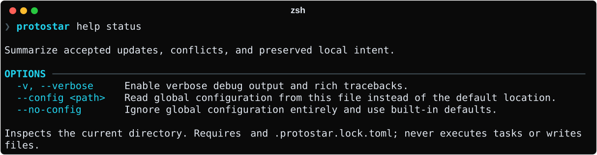
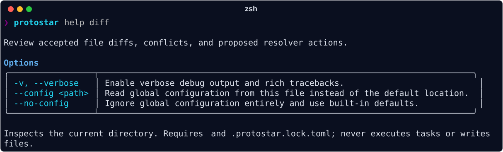
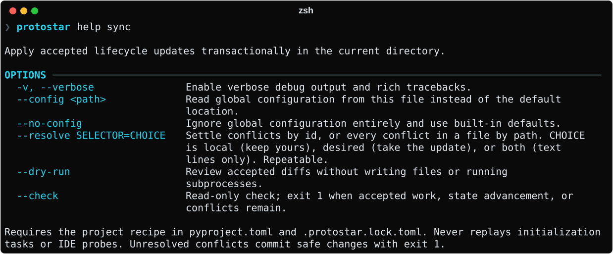

# Command Line Interface (CLI) Reference

Protostar provides a composable, deterministic command-line interface. Commands can be run interactively through terminal wizards (TUI) or headlessly via flags.

```bash
protostar [GLOBAL_OPTIONS] <COMMAND> [COMMAND_OPTIONS]
```

## Global Options

Global options can be passed to any command or evaluated independently:

--8<-- "table_cli_global.md"

## Commands

### `protostar init`

The primary command to scaffold and configure a Python repository.

```bash
protostar init [OPTIONS] [DYNAMIC_VARS...]
```

#### Core Options

--8<-- "table_cli_init_core.md"

`--one-shot` scaffolds without writing `[tool.protostar]` or `protostar.lock`.
It still generates `uv.lock` when dependencies are resolved. It requires a
project that is not already tracked by Protostar. See
[one time scaffolding](init.md#one-time-scaffolding).

#### Tooling Tri-State Flags

Every tooling module can be explicitly enabled (`--<flag>`) or disabled (`--no-<flag>`), overriding template defaults:

--8<-- "table_cli_tooling_flags.md"

#### Template Variables

A template containing custom placeholders (e.g., `<% REGION %>`) receives their values through `--var`, repeated once per variable. Values are saved in the project recipe, so never pass secrets:

```bash
protostar init --from ./api.toml --var REGION=eu-west-1 --var SERVICE_NAME=billing
```

A value that looks like a credential stops init. If it isn't a secret, keep it with `--allow-secret NAME`, repeated once per variable.

In a terminal, Protostar prompts for any variable left out. Elsewhere, including under `--json`, a missing value fails with `MissingTemplateVariablesError`.

### `protostar status` and `protostar diff`

Inspect the current directory using its recorded project recipe and ownership ledger:

```bash
protostar status
protostar diff
protostar diff --json
```





`status` summarizes accepted edits, conflicts, preserved local edits/deletions,
ownership advancement, and resolver actions. `diff` also displays unified diffs
of accepted direct edits. Conflicting content is preserved; conflict details give
the file, semantic keys or region identity, and reason. Resolver output is unknown
until application; no predicted dependency or lockfile diff is shown.

Both commands support `--json`, `--verbose`, and help. They never prompt, execute
subprocesses, write workspace files, or populate disk caches. Remote template
acquisition may use the network and reads archive data entirely in memory.
Initialization-only tasks and IDE probes are reported as excluded. For a
repository template, the first line names the applied ref and commit, and any newer
release or moved ref the repository offers; see
[template versions](templates.md#template-versions).

The explicit current directory must contain `[tool.protostar]` in `pyproject.toml`
and `protostar.lock`. For a Stage 1 project, rerun the original explicit
selection with `init --force-merge` to enroll it. Edit the recipe deliberately to
change tool selections; global defaults are never consulted during review.
Template variable values come from `[tool.protostar.variables]`; these commands never prompt.
Recorded template identity changes are rejected.

Valid reviews exit `0`, even with conflicts or pending work. Fatal errors use the
existing domain-specific exit codes. These commands only inspect; `init --dry-run`
continues to show the creation manifest rather than accepted lifecycle changes.

### `protostar sync`

Apply the accepted decisions from the same recipe-driven review:

```bash
protostar sync --dry-run
protostar sync --check --json
protostar sync --json
```



`sync` applies safe updates and advances ownership state in one transaction.
Conflicting local content and its applied baselines are retained while safe sibling
updates commit. Deleted tracked files stay deleted. Removing a tool stops requesting
its contributions without pruning existing files, dependencies, or ownership.
Initialization tasks, hook installation, arbitrary template tasks, and IDE probes
never run. Only accepted dependency requests and required metadata lock refreshes
invoke the resolver; unchanged repeats write nothing and run no subprocesses.

`--to REF` moves a repository template to a tag, branch, full commit SHA, or
`latest` (the newest release), records the ref in the recipe, and reviews the new
revision like any other update; it combines with `--dry-run`, `--check`, and
`--resolve`. `--var NAME=VALUE` supplies a variable the new revision adds, and
`--allow-secret NAME` keeps a value the secret guard flags. Without `--to`, `sync`
applies the commit `protostar.lock` records, however the ref has moved since.

`--dry-run` presents the same accepted diffs as `diff`. `--check` is read-only and
exits `1` for accepted work, baseline advancement, or conflicts; preserved local
edits and deletions alone pass. The two modes are mutually exclusive.

Application exits `0` on success and `1` after committing safe changes with retained
conflicts. JSON application envelopes have `status: "success"` or `"partial"`, the
captured `review`, and an actual `result` with sorted created, mutated, and touched
paths. Inspection uses `status: "reviewed"`; check adds `check_passed`.
Schema discovery publishes both review and application schemas.

One source revision and hook registry snapshot are captured per invocation. Inputs
are revalidated before mutation; stale inputs abort. Resolver failures, timeouts,
interrupts, and late state-write failures roll back journaled bytes and POSIX modes.
Fatal JSON errors report rollback context when available. Resolver `pyproject.toml`
and `uv.lock` writes are journaled; `.venv` and global caches remain outside the
rollback boundary. Review output contains project content, including any secrets
rendered into files.

### `protostar config`

Manages your default preferences stored in `~/.config/protostar/config.toml`.

```bash
protostar config [OPTIONS]
```

--8<-- "table_cli_config.md"

### `protostar export-schema`

Exports the official JSON Schema for Protostar TOML templates.

```bash
protostar export-schema [OPTIONS]
```

--8<-- "table_cli_export_schema.md"

### `protostar check-template`

Checks a template before you publish it: that `protostar init` would accept it, and that it follows the practices built-in templates follow. It writes nothing and runs no commands. See [Checking a Template](authoring-templates.md#checking-a-template).

```bash
protostar check-template [SOURCE] [OPTIONS]
```

--8<-- "table_cli_check_template.md"

### `protostar completion`

Generates dynamic autocompletion scripts for supported shells (Bash, Zsh, Fish, PowerShell).

```bash
protostar completion [SHELL]
```

--8<-- "table_cli_completion.md"

### `protostar help`

Displays comprehensive help panels and usage instructions.

```bash
protostar help [COMMAND]
```

## POSIX Exit Codes

Protostar maps runtime outcomes and operational exceptions to standard POSIX status codes:

--8<-- "table_exit_codes.md"
