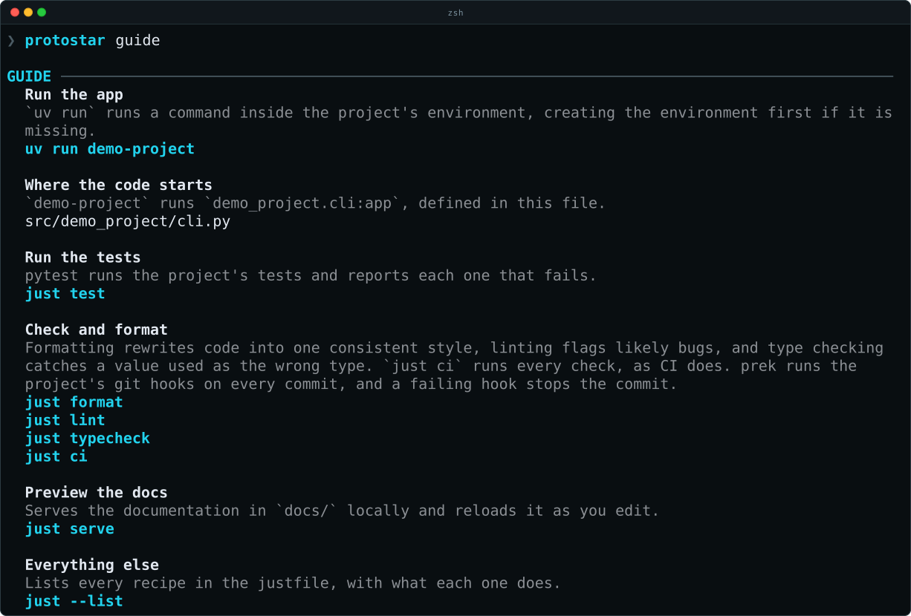

# CLI Reference

Every command runs in the current directory. Global options go before or after the command:

```text
protostar [global options] <command> [options]
```

The usage line and option table under each command are generated from Protostar's own argument parser, so they always match `protostar help <command>`.

## Global Options

--8<-- "cli_global.md"

`--json` can appear anywhere on the command line. See the [machine interface](agent-interface.md) for its payloads.

## Commands

### `protostar init`

Set up a project in the current directory: in an empty folder, or in a project you already have. In a terminal with no template given, it opens the recipe editor and then the change review; with `--template` or `--from`, it runs headlessly. See [Initialization](init.md).

--8<-- "cli_init.md"

#### Tool Flags

Each tool has a flag that turns it on and a `--no-<tool>` flag that turns it off, whatever the template chose. See the [Tooling & Flags Matrix](tooling-matrix.md) for what each one adds.

--8<-- "cli_init_tools.md"

A value that looks like a credential stops `init`. If it isn't a secret, keep it with `--allow-secret NAME`. In a terminal, Protostar asks for any template variable you leave out; elsewhere, including under `--json`, a missing value fails with `MissingTemplateVariablesError`. An unknown option, or a value the option doesn't offer, stops `init` with the values it does offer.

### `protostar status` and `protostar diff`

Show what `sync` would do, without doing it. `status` lists each file with pending changes as a labelled tree, then explains each conflict, change to a file you wrote, and edit of yours that stays, with the `sync --resolve` command for each choice. It also lists the packages uv will add and any git hook changes. `diff` adds each file's changes as a unified diff.

--8<-- "cli_status.md"

--8<-- "cli_diff.md"

Both read the project's recipe in `pyproject.toml` and `protostar.lock`, so they fail in a project without them. They never prompt, run a command, or write a file, and they exit `0` whenever the review succeeds, even with conflicts. For a repository template, the first line names the release and commit the project applied, and any newer release; see [template versions](templates.md#template-versions). See [Project Lifecycle](lifecycle.md).

### `protostar sync`

Apply the update `status` shows. Safe changes apply, and each conflict keeps your version until you choose. In a terminal, conflicts you can settle open a review screen before anything is applied. Turning off a tool, or choosing a template option that drops content, removes what it added: unedited content goes, and edited content stays as a conflict for you to settle.

--8<-- "cli_sync.md"

`sync` exits `0` when everything applied, and `1` when it applied the safe changes and left conflicts open. It never reruns `init`'s setup commands. It runs `uv add` or `uv lock` only when dependencies change, and installs a git hook only when one is missing. For a template you haven't trusted, those commands need your confirmation first: a screen in a terminal, or `--trust` for one run; otherwise `sync` stops with exit code `77` before writing anything.

Without `--to`, `sync` applies the commit `protostar.lock` records, however the template's branch or tag has moved since. If a run fails or you press `Ctrl+C`, every file it wrote is restored; see [Automatic Rollback](rollback.md). See [Project Lifecycle](lifecycle.md) and [Automating Updates](automating-updates.md).

### `protostar guide`

Show how to work on the project in the current directory: the command that runs it, the file its code starts in, and its tests, checks, and docs, each with a short explanation.

--8<-- "cli_guide.md"

The commands come from the same place as the project's `AGENTS.md` and `CONTRIBUTING.md`, so the three always agree. An action appears only when the project has it: the run command comes from `[project.scripts]`, and the justfile's recipes appear only while `just` is enabled. If a tool's program is missing, such as `just`, the guide shows the commands its recipes run instead, and ends with the command that installs it. Without a recipe, it says what it can't know and points to `protostar init`.



### `protostar eject`

Stop Protostar managing the project. `eject` removes `protostar.lock` and the recipe from `pyproject.toml`, and keeps every other file, including `uv.lock`. In a terminal it shows the change and asks first; elsewhere it needs `--yes`. Afterwards, `status`, `diff`, and `sync` no longer work in the project. See [Project Recipes](project-recipes.md#one-shot-and-eject).

--8<-- "cli_eject.md"

### `protostar config`

Edit your global configuration, stored in `~/.config/protostar/config.toml`, as a form or in `$EDITOR`. The form needs a terminal. See [Global Configuration](configuration.md).

--8<-- "cli_config.md"

### `protostar export-schema`

Print the JSON Schema for template files, for your editor or a validator. See [Editor Schema Setup](troubleshooting.md#editor-schema-setup-for-custom-templates).

--8<-- "cli_export_schema.md"

### `protostar check-template`

Check a template before you publish it: that `protostar init` would accept it, and that it follows the practices built-in templates follow. It writes nothing and runs no commands. With `--json`, it returns the findings as a payload. See [Checking a Template](authoring-templates.md#checking-a-template).

--8<-- "cli_check_template.md"

### `protostar completion`

Print the tab-completion script for your shell. See [Shell Completion](../getting-started.md#shell-completion-and-an-alias) for where to save it.

--8<-- "cli_completion.md"

### `protostar help`

Show every command, or one command's options. `protostar help <command>` is the same as `protostar <command> --help`.

--8<-- "cli_help.md"

## POSIX Exit Codes

Each kind of failure has its own exit code, so a script can tell a network failure from a broken template:

--8<-- "table_exit_codes.md"
