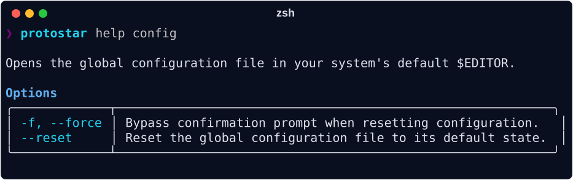

# Global Configuration

Your global configuration file acts as the baseline defaults for environment initialization (which can be overridden by templates or CLI flags). Edit its common settings as a form by running:

```bash
protostar config
```

The form covers your identity (name, email, and GitHub username), your editor, the default Python version, and which tools a new project starts with. Name and email start from your Git configuration when the file leaves them unset; Protostar reads Git's configuration but never writes it. Press `i` on a tool to see what it does, as in the recipe editor. A template's own tool choices still win over these defaults.

Beside the form, the **Changes** panel shows exactly what saving will change in the file. `Ctrl+S` saves; only the settings whose values changed are written, and comments, other keys, and your `[templates]` stay as they are. `Esc` leaves without saving, asking first if you changed anything.

The file stays the source of truth and is always yours to edit by hand. For everything the form doesn't cover, such as `[templates]` aliases, `license`, and `supported_os`, open it in your system's default `$EDITOR`, either with `e` in the form or directly:

```bash
protostar config --edit
```

The form needs an interactive terminal. Outside one, or with `--json`, bare `protostar config` fails and points to `--edit`.



To restore your configuration to the factory defaults:

```bash
protostar config --reset
```

Outside an interactive terminal, or with `--json`, there is no prompt: `--reset` fails unless you append `--force` (or `-f`), which also skips the prompt in a terminal:

```bash
protostar config --reset --force
```

## Selecting a Configuration File

By default Protostar reads `~/.config/protostar/config.toml` (or `$XDG_CONFIG_HOME/protostar/config.toml`). Two global flags override that for a single run, and both work with every subcommand:

```bash
# Read one specific file
protostar init --config ./ci/protostar.toml

# Read no configuration at all, and run on built-in defaults
protostar init --no-config
```

The `PROTOSTAR_CONFIG` environment variable is the equivalent for scripts and CI, where adding a flag to every invocation is impractical. Setting it to a path selects that file; setting it to an empty value disables configuration exactly like `--no-config`:

```bash
PROTOSTAR_CONFIG=./ci/protostar.toml protostar init --template cli
PROTOSTAR_CONFIG= protostar init --template cli
```

A `--config` flag takes precedence over `PROTOSTAR_CONFIG`, which takes precedence over the default location. `protostar config` follows the same selection, so `protostar config --config ./ci/protostar.toml` edits that file. The form saves to it, and `--edit` seeds it with the default template if it does not yet exist.

### Why Select One

An unpinned run inherits whatever configuration happens to exist on the machine, which is exactly what you do not want in three cases:

- **CI**: a self-hosted runner, or a developer running the pipeline locally, silently picks up a personal `config.toml`. Selecting a committed file (or `--no-config`) makes the run reproducible wherever it executes.
- **Reproducing a bug report**: drop the reported configuration in a file and run against it directly, without touching your own.
- **Testing a template or alias**: check how a scaffold behaves under a clean baseline rather than your accumulated defaults.

Selection is deliberate, so a `--config` or `PROTOSTAR_CONFIG` path that does not exist is an error rather than a silent fall back to defaults. A missing file at the *default* location stays perfectly normal and simply yields built-in defaults.

## The Default Baseline

When you first save from `protostar config`, or run `protostar config --edit`, a configuration file is created at `~/.config/protostar/config.toml` from this default:

```toml
--8<-- "default_config.toml"
```

## Configuration Reference

### Environment Settings (`[env]`)

Controls base environment toggles and global tool preferences applied whenever `protostar init` is executed:

--8<-- "table_config_env.md"

### Supported Licenses

When configuring `license` in `[env]`, Protostar injects the full license file and attaches the official PyPI Trove classifier to `pyproject.toml`:

--8<-- "table_licenses.md"

### Global Template Aliases (`[templates]`)

Map friendly shorthand names to local files or remote URLs using either shorthand strings or rich configuration tables:

```toml
# Shorthand string aliases:
[templates]
my-org-api = "https://raw.githubusercontent.com/MyOrg/standards/main/api.toml"
data-science = "~/Developer/templates/ds_base.toml"

# Rich configuration tables with metadata and explicit trust:
[templates.enterprise-api]
name = "Enterprise API"
source = "https://github.com/myorg/enterprise-template"
description = "Internal enterprise microservice scaffold with auth & tracing"
trusted = true
```

#### Template Alias Fields

When declaring a template using the `[templates.<alias>]` table format:

- **`source`** *(required)*: The local filesystem path or remote URL to the template.
- **`name`** *(optional)*: Display name shown in listings and wizards.
- **`description`** *(optional)*: Short summary displayed in `protostar init --list-templates`, shell autocompletion, and the TUI wizard.
- **`trusted`** *(optional, default: `false`)*: Set to `true` to explicitly trust this template and bypass the interactive remote execution warning prompt.

Pin `source` to a tag or commit when new projects from this alias must be reproducible, and leave it on a branch when you want `protostar sync` to deliver template updates. See [Pinning a Template Revision](./templates.md) for the URL forms each host accepts and what ends up in `protostar.lock`.

Alias names are case-insensitive and must be unique: an alias may not reuse a built-in template name (`api`, `astro`, `cli`, `lib`, `ml`), and two aliases may not differ only by letter case. Protostar rejects either collision when it loads your configuration, because the alias would otherwise resolve to a different template depending on how it was looked up.

Templates declared here can be invoked directly with `protostar init --template <alias>`, appear automatically in the interactive wizard, and are dynamically surfaced in shell completions.

## Next Steps

- **[Environment Initialization](./init.md):** Test your configured global defaults with `protostar init`.
- **[Templates](./templates.md):** Discover how template aliases streamline custom template consumption and bypass remote security prompts.
- **[CLI Reference](./cli-reference.md):** Review all command-line options and runtime flag overrides.
