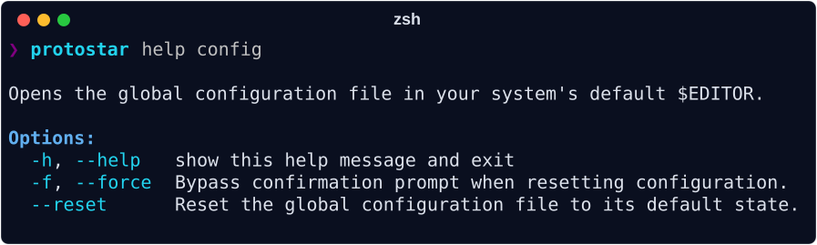

# Global Configuration

Your global configuration file acts as the singular source of truth for environment initialization. Open it in your system's default `$EDITOR` by running:

```bash
protostar config
```



To restore your configuration to the factory defaults:

```bash
protostar config --reset
```

To bypass the confirmation prompt (e.g., in automated scripts), append `--force-replace`:

```bash
protostar config --reset --force-replace
```

---

## The Default Baseline

When you first run `protostar config` a configuration file is created and opened at `~/.config/protostar/config.toml`:

```toml
--8<-- "default_config.toml"
```

---

## Configuration Reference

### Environment Settings (`[env]`)

Controls base environment toggles and global tool preferences applied whenever `protostar init` is executed:

- `ide`: Preferred IDE (`"vscode"`, `"cursor"`, or `"none"`).
- `python_version`: Default Python version to pin (e.g., `"3.13"`).
- `license`: Default project license identifier (e.g., `"MIT"`, `"Apache-2.0"`).
- `author_name`: Default author name for project metadata.
- `author_email`: Default author email for project metadata.
- `github_username`: Default GitHub username for repository URL formatting.
- `supported_os`: Operating systems matrix for CI workflows (e.g., `["MacOS", "Linux", "Windows"]`).
- `direnv`: Auto-scaffold `.envrc` shell bindings.
- Tooling toggles (`ruff`, `mypy`, `ty`, `pyrefly`, `pytest`, `pre_commit`, `prek`, `commitizen`, `renovate`, `codecov`, `zensical`, `readthedocs`, `ci`, `release`, `just`, `markdownlint`).

### Supported Licenses

When configuring `license` in `[env]`, Protostar injects the full license file and attaches the official PyPI Trove classifier to `pyproject.toml`:

--8<-- "table_licenses.md"

### Global Template Aliases (`[templates]`)

Map friendly shorthand names to local files or remote URLs:

```toml
[templates]
my-org-api = "https://raw.githubusercontent.com/MyOrg/standards/main/api.toml"
data-science = "~/Developer/templates/ds_base.toml"
```

Templates declared here can be invoked directly with `protostar init --template my-org-api`, appear automatically in the interactive wizard, and bypass the remote trust warning dialog.

For complete documentation on creating and using templates, see __[Templates & Portable Configurations](./templates.md)__.
