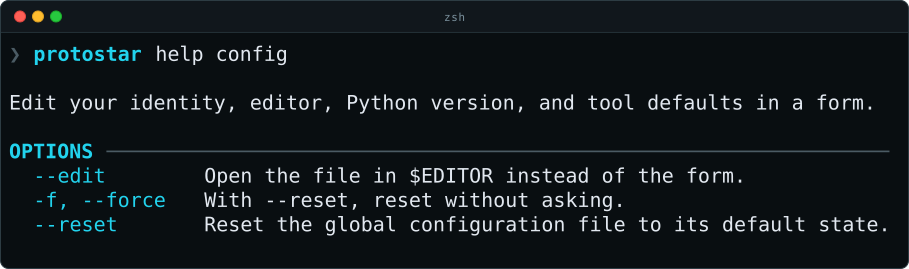

# Global Configuration

Your global configuration holds the defaults every new project starts from. A template's choices and the flags you pass still win over them. Edit the common settings in a form:

```bash
protostar config
```

The form covers your identity (name, email, and GitHub username), your editor, the default Python version, and which tools a new project starts with. Name and email start from your Git configuration when the file leaves them unset; Protostar reads Git's configuration but never writes it. Press `i` on a tool to see what it does, as in the recipe editor. A template's own tool choices still win over these defaults.

Beside the form, the Changes panel shows exactly what saving will change in the file. Saving writes only the settings whose values changed; comments, other keys, and your `[templates]` stay as they are.

--8<-- "keys_config.md"

The file stays the source of truth and is always yours to edit by hand. For everything the form doesn't cover, such as `[templates]` aliases, `license`, and `supported_os`, open it in your `$EDITOR`, with `e` in the form or directly:

```bash
protostar config --edit
```

The form needs an interactive terminal. Outside one, or with `--json`, bare `protostar config` fails and points to `--edit`.



To put your configuration back to Protostar's defaults:

```bash
protostar config --reset
```

`--reset` asks first. Outside an interactive terminal, or with `--json`, it can't ask, so it fails unless you add `--force` (or `-f`), which also skips the question in a terminal:

```bash
protostar config --reset --force
```

## Selecting a Configuration File

By default Protostar reads `~/.config/protostar/config.toml` (or `$XDG_CONFIG_HOME/protostar/config.toml`). Two global flags override that for a single run, and both work with every subcommand:

```bash
# Read one specific file
protostar init --config ./ci/protostar.toml

# Read no configuration at all, and run on built-in defaults
protostar init --no-config
```

The `PROTOSTAR_CONFIG` environment variable does the same for scripts and CI, where adding a flag to every command is awkward. A path selects that file, and an empty value works like `--no-config`:

```bash
PROTOSTAR_CONFIG=./ci/protostar.toml protostar init --template cli
PROTOSTAR_CONFIG= protostar init --template cli
```

`--config` wins over `PROTOSTAR_CONFIG`, which wins over the default location. `protostar config` follows the same selection, so `protostar config --config ./ci/protostar.toml` edits that file. The form saves to it, and `--edit` creates it from the defaults if it doesn't exist yet.

### Why Select One

Without one, a run uses whatever configuration the machine has. Three cases need something more predictable:

- **CI:** a self-hosted runner, or a developer running the pipeline locally, would pick up a personal `config.toml` without saying so. A committed file, or `--no-config`, makes the run the same wherever it runs.
- **Reproducing a bug report:** save the reported configuration to a file and run against it, without touching your own.
- **Testing a template or alias:** see how it behaves with Protostar's defaults rather than yours.

A `--config` or `PROTOSTAR_CONFIG` path that doesn't exist is an error, not a quiet fall back to defaults. A missing file at the *default* location is normal, and Protostar uses its built-in defaults.

## The Defaults

The first time you save from `protostar config`, or run `protostar config --edit`, Protostar creates `~/.config/protostar/config.toml` from these defaults:

```toml
--8<-- "default_config.toml"
```

## Configuration Reference

### Environment Settings (`[env]`)

The settings every `protostar init` starts from:

--8<-- "table_config_env.md"

### Supported Licenses

For the `license` you set in `[env]`, Protostar writes the full license file and adds its PyPI classifier to `pyproject.toml`:

--8<-- "table_licenses.md"

### Global Template Aliases (`[templates]`)

An alias gives a template a short name. Write it as a string, or as a table with more fields:

```toml
# As a string:
[templates]
my-org-api = "https://raw.githubusercontent.com/MyOrg/standards/main/api.toml"
data-science = "~/Developer/templates/ds_base.toml"

# As a table, with a description and trust:
[templates.enterprise-api]
name = "Enterprise API"
source = "https://github.com/myorg/enterprise-template"
description = "Internal enterprise microservice scaffold with auth & tracing"
trusted = true
```

#### Template Alias Fields

A `[templates.<alias>]` table takes:

- **`source`** *(required)*: A local path (`~` is expanded) or an HTTPS URL, in any form [`--from`](templates.md#repository-urls) accepts.
- **`name`** *(optional)*: Display name shown in listings and the template picker.
- **`description`** *(optional)*: Short summary displayed in `protostar init --list-templates`, shell autocompletion, and the template picker.
- **`trusted`** *(optional, default: `false`)*: Set to `true` to let this template run its commands without asking; see [Trusting a Template](templates.md#trusting-a-template).

A repository URL that names no ref starts each new project on the template's newest release; one that names a tag or branch starts it there. Either way, each project then stays on the commit it applied until you move it with `protostar sync --to <ref>`, so an alias never changes an existing project. See [Template Versions](templates.md#template-versions).

Alias names are case-insensitive and must be unique: an alias may not reuse a built-in template name (`api`, `astro`, `cli`, `lib`, `ml`), and two aliases may not differ only by letter case. Protostar rejects either one when it loads your configuration, because the alias could otherwise name a different template depending on how it was typed.

Use an alias with `protostar init --template <alias>`. It also appears in the recipe editor's template picker and in shell completion.

## Next Steps

- **[Environment Initialization<span class="hs-icon hs-icon-arrow-right" aria-hidden="true"></span>](./init.md):** Set up a project with your new defaults.
- **[Templates<span class="hs-icon hs-icon-arrow-right" aria-hidden="true"></span>](./templates.md):** Use your aliases, and trust the templates you rely on.
- **[CLI Reference<span class="hs-icon hs-icon-arrow-right" aria-hidden="true"></span>](./cli-reference.md):** Every command and option.
