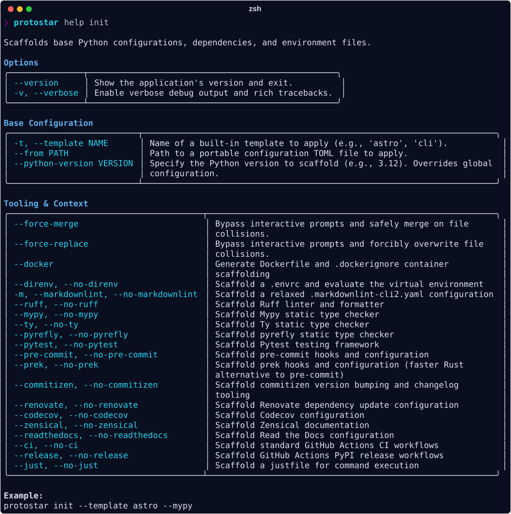

# Environment Initialization

The `init` command is the core engine of Protostar. It is not a glorified `mkdir` script; it is a deterministic state-machine designed to safely aggregate configurations, wire complex development tooling together, and construct robust directory architectures in seconds.

Protostar is designed to be run on Day 1 to build your repository's foundation, but it is perfectly safe to re-run on Day 50 to inject a forgotten dependency or adopt a new static analysis tool.

<div class="spacer-2"></div>

<div class="grid cards" markdown>

- :material-shield-check: __State-Aware Aggregation__

    Protostar doesn't just blindly overwrite files. It parses ASTs, deduplicates `.gitignore` entries, and safely merges configurations. It is perfectly safe to execute on pre-existing codebases.

- :material-clock-fast: __Deterministic Velocity__

    Instead of manually copying boilerplate from old repositories or relying on fragile bash scripts, Protostar guarantees a consistent, idempotent environment. It resolves your exact requested state in a fraction of a second, eliminating configuration drift and forgotten dependencies.

</div>

---

## Execution Footprints

To understand how Protostar interprets your flags, observe what happens when we execute different domain workflows in an empty directory. Notice how the orchestrator automatically routes tooling configurations, isolates data artifacts, and binds dependencies.

!!! note "IDE Configuration Footprints"
    The following repository tree examples assume you have explicitly configured an IDE in your global settings (e.g., `ide = "vscode"`) in addition to globally enabling direnv. This represents the best practice configuration for vscode users scaffolding python environments. If your config remains set to the default `None`, the `.vscode/settings.json` file will not be generated, though the universal `.vscode/` exclusion will still be safely appended to your `.gitignore`.

=== "The CLI Application (Tooling Focus)"
    __Command:__ `protostar init --cli --mypy --pytest --pre-commit --markdownlint`

    This footprint demonstrates Protostar's ability to wire complex tooling together automatically.

    --8<-- "cli_tree.md"

    ??? abstract "See the generated `.gitignore`"
        --8<-- "cli_gitignore.md"

    ??? abstract "See the generated `.markdownlint-cli2.yaml`"
        --8<-- "cli_markdownlint-cli2yaml.md"

    ??? abstract "See the generated `.pre-commit-config.yaml`"
        --8<-- "cli_pre-commit-configyaml.md"

    ??? abstract "See the generated `pyproject.toml`"
        --8<-- "cli_pyprojecttoml.md"

    **The Intelligence:**

    - **Dependency Locking:** Protostar instantly locked `typer` and `rich` from the CLI preset.
    - **AST Configuration:** It didn't just dump strings into `pyproject.toml`. It constructed the TOML Abstract Syntax Tree (AST), gracefully configuring `[tool.ruff]`, `[tool.mypy]`, and `[tool.pytest.ini_options]` alongside the dev-dependencies.
    - **Dynamic Hooks:** In `.pre-commit-config.yaml`, Protostar didn't just add a generic `mypy` hook. It dynamically evaluated your environment footprint and injected your CLI dependencies directly into Mypy's `additional_dependencies` block. This guarantees your CI pipeline won't fail due to missing stubs.
    - **A Note on Speed:** Standard Protostar executions take fractions of a second. However, because `--pre-commit` was flagged, Protostar queued a `pre-commit autoupdate` subprocess at the end of the run to ensure your git hooks are pinned to the absolute latest network releases. This shifts the total execution time to roughly ~4-9 seconds.

=== "The Astrophysics Pipeline (Data Focus)"
    __Command:__ `protostar init --astro`

    This footprint focuses on managing heavy, serialized data assets and preventing repository bloat.

    --8<-- "astro_tree.md"

    ??? abstract "See the generated `.gitattributes`"
        --8<-- "astro_gitattributes.md"

    ??? abstract "See the generated `.gitignore`"
        --8<-- "astro_gitignore.md"

    ??? abstract "See the generated `pyproject.toml`"
        --8<-- "astro_pyprojecttoml.md"

    **The Intelligence:**

    - **Directory Scaffolding:** It dynamically injected `data/catalogs` and `data/fits`, automatically isolating your telemetry and catalogs from the source code.
    - **Binary Safety:** It generated a `.gitattributes` file explicitly marking `*.fits` files as binary, and configuring `*.ipynb` for better text diffing.
    - **Notebook Diffing:** It automatically configured `nbdime` at the git level, saving you from parsing unreadable JSON diffs when tracking Jupyter Notebooks.
    - **Artifact Exclusions:** The `.gitignore` was populated with `*.fits`, `*.csv`, and `*.parquet`, preventing you from accidentally committing massive telemetry cubes to version control.

=== "The Machine Learning Stack (Artifact Focus)"
    __Command:__ `protostar init --ml --docker`

    This footprint focuses on containerization and strictly excluding model artifacts.

    --8<-- "ml_tree.md"

    ??? abstract "See the generated `.dockerignore`"
        --8<-- "ml_dockerignore.md"

    ??? abstract "See the generated `.gitignore`"
        --8<-- "ml_gitignore.md"

    ??? abstract "See the generated `pyproject.toml`"
        --8<-- "ml_pyprojecttoml.md"

    **The Intelligence:**

    - **Context Generation:** Because `--docker` was flagged, Protostar read the computed VCS ignores from the ML environment and generated a highly optimized `.dockerignore`. It strips out `.venv`, `.git`, local caches, and test artifacts to keep your container build context incredibly lightweight.
    - **Model Checkpoints:** The ML preset aggressively injects ignores for tensor artifacts (`*.pth`, `*.pt`, `*.onnx`, `*.safetensors`) and experiment tracking directories (`wandb/`, `mlruns/`) to ensure massive model weights never pollute the git tree.

!!! info "The Python Gravity Well"
    Protostar is engineered specifically to accelerate Python development pipelines. Its Python scaffolding (specifically leveraging `uv`) is highly refined, deeply integrated, and serves as the exclusive focus of the engine.

---

## Progressive Scaffolding & Collisions

Developers are rightfully terrified of CLI tools that touch their existing configurations. Protostar is engineered specifically to alleviate this anxiety.

Lets say you initialized a machine learning repo yesterday with `protostar init --ml --docker`

But today you remembered you'll be doing quasar analysis, and you want to enforce strict typing with `mypy`

You simply run `protostar init --astro --mypy --docker` in that existing directory.

Because Protostar detects existing configuration markers (like `pyproject.toml`), it instantly halts the execution and triggers the __Gravitational Anomaly__ intercept prompt:

```text
Protostar Ignition Sequence Initiated

Gravitational Anomaly: Protostar detected existing configuration files in the workspace.
  - pyproject.toml

? How would you like to proceed?
  » Merge      (Safely injects missing configs; preserves existing user data)
    Overwrite  (Forces injection; updates existing keys to match Protostar)
    Abort      (Safely exit without modifying the environment)
```

If you select __Merge__, Protostar performs a surgical AST injection.

- It leaves your existing `torch` and `huggingface-hub` dependencies completely untouched.
- It alphabetically merges in `astropy`, `photutils`, and `specutils`.
- It seamlessly drops the `[tool.mypy]` configuration block into the TOML file.
- It appends `*.fits` and `.mypy_cache/` to your existing `.gitignore`.

??? abstract "See the comparison"
    === "Directory Structure Before"
        --8<-- "ml_tree.md"

    === "Directory Structure After"
        --8<-- "ml_merged_tree.md"

    <hr>

    === "`.dockerignore` Before"
        --8<-- "ml_dockerignore.md"

    === "`.dockerignore` After"
        --8<-- "ml_merged_dockerignore.md"

    <hr>

    === "`.gitignore` Before"
        --8<-- "ml_gitignore.md"

    === "`.gitignore` After"
        --8<-- "ml_merged_gitignore.md"

    <hr>

    === "`pyproject.toml` Before"
        --8<-- "ml_pyprojecttoml.md"

    === "`pyproject.toml` After"
        --8<-- "ml_merged_pyprojecttoml.md"

*Curious how Protostar safely merges a `pyproject.toml` without breaking existing keys or stripping your comments? Read the [Mechanics: Executor](../mechanics/executor.md) deep dive.*

!!! success "Strict Footprint Validation"
    Protostar enforces explicit dependency boundaries for all tooling operations. If you pass an impossible or conflicting configuration matrix via the CLI, Protostar will not crash or dump inert configurations into your repository. It evaluates the topological constraints, drops the invalid tool, and prints a clean diagnostic warning before proceeding with the rest of the valid scaffolding sequence.

## Opinionated Templates

While Protostar is highly modular, sometimes you just want a vetted, turnkey environment without selecting a dozen checkboxes. Protostar ships with built-in __Opinionated Templates__ that bundle specific tools and overrides for popular workflows.

You can select a template in the interactive wizard, or trigger it headlessly:

```bash
protostar init --template astro
```

### `--template` vs `--from`

Protostar provides two different flags for template-driven configuration:

- `--template`: Scaffolds from a __trusted, built-in template__ shipped natively with the Protostar package (e.g., `astro`, `cli`).
- `--from`: Fetches an __external, portable configuration__ via a remote URL or local file path. Use this for organizational standards or custom setups.

### Tri-State CLI Toggles

When you load a template, it automatically evaluates its default tooling selections. However, Protostar's CLI uses __tri-state toggling__, meaning you can always manually override a template's default on the fly.

For example, if the `astro` template enables `direnv` by default, but you explicitly don't want it for this specific project, you can negate it using the `--no-<flag>` syntax:

```bash
protostar init --template astro --no-direnv
```

This ensures templates remain helpful starting points rather than rigid constraints.

## The Capabilities Matrix

You can mix and match these flags to generate exactly the environment you need. To view this matrix in your terminal at any time, run `protostar help init`.


