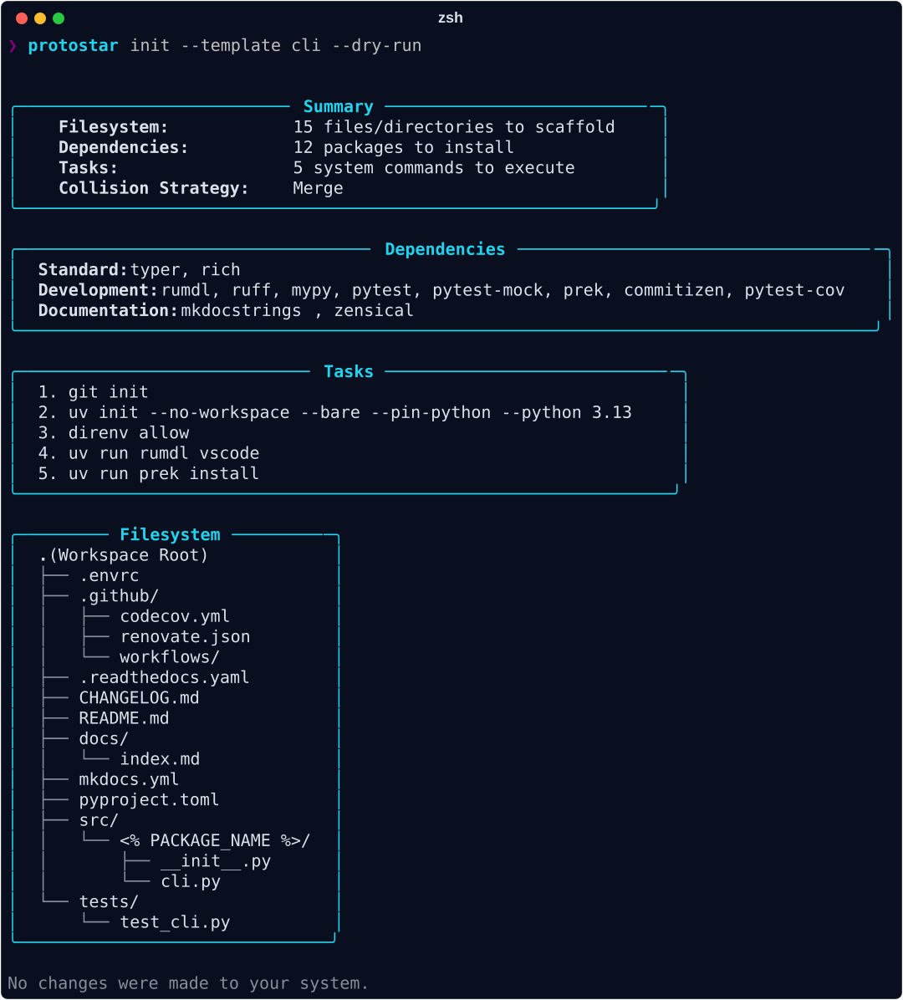
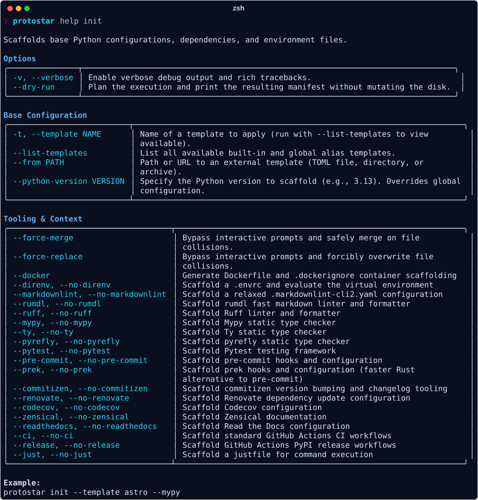

# Environment Initialization

The `init` command is the core engine of Protostar. It is a deterministic state-machine designed to safely aggregate configurations, wire development tooling together, and construct robust directory architectures in seconds.

Protostar is designed to be run on Day 1 to build your repository foundation, but it is safe to re-run on Day 50 to inject a forgotten dependency or adopt a new static analysis tool.

<div class="grid cards" markdown>

- :material-shield-check: __State-Aware Aggregation__

    Protostar doesn't blindly overwrite files. It parses ASTs, deduplicates `.gitignore` entries, and safely deep-merges configurations. It is safe to execute on pre-existing codebases.

- :material-clock-fast: __Deterministic Velocity__

    Instead of manually copying boilerplate from old repositories or relying on fragile shell scripts, Protostar guarantees a consistent, idempotent environment in fractions of a second.

</div>

---

## Opinionated Templates

While Protostar is modular, you often want a vetted, turnkey environment without selecting a dozen flags manually. Protostar ships with built-in __Opinionated Templates__ that bundle specific tools, directories, and AST overrides.

You can select a template in the interactive wizard (`protostar init`), list all available templates with `protostar init --list-templates`, or trigger one headlessly using `--template` (or `-t`):

```bash
# Scaffold from a built-in template (shorthand: protostar init -t astro)
protostar init --template astro

# List all available built-in templates and global aliases
protostar init --list-templates

# Scaffold from a remote team standard
protostar init --from https://github.com/YourOrg/standards/blob/main/backend.toml
```

### Tri-State CLI Toggles

Every tooling option in Protostar supports tri-state evaluation. Passing `--<tool>` forces it on, while passing `--no-<tool>` forces it off, overriding template opinions:

```bash
# Use the astro template but disable direnv and enable mypy
protostar init -t astro --no-direnv --mypy
```

For custom authoring, variable interpolation, global aliases, and security mechanics, see the complete __[Templates & Portable Configurations Guide](./templates.md)__.

---

## Execution Footprints

To understand how Protostar interprets your flags, observe what happens when we execute different workflows in an empty directory.

!!! note "IDE Configuration Footprints"
    The following repository tree examples assume you have configured an IDE in your global settings (e.g., `ide = "vscode"`) in addition to enabling direnv. If your config remains set to the default `None`, the `.vscode/settings.json` file will not be generated, though the universal `.vscode/` exclusion will still be safely appended to your `.gitignore`.

=== "The CLI Application (Tooling Focus)"
    __Command:__ `protostar init --template cli`

    This footprint demonstrates Protostar's ability to wire complex tooling together automatically.

    ```text
    --8<-- "tree_cli.txt"
    ```

    ??? abstract "Inspect Generated Files"
        === "pyproject.toml"
            ```toml
            --8<-- "cli/pyproject.toml"
            ```
        === ".pre-commit-config.yaml"
            ```yaml
            --8<-- "cli/pre-commit-config.fixture.yaml"
            ```
        === ".gitignore"
            ```gitignore
            --8<-- "cli/.gitignore"
            ```

    __The Intelligence:__

    - __Dependency Locking:__ Protostar locks `typer` and `rich` from the CLI template.
    - __AST Configuration:__ It constructs the TOML Abstract Syntax Tree (AST), configuring `[tool.ruff]`, `[tool.mypy]`, and `[tool.pytest.ini_options]` alongside development dependency groups.
    - __Local Toolchain Hooks:__ In `.pre-commit-config.yaml`, Protostar scaffolds local Python toolchain hooks (`ruff-check`, `ruff-format`, `mypy`) that execute directly in your project environment via `uv run`. When commit message validation (such as Commitizen) is included, top-level `default_install_hook_types` (`pre-commit`, `commit-msg`) and `default_stages` (`pre-commit`) are automatically declared.

=== "The Astrophysics Pipeline (Data Focus)"
    __Command:__ `protostar init --template astro`

    This footprint focuses on managing serialized data assets and preventing repository bloat.

    ```text
    --8<-- "tree_astro.txt"
    ```

    ??? abstract "Inspect Generated Files"
        === "pyproject.toml"
            ```toml
            --8<-- "astro/pyproject.toml"
            ```
        === ".gitattributes"
            ```gitattributes
            --8<-- "astro/.gitattributes"
            ```
        === ".gitignore"
            ```gitignore
            --8<-- "astro/.gitignore"
            ```

    __The Intelligence:__

    - __Directory Scaffolding:__ It injects `data/catalogs` and `data/fits`, isolating telemetry from source code.
    - __Binary Safety:__ It generates a `.gitattributes` file explicitly marking `*.fits` files as binary, and configuring `*.ipynb` for clean text diffing.
    - __Notebook Diffing:__ It automatically configures `nbdime` at the git level, avoiding unreadable JSON diffs when tracking Jupyter Notebooks.
    - __Artifact Exclusions:__ The `.gitignore` is populated with `*.fits`, `*.csv`, and `*.parquet`, preventing accidental commits of massive telemetry files.

=== "The Machine Learning Stack (Artifact Focus)"
    __Command:__ `protostar init --template ml --docker`

    This footprint focuses on containerization and strictly excluding model artifacts.

    ```text
    --8<-- "tree_ml.txt"
    ```

    ??? abstract "Inspect Generated Files"
        === "Dockerfile"
            ```dockerfile
            --8<-- "ml/Dockerfile"
            ```
        === ".dockerignore"
            ```dockerignore
            --8<-- "ml/.dockerignore"
            ```
        === "pyproject.toml"
            ```toml
            --8<-- "ml/pyproject.toml"
            ```

    __The Intelligence:__

    - __Container Scaffolding:__ Passing `--docker` generates a multi-stage `Dockerfile` and optimized `.dockerignore`. The `Dockerfile` leverages `uv` layer caching, non-root user execution (`appuser`), and minimal runtime images.
    - __Model Checkpoints:__ The ML template injects ignores for tensor weights (`*.pth`, `*.pt`, `*.onnx`, `*.safetensors`) and experiment tracking directories (`wandb/`, `mlruns/`).

=== "The API Service (FastAPI Focus)"
    __Command:__ `protostar init --template api`

    This footprint scaffolds a modern asynchronous web API service using FastAPI and Pydantic.

    ```text
    --8<-- "tree_api.txt"
    ```

    ??? abstract "Inspect Generated Files"
        === "pyproject.toml"
            ```toml
            --8<-- "api/pyproject.toml"
            ```
        === "justfile"
            ```just
            --8<-- "api/justfile"
            ```
        === "CHANGELOG.md"
            ```markdown
            --8<-- "api/CHANGELOG.md"
            ```

    __The Intelligence:__

    - __Modular API Architecture:__ Establishes a clean directory layout separating routers (`src/demo_project/api/routers`), core application settings (`src/demo_project/core/config.py`), database models, and schemas.
    - __Async Toolchain:__ Pre-configures `fastapi`, `uvicorn`, `pydantic-settings`, and asynchronous test infrastructure powered by `pytest-asyncio` and `httpx`.
    - __Semantic Versioning & Changelogs:__ Integrates Commitizen changelog tooling and automated release tracking out of the box.

=== "The DSP Pipeline (Audio Focus)"
    __Command:__ `protostar init --template dsp`

    This footprint focuses on audio signal processing, feature extraction, and exploratory analysis.

    ```text
    --8<-- "tree_dsp.txt"
    ```

    ??? abstract "Inspect Generated Files"
        === "pyproject.toml"
            ```toml
            --8<-- "dsp/pyproject.toml"
            ```
        === "justfile"
            ```just
            --8<-- "dsp/justfile"
            ```

    __The Intelligence:__

    - __Audio Pipeline Layout:__ Scaffolds dedicated sample directories (`data/samples/raw`, `data/samples/bounces`) alongside modular analysis and effects packages (`src/demo_project/analysis`, `src/demo_project/effects`).
    - __Scientific Signal Stack:__ Locks in core numerical and audio processing libraries: `librosa`, `soundfile`, `pedalboard`, `scipy`, `numpy`, and `matplotlib`.
    - __Notebook Prototyping:__ Prepares a `notebooks/` directory for visual spectrum inspection and rapid experimentation.

=== "The Embedded System (MicroPython Focus)"
    __Command:__ `protostar init --template embedded`

    This footprint scaffolds an embedded hardware development environment optimized for MicroPython and circuit prototyping.

    ```text
    --8<-- "tree_embedded.txt"
    ```

    ??? abstract "Inspect Generated Files"
        === "pyproject.toml"
            ```toml
            --8<-- "embedded/pyproject.toml"
            ```
        === "justfile"
            ```just
            --8<-- "embedded/justfile"
            ```

    __The Intelligence:__

    - __Board & Host Decoupling:__ Separates on-device firmware code (`src/board/boot.py`, `src/board/main.py`) from host workstation tools (`src/host/`).
    - __Host Mock Testing:__ Scaffolds a `tests/host_mocks/` harness to validate hardware interaction logic locally without physical microcontrollers connected.
    - __MicroPython Device Tooling:__ Bundles `mpremote` and `pyserial` for device communication, flashing, and interactive REPL sessions.

---

## Task Runner Orchestration (`justfile`)

Every initialized repository includes a turnkey `justfile` generated from your active tooling configuration. Recipes dynamically adapt to your selected linters, test frameworks, and documentation engines:

```just
--8<-- "cli/justfile"
```

Running `just` in your project root provides standard developer workflows immediately:

- __`just format`__: Runs automated code formatting with Ruff.
- __`just lint`__: Executes static analysis with Ruff and markdownlint.
- __`just typecheck`__: Runs static type checking across the project source tree.
- __`just test` / `just test-cov`__: Executes the test suite with coverage reporting.
- __`just ci`__: Emulates the GitHub Actions CI pipeline locally.

---

## Interactive Wizard & Metadata

When running `protostar init` without a `--template` flag, Protostar launches an interactive prompt wizard to configure your environment.

The following metadata fields are prompted during initialization or automatically resolved from your global configuration and git environment:

--8<-- "table_metadata.md"

---

## Progressive Scaffolding & Collisions

When Protostar detects existing configuration markers (like `pyproject.toml`), it triggers the __Gravitational Anomaly__ intercept prompt:

```text
Protostar Ignition Sequence Initiated

Gravitational Anomaly: Protostar detected existing configuration files in the workspace.
  - pyproject.toml

? How would you like to proceed?
  » Merge      (Safely injects missing configs; preserves existing user data)
    Overwrite  (Forces injection; updates existing keys to match Protostar)
    Abort      (Safely exit without modifying the environment)
```

Selecting __Merge__ executes an AST injection:

- Leaves your existing dependencies untouched.
- Alphabetically inserts new template dependencies.
- Merges tooling configuration tables into `pyproject.toml`.
- Appends new file patterns to `.gitignore` without duplicating existing rules.

    ??? abstract "See the injected changes"
        ```diff
        --8<-- "diff_ml_ml_merged_pyproject_toml.diff"
        --8<-- "diff_ml_ml_merged__gitignore.diff"
        ```

!!! tip "Headless Operations"
    In CI/CD environments where interactive prompts are impossible, pass `--force-merge` or `--force-replace` to bypass collision prompts deterministically.

## Advanced Flags

- __Dry-Run Simulation__: Append `--dry-run` to preview the planned filesystem structure, dependencies, and tasks without writing files or running shell commands (e.g., `protostar init --template cli --dry-run`).

    

- __Machine-Readable Output__: Pass the position-independent `--json` flag to emit structured JSON envelopes to `stdout` and route logs to `stderr` (e.g., `protostar init --template cli --json`). See the __[Agent & Machine Interface](./agent-interface.md)__ for the full protocol specification.
- __Template Shorthand__: Use `-t` as shorthand for `--template` (e.g., `protostar init -t cli`).
- __List Available Templates__: Run `protostar init --list-templates` to view all built-in templates and registered global aliases.
- __Python Version Overrides__: Override the default Python version for a single run using `--python-version` (e.g., `protostar init --template cli --python-version 3.13`).
- __Verbose Output__: Append `--verbose` (or `-v`) to enable debug logs and full tracebacks.

## The Capabilities Matrix

To view all supported subcommands and flags in your terminal, run `protostar help init`.



---

## Next Steps

- __[Templates & Portable Configs](./templates.md):__ Learn how to create and share custom TOML blueprints, fetch remote templates, and interpolate variables.
- __[Tooling & Flags Matrix](./tooling-matrix.md):__ Explore all supported linters, formatters, type checkers, and test runners.
- __[Global Configuration](./configuration.md):__ Customize your default Python version, licenses, and template aliases.
- __[Troubleshooting & FAQ](./troubleshooting.md):__ Resolve missing binary dependencies, workspace collisions, and editor configuration issues.
