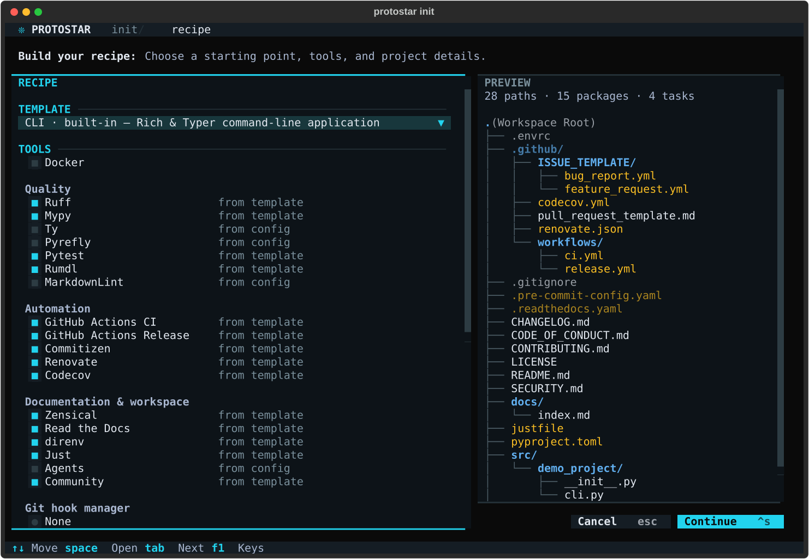
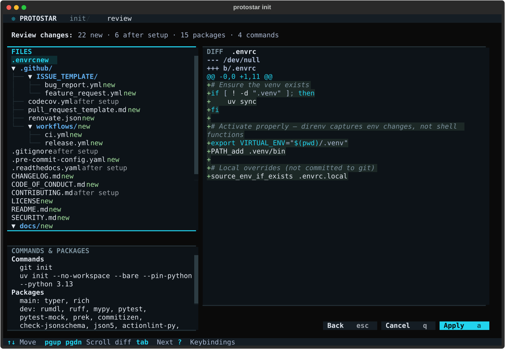
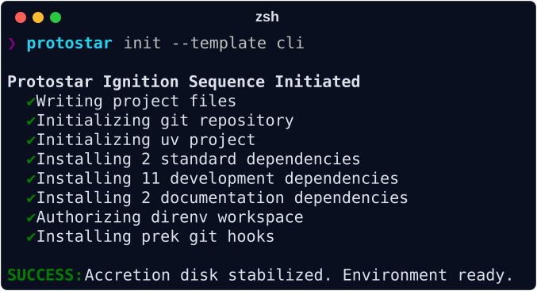
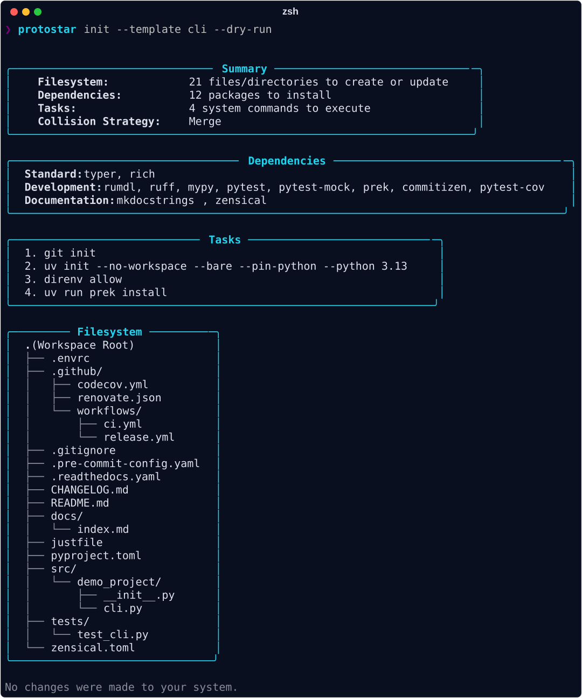
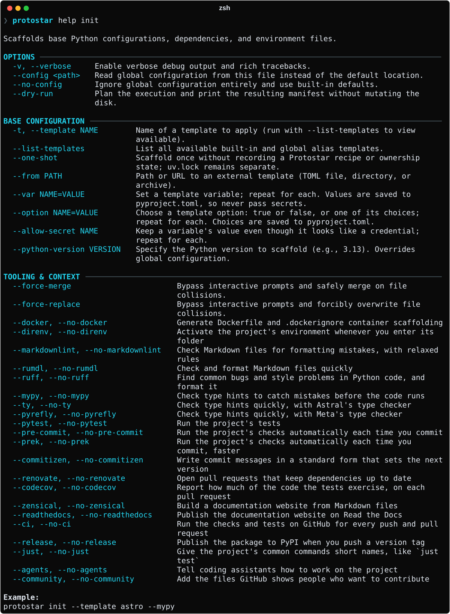

# Environment Initialization

The `init` command is Protostar's primary command. It sets up folder structures, wires together tools, and configures dependencies in seconds.

Protostar is designed to be run on Day 1 to build your repository foundation. On
an already initialized workspace, `--force-merge` safely reconciles contributions
that Protostar previously recorded. It can apply unchanged-local template updates
and additive tooling, while preserving user edits, deletions, and unowned content.
It skips the change review, so a conflict it meets keeps your version; `init`
ends by counting those you can still settle, and `protostar sync` lets you choose
a side.
It does not adopt existing configuration or switch templates, and like `sync` it
retracts content Protostar no longer produces. After tracked initialization, use the [project lifecycle](lifecycle.md) commands
`status`, `diff`, and `sync` to review and apply the recorded recipe.

<div class="grid cards" markdown>

- :material-shield-check: __Safe Merging__

    Protostar doesn't blindly overwrite files. In merge mode it uses recorded ownership baselines for supported TOML and YAML configuration (including GitHub Actions workflows, merged by job and step), line-by-line three-way merges for other generated files, and deduplicated ignore additions. Existing content without state remains unowned.

- :material-clock-fast: __Instant & Repeatable__

    Instead of manually copying boilerplate from old repositories or relying on fragile shell scripts, Protostar creates a clean, consistent environment in fractions of a second.

</div>

## Built-in Templates

While Protostar is fully modular, you often want a vetted, turnkey environment without selecting individual flags manually. Protostar ships with built-in templates that bundle domain-specific tools, directories, and AST configurations. Each one is a project *shape* (a command-line app, a web service, an analysis workbench), not a fixed stack of libraries.

The shapes come in two kinds of default. __Product__ templates (`cli`, `api`, `lib`) start with the full quality gate: strict typing, tests, CI, and commit hooks. __Workbench__ templates (`astro`, `ml`) start lean, with just Ruff, direnv, and `just`, so exploratory work isn't buried in opinions on day one. Either kind is only a starting point: every tool can be overridden with the tri-state flags below.

To scaffold from a template headlessly, pass `--template` (or `-t`):

```bash
# Scaffold from a built-in template (e.g., astro, cli, ml, api)
protostar init --template astro
```

### Tri-State CLI Toggles

Every tooling option supports tri-state evaluation. You can load a template's baseline and explicitly override any tool: passing `--<tool>` forces it on, while passing `--no-<tool>` forces it off:

```bash
# Scaffold the astro template with direnv disabled and mypy enabled
protostar init -t astro --no-direnv --mypy
```

To explore all built-in templates, load remote team standards (`--from`), supply dynamic parameters, or register global aliases, see the complete __[Templates Guide](./templates.md)__.

## Example Setups

To understand how Protostar interprets your flags, observe what happens when we execute different workflows in an empty directory.

!!! note "IDE Configurations"
    The following repository tree examples assume you have configured an IDE in your global settings (e.g., `ide = "vscode"`) in addition to enabling direnv. If your config remains set to the default `None`, the `.vscode/settings.json` file will not be generated, though the universal `.vscode/` exclusion will still be safely appended to your `.gitignore`.

=== "The CLI Application (Tooling Focus)"
    __Command:__ `protostar init --template cli`

    This example demonstrates Protostar's ability to wire complex tooling together automatically.

    ```text
    --8<-- "tree_cli.txt"
    ```

    ??? abstract "Inspect Generated Files"
        === "pyproject.toml"
            ```toml
            --8<-- "cli/pyproject.toml"
            ```
        === ".pre-commit-config.yaml"
            ```yaml
            --8<-- "cli/pre-commit-config.fixture.yaml"
            ```
        === ".gitignore"
            ```gitignore
            --8<-- "cli/.gitignore"
            ```

    __What Protostar sets up:__

    - __Dependency Locking:__ Protostar locks `typer` and `rich` from the CLI template.
    - __AST Configuration:__ It constructs the TOML Abstract Syntax Tree (AST), configuring `[tool.ruff]`, `[tool.mypy]`, `[tool.pytest.ini_options]`, and `[tool.rumdl]` alongside development dependency groups.
    - __Local Toolchain Hooks:__ In `.pre-commit-config.yaml`, Protostar scaffolds local toolchain hooks (`ruff-check`, `ruff-format`, `mypy`, `rumdl-check`, `rumdl-fmt`) that execute directly in your project environment via `uv run`, so each runs the version locked in `uv.lock`. `mypy` checks the whole project, as CI does, because checking only the staged files misses errors they cause elsewhere. Workflows are linted with `actionlint`, and the Renovate and Read the Docs configurations are validated against their schemas with `check-jsonschema`, wherever those files live.
    - __Hook Stages:__ `default_install_hook_types` always includes `pre-commit`. Commitizen adds `commit-msg`, and Pytest adds `pre-push`: the test suite runs before a push that changes `src/`, `tests/`, `pyproject.toml`, or `uv.lock`, rather than on every commit. `default_stages` is `pre-commit`, so every other hook runs at commit time.

=== "The Reusable Library (Package Focus)"
    __Command:__ `protostar init --template lib`

    This template scaffolds a clean, reusable Python library package ready for distribution.

    ```text
    --8<-- "tree_lib.txt"
    ```

    ??? abstract "Inspect Generated Files"
        === "pyproject.toml"
            ```toml
            --8<-- "lib/pyproject.toml"
            ```
        === "src/demo_project/__init__.py"
            ```python
            --8<-- "lib/src/demo_project/__init__.py"
            ```
        === ".pre-commit-config.yaml"
            ```yaml
            --8<-- "lib/pre-commit-config.fixture.yaml"
            ```
        === ".gitignore"
            ```gitignore
            --8<-- "lib/.gitignore"
            ```

    __What Protostar sets up:__

    - __PEP 561 Typing:__ Injects `py.typed` to signal inline type annotations to downstream type checkers like Mypy and Pyright.
    - __Package Packaging:__ Configures the `hatchling` build backend with a standard `src/` layout for wheel and sdist builds.
    - __Public API Architecture:__ Scaffolds `__init__.py` with explicit `__all__` re-exports and dynamic `__version__` lookup via `importlib.metadata`.
    - __Strict Typing & Quality:__ Enables strict Mypy checking, docstring linting (`D`), and `TC` (flake8-type-checking) to keep type-only imports from becoming runtime transitive dependencies.

=== "The Astrophysics Pipeline (Data Focus)"
    __Command:__ `protostar init --template astro`

    This template focuses on managing dataset files and preventing repository bloat.

    ```text
    --8<-- "tree_astro.txt"
    ```

    ??? abstract "Inspect Generated Files"
        === "pyproject.toml"
            ```toml
            --8<-- "astro/pyproject.toml"
            ```
        === ".gitattributes"
            ```gitattributes
            --8<-- "astro/.gitattributes"
            ```
        === ".gitignore"
            ```gitignore
            --8<-- "astro/.gitignore"
            ```

    __What Protostar sets up:__

    - __Directory Scaffolding:__ It injects `data/catalogs` and `data/fits`, isolating dataset files from source code.
    - __Binary Safety:__ It generates a `.gitattributes` file explicitly marking `*.fits` files as binary, and configuring `*.ipynb` for clean text diffing.
    - __Notebook Diffing:__ It automatically configures `nbdime` at the git level, avoiding unreadable JSON diffs when tracking Jupyter Notebooks.
    - __Artifact Exclusions:__ The `.gitignore` is populated with `*.fits`, `*.csv`, and `*.parquet`, preventing accidental commits of large data files.

=== "The Machine Learning Stack (Artifact Focus)"
    __Command:__ `protostar init --template ml --docker`

    This template focuses on containerization and excluding model artifacts.

    ```text
    --8<-- "tree_ml.txt"
    ```

    ??? abstract "Inspect Generated Files"
        === "Dockerfile"
            ```dockerfile
            --8<-- "ml/Dockerfile"
            ```
        === ".dockerignore"
            ```dockerignore
            --8<-- "ml/.dockerignore"
            ```
        === "pyproject.toml"
            ```toml
            --8<-- "ml/pyproject.toml"
            ```

    __What Protostar sets up:__

    - __Container Scaffolding:__ Passing `--docker` (or using a template that declares `docker = true`, such as `api`; `--no-docker` overrides it) generates a multi-stage `Dockerfile` and optimized `.dockerignore`. The `Dockerfile` leverages `uv` layer caching, non-root user execution (`appuser`), and minimal runtime images.
    - __Model Checkpoints:__ The ML template injects ignores for tensor weights (`*.pth`, `*.pt`, `*.onnx`, `*.safetensors`) and experiment tracking directories (`wandb/`, `mlruns/`).

=== "The API Service (FastAPI Focus)"
    __Command:__ `protostar init --template api`

    This template scaffolds a modern asynchronous web API service using FastAPI and Pydantic.

    ```text
    --8<-- "tree_api.txt"
    ```

    ??? abstract "Inspect Generated Files"
        === "pyproject.toml"
            ```toml
            --8<-- "api/pyproject.toml"
            ```
        === "justfile"
            ```just
            --8<-- "api/justfile"
            ```
        === "CHANGELOG.md"
            ```markdown
            --8<-- "api/CHANGELOG.md"
            ```

    __What Protostar sets up:__

    - __Modular API Architecture:__ Establishes a clean directory layout separating routers (`src/demo_project/api/routers`), core application settings (`src/demo_project/core/config.py`), database models, and schemas.
    - __Async Toolchain:__ Pre-configures `fastapi`, `uvicorn`, `pydantic-settings`, and asynchronous test infrastructure powered by `pytest-asyncio` and `httpx`.
    - __Semantic Versioning & Changelogs:__ Integrates Commitizen changelog tooling and automated release tracking out of the box.

## Task Runner Orchestration (`justfile`)

Every initialized repository includes a turnkey `justfile` generated from your active tooling configuration. Recipes dynamically adapt to your selected linters, test frameworks, and documentation engines:

```just
--8<-- "cli/justfile"
```

Running `just` in your project root provides standard developer workflows immediately:

- __`just format`__: Runs automated code formatting with Ruff and rumdl.
- __`just lint`__: Executes static analysis with Ruff and rumdl.
- __`just typecheck`__: Runs static type checking across the project source tree.
- __`just test` / `just test-cov`__: Executes the test suite with coverage reporting.
- __`just ci`__: Emulates the GitHub Actions CI pipeline locally.

## Recipe Editor & Metadata

When running `protostar init` without a `--template` flag in a terminal, Protostar opens the recipe editor. Pick a template, toggle tools, and fill in project details while a live preview shows the planned file tree.



The editor is built for the keyboard; the mouse works too. Moving never changes a value; only `Space` and `Enter` do. The footer shows the keys for whatever has focus, each button shows its own key, and `?` lists them all.

| Key | Action |
| --- | --- |
| `↑` `↓` | Move between rows. Lists move within, then continue to the next row. |
| `Space` | Toggle a checkbox, choose an option, or open a menu. |
| `Enter` | Same as `Space`; in a text field, accept it and move on. |
| `Tab` / `Shift+Tab` | Next or previous control; the tool checkboxes count as one stop. |
| `Ctrl+S` | Continue to the change review. |
| `Esc` | Cancel, after asking. |
| `Ctrl+C` | Quit immediately. |
| `?` | Show all keybindings. |

__Continue__ opens the change review. It lists every planned path as new, modified, conflict, existing, or after setup, shows a diff for each file Protostar writes before running commands, and then the commands and packages that follow. Nothing runs until you choose __Apply__ (`A`). `↑` `↓` move between files, `PgUp` `PgDn` scroll the diff, and `Esc` goes back to the editor.



The following metadata fields appear in the editor, pre-filled from your global configuration and git environment:

--8<-- "table_metadata.md"

## Execution Progress

Once planning succeeds, Protostar writes the project files and runs each subprocess
(`git init`, `uv init`, one `uv add` per dependency group, hook installation) as a
separate step. The running step animates in a spinner; each finished step leaves a
permanent `✔` line, so the completed work stays on screen:



If a step fails or you interrupt it, that step is marked `✖`, every tracked change
is rolled back, and the error report follows. Piped output omits the spinner but
keeps the checklist lines; `--json` suppresses the checklist entirely.

## Existing Projects

When `init` runs in a directory that already holds a project but has no recipe yet, Protostar first reads what the project has. It only reads: nothing is written and no command runs.

- __Facts__ fill the recipe in place of defaults and placeholders. The Python version and minimum come from `requires-python` (or `.python-version`), the author, description, and GitHub account from `[project]`, the license from `[project].license`, its classifiers, or the license file's heading, the supported operating systems from the classifiers, and the copyright year from the license file, so a regenerated license keeps its year. A value you pass or type always wins over a fact. Headless runs use the facts too, for the metadata the selected tools read.
- __Tools__ the project already uses start switched on in the recipe editor, each marked `found` with what showed it, such as `found · justfile` or `found · pyproject.toml [tool.ruff]`. Found tools are only ever added: a template's opinions and your configured defaults still apply to everything else, except that a found hook runner replaces the configured one. A found tool whose prerequisite is off stays off, still marked, so you can decide. Headless runs never switch a tool on because it was found; flags stay the only selection there.

The editor's headline says when it has filled in an existing project, and a note under __Tools__ names anything it left out, such as other GitHub Actions workflows the CI tool would run beside, or a file it could not read. `protostar init --dry-run --json` reports the same analysis for agents (see the [machine interface](agent-interface.md)).

The change review that follows lists every change Protostar would make to a file you already have, and each can be kept out; __Keep all mine__ (`K`) adopts the project exactly as it is, and `protostar sync` can take any kept-out change later (see [changes to files you already have](lifecycle.md#changes-to-files-you-already-have)).

## Progressive Scaffolding & Collisions

When Protostar detects existing configuration files (like `pyproject.toml`), the change review marks them as conflicts and asks how to handle them under __Existing files__:

- __Merge__ (`M`) safely injects missing configs and preserves existing user data.
- __Overwrite__ (`O`) forces injection and updates existing keys to match Protostar.

Choosing either re-prepares the review with its diffs. Press __Cancel__ to exit without modifying the environment.

Under __Merge__, a file Protostar can't merge into is kept as it is and marked
`conflict`, such as an existing `justfile` it has never managed. Highlight it to
see your version beside Protostar's and settle it under __Conflicts__: __Keep
mine__ (`k`) leaves the file untouched and adopts it, so later updates merge into
it three ways; __Take update__ (`u`) replaces it. __Keep both__ (`b`) is offered
for overlapping lines, and __Leave open__ (`x`) keeps today's behavior.

Everything else Merge would change in a file you already have is listed too, as
__Changes to your file__: each key, table, list member, or dependency it adds.
Each applies unless you keep it out with `k`; keeping it out records Protostar's
version without writing it, so `protostar sync` can take it later.
__Keep all mine__ (`K`) keeps your side of every conflict and change at once,
which adopts the project exactly as it is. The review shows the result before
anything runs. It covers the files written before setup commands, and the
configuration merges and dependencies after them whenever no command creates
their files; anything later is listed after setup, and `protostar sync` settles
it the same way (see [changes to files you already have](lifecycle.md#changes-to-files-you-already-have)).

Selecting __Merge__ reconciles declared TOML configuration against
`protostar.lock`. A tracked project requires the same explicitly selected
template source; switching templates or adding a template to tracked tooling-only
state is unsupported.

The example below starts from a tracked ML workspace, adds representative
astronomy dependencies, ignore rules, and data directories as foreign local
content, then repeats the ML template with `--mypy --docker --force-merge`:

- Leaves the existing foreign dependencies, ignores, and directories untouched.
- Adds accepted new dependencies through `uv add`.
- Updates unchanged owned tooling values and preserves local edits/deletions with structured warnings.
- Appends new file patterns to `.gitignore` without duplicating existing rules.

    ??? abstract "See the injected changes"
        ```diff
        --8<-- "diff_ml_ml_merged_pyproject_toml.diff"
        --8<-- "diff_ml_ml_merged__gitignore.diff"
        ```

!!! tip "Headless Operations"
    In CI/CD environments where interactive prompts are impossible, pass `--force-merge` or `--force-replace` to bypass collision prompts deterministically.

## Advanced Flags

- __Dry-Run Simulation__: Append `--dry-run` to preview the planned filesystem structure, dependencies, and tasks without writing files or running shell commands (e.g., `protostar init --template cli --dry-run`).
    
- __Machine-Readable Output__: Pass the position-independent `--json` flag to emit structured JSON envelopes to `stdout` and route logs to `stderr` (e.g., `protostar init --template cli --json`). See the __[Agent & Machine Interface](./agent-interface.md)__ for the full protocol specification.
- __Template Shorthand__: Use `-t` as shorthand for `--template` (e.g., `protostar init -t cli`).
- __List Available Templates__: Run `protostar init --list-templates` to view all built-in templates and registered global aliases.
- __Template Variables__: Supply a template's custom variables with `--var NAME=VALUE`, once per variable (e.g., `protostar init --from ./team.toml --var REGION=eu-west-1`). In a terminal, Protostar asks for any you leave out; elsewhere, including under `--json`, a missing value is an error. Values are saved in the project recipe, so never pass secrets. A value that looks like a credential stops init; if it isn't a secret, keep it with `--allow-secret NAME`. See [Template variables](../development/project-recipe.md#template-variables).
- __Template Options__: Choose a template's [options](./authoring-templates.md#template-options) with `--option NAME=VALUE`, once per option: `true` or `false`, or one of a choice's values (e.g., `protostar init --from ./team.toml --option database=postgres`). An option left out takes the template's default. The recipe editor shows a switch or a choice for each.
- __Python Version Overrides__: Override the default Python version for a single run using `--python-version` (e.g., `protostar init --template cli --python-version 3.13`).
- __Verbose Output__: Append `--verbose` (or `-v`) to enable debug logs and full tracebacks.

## The Capabilities Matrix

To view all supported subcommands and flags in your terminal, run `protostar help init`.



## Next Steps

- __[Templates](./templates.md):__ Learn how to create and share custom TOML blueprints, fetch remote templates, and interpolate variables.
- __[Tooling & Flags Matrix](./tooling-matrix.md):__ Explore all supported linters, formatters, type checkers, and test runners.
- __[Global Configuration](./configuration.md):__ Customize your default Python version, licenses, and template aliases.
- __[Troubleshooting & FAQ](./troubleshooting.md):__ Resolve missing binary dependencies, workspace collisions, and editor configuration issues.

## Persisted project intent

By default, successful initialization records `[tool.protostar]` in `pyproject.toml` alongside
the separate ownership ledger. Unspecified flags preserve recorded diversions on
reinitialization. See [project recipes](../development/project-recipe.md) for
enrollment, selection precedence, and template variables.

## One time scaffolding

Use `--one-shot` when you want the generated environment without Protostar
managing future updates:

```bash
protostar init --template cli --one-shot
```

Protostar scaffolds the same project files and resolves dependencies, including
`uv.lock`, but does not add `[tool.protostar]` to `pyproject.toml` or write
`protostar.lock`. Generated agent guidance describes the resulting project
without referring to a recorded recipe or `protostar sync`. The run retains
normal conflict handling and rollback.

The flag requires a project with neither a recorded recipe nor a
`protostar.lock`. Without those files, `protostar status`, `diff`, and `sync`
cannot manage the scaffold afterward. A later tracked `init --force-merge`
can establish a recipe and ownership state, but existing files remain subject
to the normal rules for foreign content.
