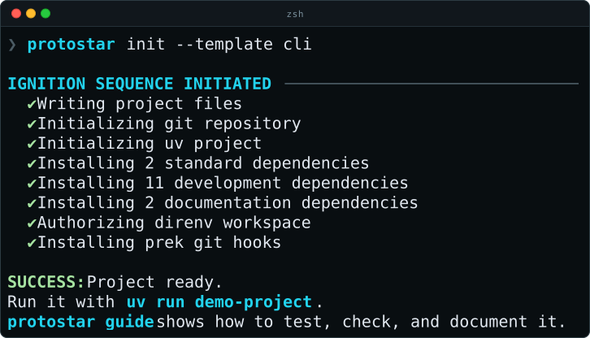
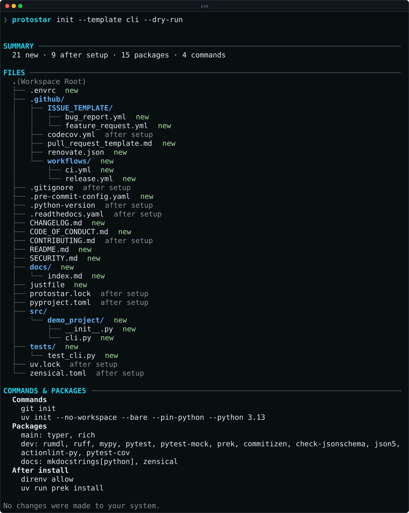

# Environment Initialization

`protostar init` sets up a project in the current directory: an empty folder, or a project you already have. In a terminal with no template given, it opens the recipe editor; with `--template` or `--from`, it runs headlessly. Either way, nothing is written until you have seen the plan, in the change review or with `--dry-run`, and if anything fails part-way, every change is [rolled back](rollback.md).

Afterwards the project is tracked ([How Protostar Tracks Your Files](tracking.md) explains what that means): its recipe in `pyproject.toml` records what it asked for (see [Project Recipes](project-recipes.md)), `protostar.lock` records what was applied, and `status`, `diff`, and `sync` keep it current (see [Project Lifecycle](lifecycle.md)).

Running `init --force-merge` again in a tracked project reapplies the same template. Content Protostar wrote and you haven't touched takes the template's current version, your edits and deletions stay, and content Protostar no longer produces is removed. It skips the change review, so each conflict keeps your version; `init` ends by counting them, and `protostar sync` lets you settle them. It can't switch the project to another template. To update a tracked project, use `sync`.

## Built-in Templates

A built-in template is a tested starting point, so you don't have to choose every tool yourself. Each one is a project *shape* (a command-line app, a web service, an analysis workbench) with the tools, directories, and settings that shape needs, not a fixed stack of libraries.

How much tooling a shape starts with is its [tier](./templates.md#choosing-a-tier), chosen with `--tier`. The __production__ tier adds the full quality gate: strict typing, tests, CI, and commit hooks. The __workbench__ tier stays lean, with just Ruff, direnv, and `just`, so exploratory work isn't buried in opinions on day one. Every built-in offers both: `cli`, `api`, and `lib` start in production, and `astro` and `ml` in workbench. Either tier is only a starting point: every tool can be turned on or off with the flags below.

To scaffold from a template headlessly, pass `--template` (or `-t`):

```bash
# Scaffold from a built-in template (e.g., astro, cli, ml, api)
protostar init --template astro
```

### Turning Tools On and Off

Every tool has a pair of flags. `--<tool>` turns it on and `--no-<tool>` turns it off, whatever the template chose; a tool you pass neither for follows the template. The project records your choice, so `sync` keeps it ([which choice wins](project-recipes.md#which-choice-wins)):

```bash
# Scaffold the astro template with direnv disabled and mypy enabled
protostar init -t astro --no-direnv --mypy
```

To explore all built-in templates, load remote team standards (`--from`), supply dynamic parameters, or register global aliases, see the complete __[Templates Guide](./templates.md)__.

## Example Setups

Here is what each built-in template writes into an empty folder.

!!! note "IDE Configurations"
    The following repository tree examples assume you have configured an IDE in your global settings (e.g., `ide = "vscode"`) in addition to enabling direnv. If your config remains set to the default `None`, the `.vscode/settings.json` file will not be generated, though the universal `.vscode/` exclusion will still be safely appended to your `.gitignore`.

=== "The CLI Application (Tooling Focus)"
    __Command:__ `protostar init --template cli`

    This example demonstrates Protostar's ability to wire complex tooling together automatically.

    ```text
    --8<-- "tree_cli.txt"
    ```

    ??? abstract "Inspect Generated Files"
        === "pyproject.toml"
            ```toml
            --8<-- "cli/pyproject.toml"
            ```
        === ".pre-commit-config.yaml"
            ```yaml
            --8<-- "cli/pre-commit-config.fixture.yaml"
            ```
        === ".gitignore"
            ```gitignore
            --8<-- "cli/.gitignore"
            ```

    __What Protostar sets up:__

    - __Dependency Locking:__ Protostar locks `typer` and `rich` from the CLI template.
    - __Tool Settings:__ It writes `[tool.ruff]`, `[tool.mypy]`, `[tool.pytest.ini_options]`, and `[tool.rumdl]` into `pyproject.toml`, with the development dependency group.
    - __Local Toolchain Hooks:__ In `.pre-commit-config.yaml`, Protostar scaffolds local toolchain hooks (`ruff-check`, `ruff-format`, `mypy`, `rumdl-check`, `rumdl-fmt`) that execute directly in your project environment via `uv run`, so each runs the version locked in `uv.lock`. `mypy` checks the whole project, as CI does, because checking only the staged files misses errors they cause elsewhere. Workflows are linted with `actionlint`, and the Renovate and Read the Docs configurations are validated against their schemas with `check-jsonschema`, wherever those files live.
    - __Hook Stages:__ `default_install_hook_types` always includes `pre-commit`. Commitizen adds `commit-msg`, and Pytest adds `pre-push`: the test suite runs before a push that changes `src/`, `tests/`, `pyproject.toml`, or `uv.lock`, rather than on every commit. `default_stages` is `pre-commit`, so every other hook runs at commit time.

=== "The Reusable Library (Package Focus)"
    __Command:__ `protostar init --template lib`

    This template scaffolds a clean, reusable Python library package ready for distribution.

    ```text
    --8<-- "tree_lib.txt"
    ```

    ??? abstract "Inspect Generated Files"
        === "pyproject.toml"
            ```toml
            --8<-- "lib/pyproject.toml"
            ```
        === "src/demo_project/__init__.py"
            ```python
            --8<-- "lib/src/demo_project/__init__.py"
            ```
        === ".pre-commit-config.yaml"
            ```yaml
            --8<-- "lib/pre-commit-config.fixture.yaml"
            ```
        === ".gitignore"
            ```gitignore
            --8<-- "lib/.gitignore"
            ```

    __What Protostar sets up:__

    - __PEP 561 Typing:__ Injects `py.typed` to signal inline type annotations to downstream type checkers like Mypy and Pyright.
    - __Packaging:__ Configures the `hatchling` build backend with a standard `src/` layout for wheel and sdist builds.
    - __Public API Architecture:__ Scaffolds `__init__.py` with explicit `__all__` re-exports and dynamic `__version__` lookup via `importlib.metadata`.
    - __Strict Typing & Quality:__ Enables strict Mypy checking, docstring linting (Ruff's `D` rules), and `TC` (flake8-type-checking) to keep type-only imports from becoming runtime transitive dependencies.

=== "The Astrophysics Pipeline (Data Focus)"
    __Command:__ `protostar init --template astro`

    This template focuses on managing dataset files and preventing repository bloat.

    ```text
    --8<-- "tree_astro.txt"
    ```

    ??? abstract "Inspect Generated Files"
        === "pyproject.toml"
            ```toml
            --8<-- "astro/pyproject.toml"
            ```
        === ".gitattributes"
            ```gitattributes
            --8<-- "astro/.gitattributes"
            ```
        === ".gitignore"
            ```gitignore
            --8<-- "astro/.gitignore"
            ```

    __What Protostar sets up:__

    - __Directory Scaffolding:__ It injects `data/catalogs` and `data/fits`, isolating dataset files from source code.
    - __Binary Safety:__ It generates a `.gitattributes` file explicitly marking `*.fits` files as binary, and configuring `*.ipynb` for clean text diffing.
    - __Notebook Diffing:__ It automatically configures `nbdime` at the git level, avoiding unreadable JSON diffs when tracking Jupyter Notebooks.
    - __Artifact Exclusions:__ The `.gitignore` is populated with `*.fits`, `*.csv`, and `*.parquet`, preventing accidental commits of large data files.

=== "The Machine Learning Stack (Artifact Focus)"
    __Command:__ `protostar init --template ml --docker`

    This template focuses on containerization and excluding model artifacts.

    ```text
    --8<-- "tree_ml.txt"
    ```

    ??? abstract "Inspect Generated Files"
        === "Dockerfile"
            ```dockerfile
            --8<-- "ml/Dockerfile"
            ```
        === ".dockerignore"
            ```dockerignore
            --8<-- "ml/.dockerignore"
            ```
        === "pyproject.toml"
            ```toml
            --8<-- "ml/pyproject.toml"
            ```

    __What Protostar sets up:__

    - __Container Scaffolding:__ Passing `--docker` (or using a template that declares `docker = true`, such as `api`; `--no-docker` overrides it) generates a multi-stage `Dockerfile` and optimized `.dockerignore`. The `Dockerfile` leverages `uv` layer caching, non-root user execution (`appuser`), and minimal runtime images.
    - __Model Checkpoints:__ The ML template injects ignores for tensor weights (`*.pth`, `*.pt`, `*.onnx`, `*.safetensors`) and experiment tracking directories (`wandb/`, `mlruns/`).

=== "The API Service (FastAPI Focus)"
    __Command:__ `protostar init --template api`

    This template scaffolds a modern asynchronous web API service using FastAPI and Pydantic.

    ```text
    --8<-- "tree_api.txt"
    ```

    ??? abstract "Inspect Generated Files"
        === "pyproject.toml"
            ```toml
            --8<-- "api/pyproject.toml"
            ```
        === "justfile"
            ```just
            --8<-- "api/justfile"
            ```
        === "CHANGELOG.md"
            ```markdown
            --8<-- "api/CHANGELOG.md"
            ```

    __What Protostar sets up:__

    - __Modular API Architecture:__ Establishes a clean directory layout separating routers (`src/demo_project/api/routers`), core application settings (`src/demo_project/core/config.py`), database models, and schemas.
    - __Async Toolchain:__ Pre-configures `fastapi`, `uvicorn`, `pydantic-settings`, and asynchronous test infrastructure powered by `pytest-asyncio` and `httpx`.
    - __Semantic Versioning & Changelogs:__ Integrates Commitizen changelog tooling and automated release tracking out of the box.

## Task Runner Orchestration (`justfile`)

With `just` on, the project gets a `justfile` built from its tools: each recipe runs the linters, type checker, tests, and docs the project has. This is the `cli` template's:

??? abstract "The `cli` template's `justfile`"
    ```just
    --8<-- "cli/justfile"
    ```

Running `just` in your project root provides standard developer workflows immediately:

- __`just format`__: Runs automated code formatting with Ruff and rumdl.
- __`just lint`__: Executes static analysis with Ruff and rumdl.
- __`just typecheck`__: Runs static type checking across the project source tree.
- __`just test` / `just test-cov`__: Executes the test suite with coverage reporting.
- __`just ci`__: Runs the linters, type checker, and tests together, the checks CI runs.

## Recipe Editor & Metadata

When running `protostar init` without a `--template` flag in a terminal, Protostar opens the recipe editor. Pick a template, toggle tools, and fill in project details while a live preview shows the planned file tree. Each file in the preview says what `init` does to it: `new`, `modified`, `existing`, `after setup` (written once the commands run), or a `conflict` to settle. The change review that follows is where conflicts and changes to your files are decided.


The editor is built for the keyboard; the mouse works too. Moving never changes a value; only `Space` and `Enter` do. The footer shows the keys for whatever has focus, each button shows its own key, and `?` lists them all.

??? info "Every key in the recipe editor"
    --8<-- "keys_recipe_editor.md"

__Continue__ opens the change review. Its left panel has three tabs. __Decisions__ appears when something needs you: every conflict and change to a file you already have, each row led by what happens to it, with the count still open beside the tab. __Files__ lists every planned path as new, modified, conflict, existing, or after setup, and __Setup__ lists the commands and packages that follow. The diff beside them shows the highlighted decision or file. Settling a conflict moves on to the next open one. Nothing runs until you choose __Apply__.

??? info "Every key in the change review"
    --8<-- "keys_change_review.md"


The following metadata fields appear in the editor, pre-filled from your global configuration and git environment:

--8<-- "table_metadata.md"

## Execution Progress

Once planning succeeds, Protostar writes the project files and runs each subprocess (`git init`, `uv init`, one `uv add` per dependency group, hook installation) as a separate step. The running step animates in a spinner; each finished step leaves a permanent `✔` line, so the completed work stays on screen:



If a step fails or you interrupt it, that step is marked `✖`, every tracked change is rolled back, and the error report follows. Piped output omits the spinner but keeps the checklist lines; `--json` suppresses the checklist entirely.

A successful run ends with what to do next: the command that runs the app, when the project installs one, and `protostar guide`, which shows how to test, check, and document the project. If a selected tool's binary is missing, the output ends with the one command that installs it; see [Tool Binaries](troubleshooting.md#tool-binaries-direnv-just).

## Existing Projects

When `init` runs in a directory that already holds a project but has no recipe yet, Protostar first reads what the project has. It only reads: nothing is written and no command runs.

- __Facts__ fill the recipe in place of defaults and placeholders. The Python version and minimum come from `requires-python` (or `.python-version`), the author, description, and GitHub account from `[project]`, the license from `[project].license`, its classifiers, or the license file's heading, the supported operating systems from the classifiers, and the copyright year from the license file, so a regenerated license keeps its year. A value you pass or type always wins over a fact. Headless runs use the facts too, for the metadata the selected tools read.
- __Tools__ the project already uses start switched on in the recipe editor, each marked `found`. Press `i` on a tool to see what showed it, such as `justfile` or `pyproject.toml [tool.ruff]`. Found tools are only ever added: a template's opinions and your configured defaults still apply to everything else, except that a found hook runner replaces the configured one. A found tool whose prerequisite is off stays off, still marked, so you can decide. Headless runs never switch a tool on because it was found; flags stay the only selection there.

The editor's headline says when it has filled in an existing project, and a note under __Tools__ names any file it could not read. Other GitHub Actions workflows the CI tool would run beside are listed in its `i` popup. `protostar init --dry-run --json` reports the same analysis for agents (see the [machine interface](agent-interface.md)).

The change review that follows lists every change Protostar would make to a file you already have, and each can be kept out; __Keep all mine__ (`K`) keeps the project exactly as it is, and `protostar sync` can take any kept-out change later (see [changes to files you already have](lifecycle.md#changes-to-files-you-already-have)).

## Progressive Scaffolding & Collisions

When Protostar detects existing configuration files (like `pyproject.toml`), the recipe editor asks how to handle them in its __Existing files__ panel, under the recipe, and the change review lists each decision that leaves:

- __Merge__ keeps your values and adds what's missing.
- __Overwrite__ replaces them with Protostar's version.

Choosing either re-prepares the review with its diffs. Press __Cancel__ to exit without modifying the environment.

Under __Merge__, a file Protostar can't merge into is kept as it is and marked `conflict`, such as an existing `justfile` it has never managed. Highlight it to see your version beside Protostar's and settle it under __Conflicts__: __Keep mine__ (`k`) leaves the file untouched and adopts it, so later updates merge into it three ways; __Take update__ (`u`) replaces it. __Keep both__ (`b`) is offered for overlapping lines, and __Leave open__ (`x`) decides nothing now: your file stays, and `protostar status` keeps listing the conflict.

Everything else Merge would change in a file you already have is listed too, as __Changes to your file__: each key, table, list member, or dependency it adds. Each applies unless you keep it out with `k`; keeping it out records Protostar's version without writing it, so `protostar sync` can take it later. __Keep all mine__ (`K`) keeps your side of every conflict and change at once, which keeps the project exactly as it is. The review shows the result before anything runs. It covers the files written before setup commands, and the configuration merges and dependencies after them whenever no command creates their files; anything later is listed after setup, and `protostar sync` settles it the same way (see [changes to files you already have](lifecycle.md#changes-to-files-you-already-have)).

In a project Protostar already tracks, Merge works from what `protostar.lock` records, and only with the template the project already follows; see [A Project Can't Switch Templates](troubleshooting.md#a-project-cant-switch-templates).

The example below starts from a tracked ML project to which someone added their own astronomy dependencies, ignore rules, and data directories, then runs the ML template again with `--mypy --docker --force-merge`:

- Their dependencies, ignore rules, and directories stay as they were.
- The new dependencies are added through `uv add`.
- Settings Protostar wrote and nobody edited take the template's current values; edits and deletions stay, and the run reports each one.
- `.gitignore` gains the patterns it was missing, without duplicates.

    ??? abstract "See the injected changes"
        ```diff
        --8<-- "diff_ml_ml_merged_pyproject_toml.diff"
        --8<-- "diff_ml_ml_merged__gitignore.diff"
        ```

!!! tip "Without a terminal"
    In CI, or anywhere nothing can ask, choose with `--force-merge` or `--force-replace`.

## Advanced Flags

- __Dry Run__: Append `--dry-run` to see what a run would do without writing files or running shell commands (e.g., `protostar init --template cli --dry-run`). It shows the same review as the recipe editor: each file labelled `new`, `modified`, or `conflict`, the commands and packages, and every conflict and proposal with its id. 
- __Settling Decisions Headlessly__: Pass `--resolve SELECTOR=CHOICE`, once per decision, to settle the conflicts and proposals `--dry-run` lists without the change review (e.g., `protostar init --template cli --force-merge --resolve 89cd01278762=desired`). `CHOICE` is `desired` (take the update), `local` (keep yours, or keep a proposal out), or `both` (text lines only); a file path settles every decision in that file. Without it, a run keeps your version of every conflict and applies every proposal. `--resolve` chooses no collision strategy, so existing files still need `--force-merge`. Combine it with `--dry-run` to see the settled outcome first. It works like [`sync --resolve`](lifecycle.md#resolve-conflicts).
- __Machine-Readable Output__: Pass the position-independent `--json` flag to emit structured JSON envelopes to `stdout` and route logs to `stderr` (e.g., `protostar init --template cli --json`). See the __[Agent & Machine Interface](./agent-interface.md)__ for the full protocol specification.
- __Template Shorthand__: Use `-t` as shorthand for `--template` (e.g., `protostar init -t cli`).
- __List Available Templates__: Run `protostar init --list-templates` to view all built-in templates and registered global aliases.
- __Template Variables__: Supply a template's custom variables with `--var NAME=VALUE`, once per variable (e.g., `protostar init --from ./team.toml --var REGION=eu-west-1`). In a terminal, Protostar asks for any you leave out; elsewhere, including under `--json`, a missing value is an error. Values are saved in the project recipe, so never pass secrets. A value that looks like a credential stops init; if it isn't a secret, keep it with `--allow-secret NAME`. See [Template variables](project-recipes.md#template-variables).
- __Template Options__: Choose a template's [options](./authoring-templates.md#template-options) with `--option NAME=VALUE`, once per option: `true` or `false`, or one of a choice's values (e.g., `protostar init --from ./team.toml --option database=postgres`). An option left out takes the template's default. The recipe editor shows a switch or a choice for each.
- __Python Version Overrides__: Override the default Python version for a single run using `--python-version` (e.g., `protostar init --template cli --python-version 3.13`).
- __Verbose Output__: Append `--verbose` (or `-v`) to enable debug logs and full tracebacks.

## One-Shot Scaffolding

Use `--one-shot` when you want the generated environment without Protostar managing future updates:

```bash
protostar init --template cli --one-shot
```

Protostar scaffolds the same project files and resolves dependencies, including `uv.lock`, but does not add `[tool.protostar]` to `pyproject.toml` or write `protostar.lock`. Generated agent guidance describes the resulting project without referring to a recorded recipe or `protostar sync`. The run retains normal conflict handling and rollback.

The flag requires a project with neither a recorded recipe nor a `protostar.lock`. Without those files, `protostar status`, `diff`, and `sync` cannot manage the scaffold afterward. A later `init --force-merge` can start tracking the project, but the files already there stay yours unless you choose otherwise.

## Next Steps

- __[Templates<span class="hs-icon hs-icon-arrow-right" aria-hidden="true"></span>](./templates.md):__ Learn how to create and share custom TOML blueprints, fetch remote templates, and interpolate variables.
- __[Tooling & Flags Matrix<span class="hs-icon hs-icon-arrow-right" aria-hidden="true"></span>](./tooling-matrix.md):__ Explore all supported linters, formatters, type checkers, and test runners.
- __[Global Configuration<span class="hs-icon hs-icon-arrow-right" aria-hidden="true"></span>](./configuration.md):__ Customize your default Python version, licenses, and template aliases.
- __[CLI Reference<span class="hs-icon hs-icon-arrow-right" aria-hidden="true"></span>](./cli-reference.md#protostar-init):__ Every `init` option, also printed by `protostar help init`.
- __[Troubleshooting & FAQ<span class="hs-icon hs-icon-arrow-right" aria-hidden="true"></span>](./troubleshooting.md):__ Resolve missing binary dependencies, workspace collisions, and editor configuration issues.
