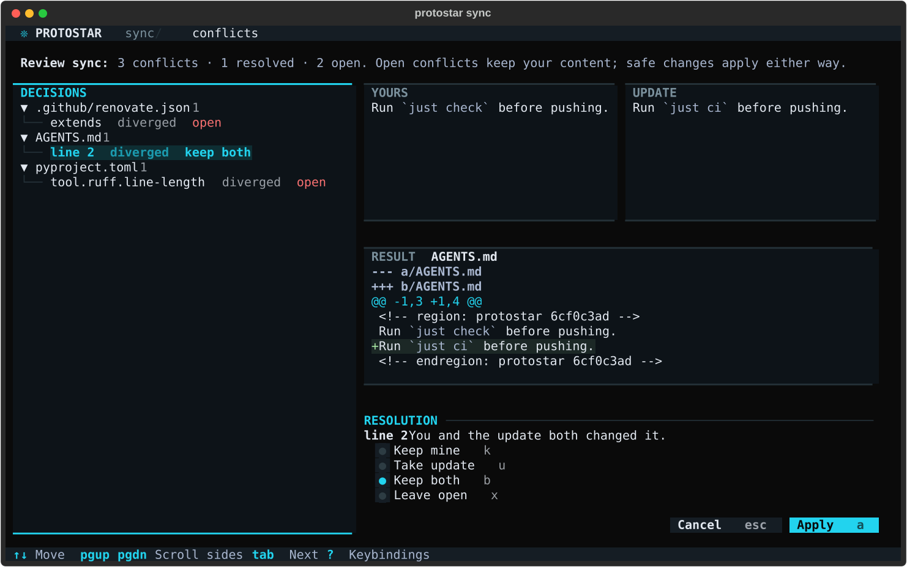

# Review and synchronize a project

After `init`, commit `pyproject.toml` and `.protostar.lock.toml`. The
[project recipe](../development/project-recipe.md) records desired selection; the
lock records accepted ownership. Run lifecycle commands from that project's root.
Protostar uses the current directory and never searches ancestors for a project.

## Review, apply, repeat

```bash
protostar init --template cli
protostar status
protostar diff
protostar sync --dry-run
protostar sync
protostar sync --check
```

`status` summarizes accepted updates, conflicts, preserved edits/deletions, and
ownership advancement. `diff` and `sync --dry-run` show the same accepted byte
changes. Conflicts appear separately with file, key, identity, and line
diagnostics; a conflicted file can still have independent accepted edits. Resolver actions list
accepted requirements and their `pyproject.toml`/`uv.lock` footprint. Their output
is unknown until application, so previews do not invent a resulting lockfile diff.

`sync` applies safe edits and composite ownership state transactionally. It never
reruns project initialization, Git initialization, hook installation, arbitrary
template tasks, or IDE extension probes. It is not an environment reinstall or a
package upgrade command. An unchanged repeat writes nothing and runs no subprocess.
Each resolver subprocess it does run (`uv add` per dependency group, or `uv lock`)
leaves a `✔` line on screen as it finishes.

Built-in templates come from the installed Protostar version. Local templates use
the recorded locator; remote templates use the exact recorded source. A revision
at the same identity can update the project. Changing template identity, switching
to tooling-only mode, or retargeting an alias is not a supported lifecycle update.
Missing sources fail visibly rather than falling back to cached content.

## Preserve local intent and handle partial updates

Suppose a template changes two settings and you independently edited one of them.
Inspection reports the divergent setting as a conflict and the other as accepted.
`sync` commits the safe setting while retaining your conflicting content and its
previous applied baseline. It returns exit `1` with a partial result; this is a
committed update, not a failed transaction.

```bash
protostar sync --json > sync-result.json
# Exit 1 with status "partial": inspect review.conflicts in sync-result.json.
protostar diff
```

Settle the conflict with a [resolution](#resolve-conflicts), or edit your
project or same-source template and review again. If local content already equals
new desired content, Protostar can advance its baseline without rewriting that
content. This still counts as pending work until `sync` records the advancement.

Generated files without a structured format, such as the `justfile` and
`Dockerfile`, merge line by line against the text Protostar last wrote. Your
edits and Protostar's changes combine when they touch different lines. When both
change the same or adjacent lines, the whole file is kept exactly as you left it
rather than half updated, and each overlap is reported as a `diverged` conflict
with its `lines` (a one-based `start` and a `count`, numbered like a unified diff
hunk header). The update stays pending until those lines match what you want.
A checkout that only converts line endings, such as Git's `core.autocrlf`, is not
an edit, and a merged file keeps your line endings.

Local edits or deletions with unchanged desired intent are preserved and do not
make checks fail. Deleted managed files stay deleted. Each preserved edit has an
`id`, and you can [take its update later](#take-a-kept-change-later). Omitted
template contributions retain their existing files and ownership; sync never
prunes them. Equal foreign content remains unowned.

GitHub Actions workflows are the exception to pruning, because each is one
generator's complete output. When Protostar stops generating a step or key (for
example the Codecov upload steps after you turn Codecov off), an unedited copy is
removed and an edited copy is kept with a `retracted` conflict. Workflow files are
merged by job and by step name, so your own jobs, steps, triggers, and inputs stay.
An action version you or Renovate changed (including a SHA pin) is yours: a newer
Protostar version of the same action does not conflict and `sync --check` passes.

## Resolve conflicts

A conflict stays open, and `sync --check` keeps failing, until you settle it.
Every resolution makes the update Protostar's new baseline there; your choice
decides only which content stays in the file:

| Choice | Meaning | Afterwards |
| --- | --- | --- |
| `local` | Keep mine | Your content reads as a local edit of the update and is preserved until the update changes there again. |
| `desired` | Take the update | The update is written. |
| `both` | Keep both | Your lines, then the update's. Only for overlapping lines of a text file. |

Choosing `local` is also how you finish a hand edit: change the file however you
like, then keep it. The same choices settle every kind of conflict Protostar can
show both sides of:

- A `diverged` or `type-mismatch` value or line range takes the side you choose.
- An `unowned` file, value, or workflow job kept with `local` is adopted: it
  stays as it is and merges three ways from then on (a job's steps by name).
  With `desired` it is replaced.
- A dependency whose requirement differs from the request (`unowned`,
  `diverged`, or `deleted-ancestor`) kept with `local` stands for the request
  from then on, so `ruff>=0.5` satisfies a request for `ruff`; with `desired`
  the resolver adds the request.
- A `deleted-ancestor` file or table kept with `local` stays deleted; `desired`
  recreates it.
- A `retracted` value kept with `local` stays and is no longer Protostar's;
  `desired` removes it.

Conflicts caused by document policy (`duplicate-identity`, `shared-structure`,
`unsafe-pin`), a table outside the file's root, and a dependency listed more
than once offer no choices. Fix those by hand.

In an interactive terminal, `sync` opens its review screen before it applies
anything whenever a conflict can be settled or it proposes a change to a file
you already have. It lists them by file, with your preserved edits, showing
your side, the update's side, and a preview of the file each choice produces.
Press `k` to keep yours, `u` to take the update, `b` to keep both, `x` to leave a
conflict open, and `n` for the next open one; on a file's row, a choice applies
to every conflict and proposal in that file, but never to a preserved edit. `a`
applies the sync with those choices, and open conflicts keep your content as
before. `esc` asks before leaving without applying anything. The screen never
opens for `--dry-run`, `--check`, `--json`, `--resolve`, or a non-interactive
terminal, and never for preserved edits alone.



Each conflict has an `id` covering its location and content. `status` prints it
with the choices it offers, and JSON reviews list both with every side under
`review.conflicts`. Pass `--resolve SELECTOR=CHOICE` to `sync`, where the selector
is an `id` or a file path that selects every conflict and proposal in that file:

```bash
protostar sync --dry-run --resolve 3f2a9c1b7d4e=local
protostar sync --resolve justfile=both --resolve 8b0e5d2c61fa=desired
```

Later selectors override earlier ones, so an `id` can refine a file-wide choice.
Settled conflicts move from `review.conflicts` to `review.resolved`. A selector
that matches nothing fails before anything is written. An `id` stops matching as
soon as either side of its conflict changes, so a choice is never applied to
content you did not review. The overlapping line ranges of one text file are
applied together: resolve every one, or the file stays as it is.

## Changes to files you already have

A change Protostar would make inside a file it has never owned is a proposal:
`init` in an existing project, or a tool you enable whose configuration file you
already wrote. That covers a new key or table, members added to a list such as
Ruff's `select`, and a new dependency in a project whose requirements it never
managed. A proposal applies unless you keep it out. Keeping it out records
Protostar's version as the baseline without writing it, exactly like keeping
your side of a conflict, so it reads as your deletion from then on: it is
preserved, `sync --check` passes, and you can take it later.

The `init` change review lists every proposal per file beside the file's diff,
with the conflicts. Press `k` or `u` on a file to keep yours or take the update
for all of its changes, and `K` to keep yours for every conflict and change in
the review, which adopts the project exactly as it is. When no setup command
creates them, as in a project that already has a `pyproject.toml`, the review
shows the configuration merges and dependency choices too, so every change to an
existing file is decided before anything runs. `status` and JSON reviews list
proposals under `review.proposals`; a proposal without a `resolution` applies.
`--force-merge` without a review applies every proposal, as before.

`.gitignore` additions stay automatic: they only add missing lines.

## Take a kept change later

Every preserved edit or deletion is a decision you can revisit. `status` prints
each with its `id`, and JSON reviews list them under `review.preserved` with
their sides. Taking the update writes Protostar's version there, through the
resolver for a dependency:

```bash
protostar status
protostar sync --resolve 53c675afdfb0=desired
```

A file path never selects preserved edits, since each is deliberate: name them
by `id`. The sync review screen lists them too, where `u` on a preserved edit's
own row takes its update. This is how a project adopted as it was takes up
Protostar's standards one at a time.

## Edit the recipe deliberately

Edit entries in `[tool.protostar]` using the
[recipe rules](../development/project-recipe.md). For example:

```toml
[tool.protostar.tools]
renovate = false
mypy = true
```

The `tools` table is left out of `pyproject.toml` until it has an entry, so add it when you need it.

An omitted tool follows current template opinion, then the fallback captured on
initialization. Current global defaults cannot change project selection. An opt-out
suppresses only that tool's contributions and warnings, retaining its previous
files, dependencies, and ownership. Other producers sharing a target still apply.
Re-enabling a tool resumes reconciliation against retained baselines; it does not
restore deleted files or adopt foreign content. Filesystem edits never implicitly
write a recipe opt-out. Captured metadata and year keep rendering repeatable.

## Enroll an existing project

A project Protostar has never touched starts with `protostar init`, which reads the project first and fills the recipe from it; see [existing projects](init.md#existing-projects).

A Stage 1 project needs an explicit recipe. Rerun its original selection:

```bash
protostar init --template cli --force-merge
```

Include the original tooling choices and source as appropriate. Protostar does not
reconstruct a request from the ownership lock. Enrollment preserves existing
ownership and does not adopt equal foreign content. Template variable values come
from the recipe; see [template variables](../development/project-recipe.md#template-variables).
Missing recipes, malformed state, and missing variable values fail before mutation.

## Use checks in CI

```bash
protostar sync --check --json > review.json
```

| Invocation/outcome | Exit code |
| --- | --- |
| Valid status, diff, or dry-run review, including conflicts | `0` |
| Sync completes with no unresolved conflicts, including a no-op | `0` |
| Sync commits safe work and retains unresolved conflicts | `1` |
| Check finds accepted edits, resolver work, state advancement, or conflicts | `1` |
| Check finds only preserved local deviations or no work | `0` |
| Fatal error | Domain-specific code; interruption uses `130` |

`--check` and `--dry-run` are mutually exclusive. Check never applies work. All
commands accept `--json` without prompts: stdout contains one deterministic JSON
envelope; diagnostics and subprocess output go to stderr. Check includes
`check_passed`; review uses `status: "reviewed"`; application uses `"success"` or
`"partial"`. See the [machine interface](agent-interface.md) for generated examples
and schema discovery.

## Security and rollback boundaries

Inspection does not write workspace files, populate source caches, run subprocesses,
or prompt. Remote acquisition can access the network outside pure planning and
holds source data in memory. Each invocation captures one source revision and hook
registry snapshot; apply uses those captured decisions without a second fetch.
Trust is not inherited from the recipe or lock. Initialization-only tasks remain
excluded even for trusted external templates.

Template variable values are recorded in the recipe after passing the secret guard
when they were entered; sync does not check them again. Generated files and review diffs contain project content, so
diffs are not a secret-redaction system. Keep credentials out of rendered
configuration.

Before mutation, sync checks captured bytes, existence, and modes. Changed inputs
abort as a stale review before the first write. This protects the review/apply
interval, not arbitrary concurrent writes during execution. Symlinks and special
filesystem nodes are rejected for transaction-managed targets.

Fatal resolver failures, timeouts, interrupts, and late state-write failures trigger
[automatic rollback](rollback.md). Managed processes are terminated and reaped
before journaled files are restored to exact original bytes and POSIX modes.
Direct edits, ownership state, and declared resolver `pyproject.toml`/`uv.lock`
paths are covered. `.venv` and global caches remain outside that guarantee.
