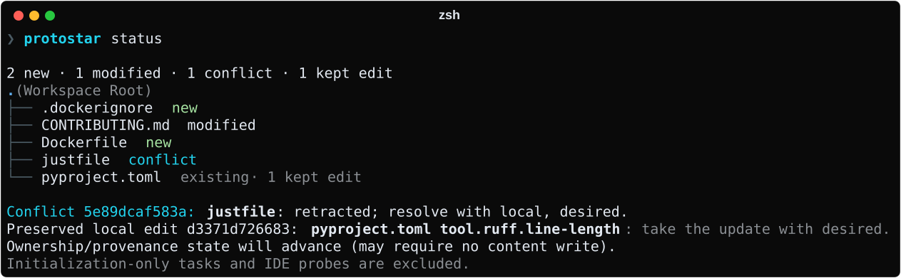
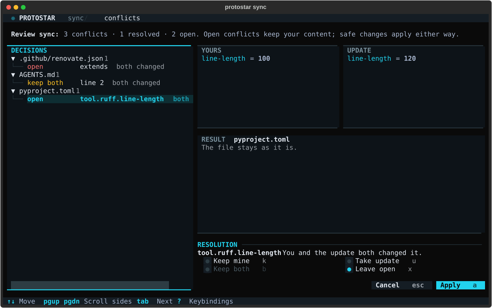

# Project Lifecycle

Once `init` has set up a project, `status`, `diff`, and `sync` keep it current as its template, its tools, and Protostar itself change. This page shows how. [How Protostar Tracks Your Files](tracking.md) explains the ideas behind it: what counts as yours, and how a conflict arises.

Commit `pyproject.toml` and `protostar.lock` after `init`, and run these commands from the project's root folder. Protostar works on the current directory, and never looks in parent folders for a project.

To keep projects current without running anything by hand, with a scheduled update pull request and a check in CI, see [Automating Updates](automating-updates.md).

## Review, Apply, Repeat

```bash
protostar status
protostar diff
protostar sync
protostar sync --check
```

`status` shows what an update would do, without doing it. It draws each file with pending changes as the same labelled tree `init` previews: `new`, `modified`, `removed`, or `conflict`. Below the tree, each conflict, proposed change, and kept edit says in a sentence what happened and what Protostar does unless you choose, followed by the `sync --resolve` command for each choice, ready to copy. It also lists the packages uv will add.



Here the recipe turns Docker on and `just` off. Docker's files are new, and `CONTRIBUTING.md` changes to match the new tools. The `justfile` was edited by hand, so removing it is a conflict: it stays until you choose. The hand-edited Ruff line length is a kept edit, with one command that takes Protostar's value instead.

`diff` adds each file's changes as a unified diff, and `sync --dry-run` shows the same. What uv changes in `pyproject.toml` and `uv.lock` isn't known until it runs, so no preview shows a lockfile diff.

`sync` applies the update. `sync --check` changes nothing and exits `1` while the project is behind its recipe or has an open conflict, which makes it a CI gate; kept edits don't fail it.

## What Sync Does

`sync` applies the safe changes and keeps your version of every conflict, in one transaction: if it fails part-way, every file goes back ([Automatic Rollback](rollback.md)). With conflicts left open, it still applies the safe changes, and exits `1` rather than `0`.

It runs a command only when the update needs one: `uv add` or `uv lock` when dependencies change, and a git hook install when a hook is missing. It never reruns `init`'s setup, such as `git init`, a template's own tasks, or a reinstall of the environment. A repeat with nothing new writes nothing and runs nothing.

Git hooks live in `.git/hooks`, outside the project's files, so each clone has its own. `sync` keeps this clone's hooks in line with the recipe:

- It installs the hook manager's hooks when one is missing, as in a fresh clone or after switching to the production tier.
- It removes hooks a hook manager generated that can now only fail, after you switch manager or turn hooks off. A hook you wrote yourself is never removed.
- A failed hook install is a warning, not a reason to roll back.
- Hooks never count as pending, so `sync --check` passes in a checkout without them, as in CI.

Which template revision an update comes from depends on the template:

- **Built-in templates** come from the installed Protostar, so upgrading Protostar brings their updates.
- **Local templates** come from their files as they are now.
- **Repository templates** stay on the commit `protostar.lock` records until you move them with `sync --to`; see [template versions](templates.md#template-versions).

A project can't switch to a different template, and a template that can't be found fails rather than falling back to a cached copy.

## When You and the Update Both Changed Something

Suppose a template changes two settings, and you had edited one of them. `status` shows the one you edited as a conflict and the other as a safe change. `sync` applies the safe change, keeps your version of the conflict, and exits `1`:

```bash
protostar sync --json > sync-result.json
# Exit 1 with status "partial": the open conflicts are under review.conflicts.
```

Settle the conflict with one of [the choices below](#resolve-conflicts), or change your file to what you want and choose yours.

Files with no structure of their own, such as the `justfile` and `Dockerfile`, merge line by line against the text Protostar last wrote. Your edits and the update combine when they touch different lines. When both change the same or neighbouring lines, the whole file stays exactly as you left it, rather than half updated, and each overlap is a conflict with its line range. A checkout that only converts line endings, such as Git's `core.autocrlf`, isn't an edit, and a merged file keeps your line endings.

## When Protostar Takes Something Back

Content Protostar no longer produces is taken back: what a tool added when you turn it off, what a [template option](authoring-templates.md#template-options) brought when you change it, and what a new template release drops. Each piece is removed if you never edited it, and kept as a conflict if you did, where keeping yours makes it yours and taking the update removes it.

Protostar takes content back piece by piece: each `[tool.*]` table in `pyproject.toml`, each workflow step, each hook, each dependency, each managed block. Turning Codecov off removes its upload steps from the CI workflow and leaves your own steps alone; turning Mypy off removes its hook, so no commit runs a tool that's no longer installed. A whole file, such as `zensical.toml` or the Renovate settings, is taken back key by key, and deleted only if nothing of yours is left in it. Project fields such as `[project].name` are never taken back.

Workflows merge by job and by step name, so your own jobs, steps, triggers, and inputs stay. An action version you or Renovate changed, including a pin to a commit, is yours: a newer version of the same action from Protostar doesn't conflict, and `sync --check` passes.

## Resolve Conflicts

A conflict stays open, and `sync --check` keeps failing, until you settle it. In a terminal, `protostar sync` opens a screen showing both sides of each conflict and what the file will look like, before anything is written:

<div class="hs-terminal">
  <div class="hs-terminal-bar">
    <div class="hs-terminal-dots" aria-hidden="true">
      <span class="dot dot-close"></span>
      <span class="dot dot-minimize"></span>
      <span class="dot dot-maximize"></span>
    </div>
    <span class="hs-terminal-title">protostar sync</span>
  </div>
  <div class="hs-terminal-screen" data-asciinema="../../assets/demo_sync.cast">
    <noscript>
      <a href="../../assets/demo_sync.cast">Download the Protostar terminal recording</a>
    </noscript>
  </div>
</div>

The screen opens whenever there is a conflict you can settle or a proposed change, and lists them by file with your kept edits. A choice on a file's row applies to every conflict and proposed change in that file, but never to a kept edit. Applying keeps your version of any conflict left open. It never opens for `--dry-run`, `--check`, `--json`, `--resolve`, or without a terminal.

--8<-- "keys_sync_conflicts.md"



Whichever side you choose, the update becomes Protostar's record for that content, so the same conflict never returns for the same update:

| Choice | `--resolve` | What stays in the file |
| --- | --- | --- |
| Keep mine | `local` | Your version. It counts as your edit of the update, and stays until a later update changes that content again. |
| Take update | `desired` | The update's version. |
| Keep both | `both` | Your lines, then the update's. Only for overlapping lines in a text file. |

Keeping yours is also how you finish a hand edit: change the file however you like, then keep it. What each choice means depends on the conflict:

- **You and the update both changed it:** the side you choose stays.
- **It was yours before Protostar managed it,** such as a `justfile` you already had: keeping yours adopts it, so it stays as it is and later updates merge into it. Taking the update replaces it.
- **A dependency you declared differently,** such as `ruff>=0.5` where the update asks for `ruff`: keeping yours lets your requirement stand for the update's from then on. Taking the update asks uv for it.
- **You deleted it, and the update changed it:** keeping yours leaves it deleted; taking the update brings it back.
- **The update no longer includes something you edited:** keeping yours makes it yours; taking the update removes it.

A few conflicts have no sides to choose between, such as a key defined twice so Protostar can't tell which copy to update. `status` says so; fix those by hand.

### Settling Conflicts from the Command Line

Each conflict has an `id`. `status` prints the `sync --resolve` command for each of its choices. Pass one `--resolve` per decision, naming an `id`, or a file path for every conflict and proposed change in that file:

```bash
protostar sync --dry-run --resolve 3f2a9c1b7d4e=local
protostar sync --resolve justfile=both --resolve 8b0e5d2c61fa=desired
```

Later selectors override earlier ones, so an `id` can refine a choice made for its whole file. A selector that matches nothing fails before anything is written. An `id` covers both sides of its conflict and stops matching as soon as either changes, so a choice never applies to content you didn't review. The overlapping line ranges of one text file apply together: settle every one, or the file stays as it is.

## Changes to Files You Already Have

A change Protostar would make inside a file it has never written to is a proposed change: in a project you run `init` in, or when you turn on a tool whose configuration file you already wrote. That covers a new key or table, members added to a list such as Ruff's `select`, and a new dependency in a project whose requirements Protostar never managed. A proposed change applies unless you keep it out. Keeping it out records Protostar's version without writing it, so it reads as your deletion from then on: it stays out, `sync --check` passes, and you can take it later.

The `init` change review opens on its Decisions tab, listing every conflict and proposed change by file, conflicts first. Keep all mine keeps your side of every one at once, which leaves the project exactly as it is. When no setup command creates them, as in a project that already has a `pyproject.toml`, the review shows the configuration merges and dependency choices too, so every change to an existing file is decided before anything runs. Without the review, `init --force-merge` applies every proposed change unless you keep it out with `--resolve`, using the ids `init --dry-run` prints:

```bash
protostar init --force-merge --resolve pyproject.toml=local
```

Lines Protostar adds to `.gitignore` are never a decision: it only adds patterns that are missing.

## Take a Kept Change Later

Every kept edit and kept-out change can be revisited. `status` prints the command that takes the update for each:

```bash
protostar status
protostar sync --resolve 53c675afdfb0=desired
```

A file path never selects a kept edit, since each one was deliberate: name it by its `id`. On the sync screen, choosing Take update on a kept edit's own row does the same. This is how a project kept exactly as it was takes up its template's standards, one at a time.

## Change the Recipe

To turn a tool on or off, add it to `[tool.protostar.tools]` and run `sync`:

```toml
[tool.protostar.tools]
renovate = false
mypy = true
```

A tool you leave out follows the template; [which choice wins](project-recipes.md#which-choice-wins) has the full order. Turning a tool off takes back what it added, and turning it on again adds it back. Deleting a tool's files by hand never turns the tool off: the next `status` shows them as your deletions. To change a template option or tier, use `sync --option NAME=VALUE` or `sync --tier`; [Project Recipes](project-recipes.md) covers everything else the recipe holds.

## When the Recipe Is Missing

A project that has never been tracked starts with `protostar init`, which reads it first; see [existing projects](init.md#existing-projects).

A project with a `protostar.lock` but no recipe, because `[tool.protostar]` was deleted, can't be synced: `status` and `sync` stop and say so. Rerun the original `init` command with `--force-merge`, with the same template and the tool flags you chose then:

```bash
protostar init --template cli --force-merge
```

This writes a new recipe and keeps what the lock records; Protostar never guesses the original command from the lock.

## Stop Tracking a Project

`protostar eject` removes `protostar.lock` and `[tool.protostar]`, and keeps every other file, including `uv.lock`. It shows the change and asks first; `--dry-run` previews the `pyproject.toml` diff, and `--yes` confirms without a terminal. Afterwards, `status`, `diff`, and `sync` no longer work in the project.

## What Protects Your Project

- **Previews change nothing.** `status`, `diff`, `sync --dry-run`, and `sync --check` write no file, run no command, and never prompt.
- **What you reviewed is what applies.** `sync` checks, just before writing, that every file it read is unchanged since the review it showed you, and stops before writing anything if one changed. Run it again to review the new state.
- **Commands need trust.** For a template you haven't trusted, `sync` lists the commands an update needs and asks first, or takes `--trust`; see [Trusting a Template](templates.md#trusting-a-template).
- **Failures roll back.** See [Automatic Rollback](rollback.md).
- **Diffs aren't redacted.** Reviews and diffs show your files' content, so keep secrets out of files a template renders. Template variables are checked for secrets only when you enter them.
