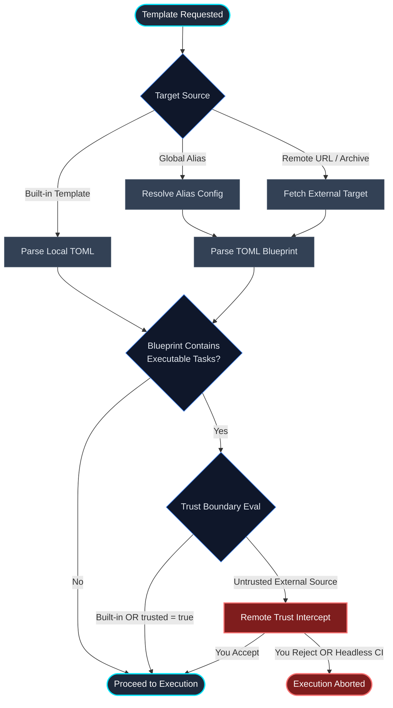

# Templates

Protostar's template engine allows you to define declarative, reusable environment blueprints. Whether you are using built-in templates, fetching team standards from remote Git repositories, or defining custom local setups, templates eliminate boilerplate and ensure consistent repository architecture.

<div class="grid cards" markdown>

- :material-cube-outline: __Built-in Templates__

    Turnkey environment matrices for common domains (e.g., `api`, `astro`, `cli`, `lib`, `ml`) shipped natively with Protostar.

- :material-web: __External & Remote (`--from`)__

    Apply templates from a GitHub, GitLab, Bitbucket, Codeberg, or Sourcehut repository at a release you choose, or from local files.

- :material-card-account-details-outline: __Global Aliases (`[templates]`)__

    Register custom templates in your global `config.toml` to access them directly by name without retyping long URLs.

- :material-shield-alert-outline: __Interactive Security Prompts__

    Clear confirmation prompts for external templates containing executable shell commands, preventing unauthorized command execution.

</div>

## Using Templates

Protostar provides flags for discovering and loading templates during `init`:

```bash
# 1. Using a built-in template or a global alias (shorthand: -t)
protostar init --template astro
protostar init -t astro

# 2. Listing all available built-in templates and global aliases
protostar init --list-templates

# 3. Using an external template directly from a file or URL
protostar init --from https://github.com/YourOrg/standards/blob/main/backend.toml
```

### Listing Available Templates

To inspect all available built-in templates alongside any global aliases registered in your configuration:

```bash
protostar init --list-templates
```

This displays a structured overview in the terminal outlining template aliases, display names, descriptions, types (Built-in or Global Alias), trust status, and origin sources. When invoked with `--json`, it emits a machine-readable JSON array of discovered templates.

### Dynamic Tri-State CLI Toggles

Templates declare opinions about which tools to enable (e.g., `ruff = true`, `mypy = true`, `direnv = true`). However, Protostar uses __tri-state toggling__, meaning you can always override a template's default on the fly using `--<flag>` or `--no-<flag>`:

```bash
# Load the astro template, but disable direnv and enable mypy
protostar init -t astro --no-direnv --mypy
```

Container scaffolding follows the same rules. A template can opt in with `docker = true` (the built-in `api` template does), and `--no-docker` turns it back off:

```bash
# The api template scaffolds a Dockerfile by default; skip it for this project
protostar init -t api --no-docker
```

!!! tip "Precedence Cascade (Highest to Lowest)"
    1. __CLI Flags__ – Explicit terminal arguments (e.g., `--mypy`).
    1. __Template Blueprint__ – Settings declared in your active template.
    1. __Global UserConfig__ – Your fallback defaults in `~/.config/protostar/config.toml`.

## External & Remote Templates (`--from`)

The `--from` flag accepts local filesystem paths, direct raw TOML URLs, and repository web links.

### Repository URLs

A template in a GitHub, GitLab, Bitbucket, Codeberg, or Sourcehut repository is identified by its repository and its path inside that repository. The revision you apply is a separate choice, so the same template can move between releases without becoming a different template. Point `--from` at the repository, or at any web page, raw file, or archive in it:

```bash
# The repository's newest release
protostar init --from https://github.com/YourOrg/fastapi-template

# A named tag, branch, or full commit SHA
protostar init --from https://github.com/YourOrg/fastapi-template/tree/v1.2.0

# A template in a subdirectory of the repository, at a branch
protostar init --from https://github.com/YourOrg/templates/tree/main/services/api
```

Every form below names the same kind of thing: a repository, an optional ref, and an optional path.

| Provider | Examples |
| :--- | :--- |
| __GitHub__ | `/tree/<ref>/<dir>`, `/blob/<ref>/api.toml`, `/archive/refs/tags/<tag>.zip`, `raw.githubusercontent.com/<owner>/<repo>/<ref>/api.toml` |
| __GitLab__ | `/-/tree/<ref>/<dir>`, `/-/blob/<ref>/api.toml`, `/-/archive/<ref>/<repo>-<ref>.zip`; nested groups are supported |
| __Bitbucket__ | `/src/<ref>/<dir>`, `/get/<ref>.zip` |
| __Codeberg__ | `/src/tag/<ref>/<dir>`, `/src/branch/<ref>/<dir>`, `/archive/<ref>.zip` |
| __Sourcehut__ | `/tree/<ref>/item/<dir>`, `/blob/<ref>/api.toml`, `/archive/<ref>.tar.gz` |

The path names either a template directory, which holds a `protostar.toml` and an optional `template/` directory of companion files, or a single `.toml` file. A path to a `protostar.toml` names its directory. Branch names may contain slashes: Protostar matches the longest ref the repository actually has.

Protostar lists the repository's tags and branches with one Git smart-HTTP request (the same one `git ls-remote` makes), without needing `git` installed, and then downloads the template's files for exactly one commit, in memory, rejecting unsafe archive members.

Any other HTTPS URL, such as a raw `protostar.toml` or an archive on your own server, is fetched exactly as given. It has no revisions to choose between. Template source URLs may not carry credentials or query parameters.

### Template Versions

A URL that names no ref starts on the repository's newest release: the highest tag that is a [PEP 440](https://peps.python.org/pep-0440/) version (`v1.2.0` and `1.2.0` both count), not counting pre-releases. A repository with no release tags starts on its default branch.

The recipe in `pyproject.toml` records the ref, and `protostar.lock` records the commit it named:

```toml
[tool.protostar.source]
origin = "remote"
locator = "https://github.com/YourOrg/templates"
path = "services/api"
ref = "v1.2.0"
```

`protostar sync` always applies the recorded commit, so it is reproducible even if someone moves the tag or pushes to the branch. `protostar status` checks the repository and reports what it offers:

```text
Template v1.2.0 @ 4f0b8c2d1e9a; v1.3.0 available (sync --to v1.3.0).
```

A branch reports when it has moved, and a moved tag is reported the same way. Nothing changes until you move the project yourself:

```bash
protostar sync --to v1.3.0 --dry-run   # preview the upgrade
protostar sync --to v1.3.0             # apply it and record the new ref
protostar sync --to latest             # the newest release
protostar sync --to main               # follow a branch, to its current commit
```

`sync --to` is an ordinary three-way sync against the new revision: your local edits are kept, and conflicts are reported exactly as for any other update. Editing `ref` in the recipe by hand and running `sync` does the same thing. `sync --check` does not fail just because a newer release exists; it checks that the recorded revision is applied. Pre-releases are offered only while the project is already on one.

A new version that adds a template variable needs a value: `sync --to` asks for it in an interactive terminal, and otherwise takes `--var NAME=VALUE`.

Aliases work the same way. An alias to a bare repository URL starts every new project on the newest release, and an alias that names a tag starts every project there:

```toml
[templates.backend]
source = "https://github.com/YourOrg/standards/tree/v2.0.0/backend"
```

Built-in templates follow the installed Protostar version, and local templates follow their files, so neither has revisions for `--to` to move between.

## The Global Alias Registry

Instead of memorizing long URLs or local paths, you can register templates in your global configuration file (`~/.config/protostar/config.toml`). Protostar supports both shorthand string aliases and rich configuration tables:

```toml
# Run `protostar config` to edit this file

# Shorthand string aliases:
[templates]
simple-api = "https://raw.githubusercontent.com/YourOrg/standards/main/backend.toml"
local-ds = "~/Developer/templates/data-science.toml"

# Rich configuration tables with explicit metadata and trust:
[templates.enterprise-api]
name = "Enterprise API"
source = "https://github.com/YourOrg/enterprise-template"
description = "Internal enterprise microservice scaffold with auth & tracing"
trusted = true
```

### Table Metadata Fields

When declaring a template via `[templates.<alias>]`, you can specify:

- __`source`__ *(required)*: The remote URL (`https://`, `git@`) or local filesystem path (`~/...`).
- __`name`__ *(optional)*: A human-readable display name for the template.
- __`description`__ *(optional)*: A short explanation of the stack, displayed in `protostar init --list-templates`, shell auto-completion, and the interactive wizard.
- __`trusted`__ *(optional, default: `false`)*: Set to `true` to explicitly trust this template and bypass the interactive remote execution warning dialog.

Alias names are case-insensitive and must be unique: an alias may not reuse a built-in template name (`api`, `astro`, `cli`, `lib`, `ml`), and two aliases may not differ only by letter case. Protostar rejects either collision when it loads your configuration, because the alias would otherwise resolve to a different template depending on how it was looked up.

Once registered, you can reference them directly by alias with `--template` (or `-t`):

```bash
protostar init --template enterprise-api
# Or using shorthand:
protostar init -t enterprise-api
```

In the interactive TUI wizard, your aliases are automatically discovered and displayed under a dedicated __External Aliases__ category with their custom descriptions. You can also run `protostar init --list-templates` to view all configured aliases alongside built-in templates.

## Supplying Template Parameters

Templates can define custom parameters (such as service names, regions, or deployment settings). Their values are saved in the project recipe in `pyproject.toml`, so they must never be secrets.

### Passing Parameters via CLI

Pass each value with `--var`, once per parameter:

```bash
protostar init --from ./service.toml --var SERVICE_NAME=billing --var REGION=eu-west-1
```

### Interactive Resolution

If a template requires parameters that were not supplied with `--var`, Protostar prompts for the missing values in an interactive terminal before any disk mutations occur. Without a terminal, including under `--json`, it stops with an error naming every missing parameter. Later runs of `init` reuse the recorded values.

### Automatic Metadata Resolution

Standard project variables—such as the human-readable project name, PEP 8 sanitized package identifier, target Python version, current calendar year, and author details—are resolved automatically by Protostar from your environment and directory context. You do not need to provide these manually.

!!! tip "Defining Template Variables"
    If you are authoring your own template and want to embed `<% VARIABLE_NAME %>` placeholders or inspect all built-in late-binding variables, see the [Authoring Custom Templates: Variable Interpolation](authoring-templates.md#level-3-variable-interpolation) guide.

## Security Model: The Remote Trust Dialog

Protostar enforces a strict security boundary for external templates to prevent untrusted remote code execution.



### Sandboxing & Security Prompts

While Protostar enforces filesystem path jailing (preventing templates from writing outside your workspace) and binary safelisting (disallowing direct calls to shells like `/bin/sh`), developer tools like `uv run`, `git`, and `npm` can still execute scripts provided within the repository.

To address this, Protostar prompts for confirmation before running external commands:

1. __Built-in Templates:__ Trusted implicitly (shipped within the validated Protostar package).
1. __Explicitly Trusted Aliases:__ Trusted when configured with `trusted = true` under `[templates.<alias>]` in your global `config.toml`.
1. __Untrusted External Templates (`--from` or untrusted aliases):__ If an untrusted template attempts to execute `system_tasks` or `post_install_tasks`, the Orchestrator halts before touching disk or shell. The change review lists the template's exact commands under __Untrusted template__, and __Apply__ stays disabled until you tick the checkbox confirming them (`T`).

In non-interactive environments (e.g., CI/CD or `--json` mode), untrusted templates with executable tasks abort immediately with `SecurityViolationError` to prevent hanging or unauthorized execution. To run them headlessly, configure them with `trusted = true` in your global configuration aliases.

## Ready to Author Your Own Templates?

If you want to build reusable blueprints for your team, inject custom configurations into `pyproject.toml`, or package full multi-file template repositories with dynamic variables, head over to the __[Authoring Custom Templates](./authoring-templates.md)__ guide.

## Related Guides & Next Steps

- __[Authoring Custom Templates](./authoring-templates.md):__ Build your own single-file blueprints or multi-file repository archives with dynamic variables.
- __[Tooling & Flags Matrix](./tooling-matrix.md):__ Explore all tools and built-in templates available in Protostar.
- __[Global Configuration](./configuration.md):__ Learn how to register shorthand aliases under `[templates]` in your `config.toml`.
- __[Agent & Machine Interface](./agent-interface.md):__ Inspect blueprints and validate template JSON schemas in automated agent pipelines.
