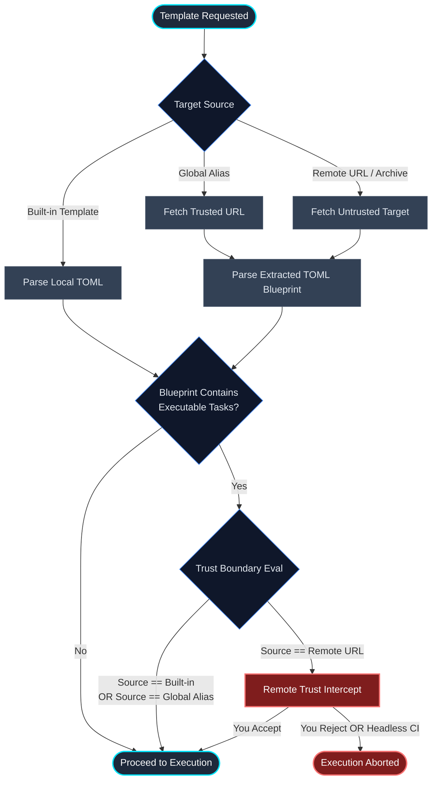

# Templates & Portable Configurations

Protostar's template engine allows you to define declarative, reusable environment blueprints. Whether you are using built-in domain presets, fetching team standards from remote Git repositories, or defining custom local setups, templates eliminate boilerplate and ensure consistent repository architecture.

<div class="grid cards" markdown>

- :material-cube-outline: __Built-in Templates__

    Turnkey environment matrices for common domains (e.g., `astro`, `cli`, `ml`, `dsp`) shipped natively with Protostar.

- :material-web: __Portable & Remote (`--from`)__

    Fetch raw TOML blueprints directly from GitHub, GitLab, Codeberg, or local files with dynamic URL translation and archive unpacking.

- :material-card-account-details-outline: __Global Aliases (`[templates]`)__

    Register custom templates in your global `config.toml` to access them directly by name without retyping long URLs.

- :material-shield-alert-outline: __Interactive Security Prompts__

    Clear confirmation prompts for external templates containing executable shell commands, preventing unauthorized command execution.

</div>

---

## Using Templates

Protostar provides flags for discovering and loading templates during `init`:

```bash
# 1. Using a built-in template or a global alias (shorthand: -t)
protostar init --template astro
protostar init -t astro

# 2. Listing all available built-in templates and global aliases
protostar init --list-templates

# 3. Using a portable configuration directly from a file or URL
protostar init --from https://github.com/YourOrg/standards/blob/main/backend.toml
```

### Listing Available Templates

To inspect all available built-in templates alongside any global aliases registered in your configuration:

```bash
protostar init --list-templates
```

This displays a structured overview in the terminal outlining template names, types (Built-in or Global Alias), and origin sources.

### Dynamic Tri-State CLI Toggles

Templates declare opinions about which tools to enable (e.g., `ruff = true`, `mypy = true`, `direnv = true`). However, Protostar uses __tri-state toggling__, meaning you can always override a template's default on the fly using `--<flag>` or `--no-<flag>`:

```bash
# Load the astro template, but disable direnv and enable mypy
protostar init -t astro --no-direnv --mypy
```

!!! tip "Precedence Cascade (Highest to Lowest)"
    1. __CLI Flags__ – Explicit terminal arguments (e.g., `--mypy`).
    2. __Template Blueprint__ – Settings declared in your active template.
    3. __Global UserConfig__ – Your fallback defaults in `~/.config/protostar/config.toml`.

---

## Portable Configurations (`--from`)

The `--from` flag accepts local filesystem paths, direct raw TOML URLs, and repository web links.

### Automatic URL Translation

Protostar automatically detects and translates standard web UI URLs into raw downloadable endpoints for all major hosting providers:

| Provider | Web URL | Translated Endpoint |
| :--- | :--- | :--- |
| __GitHub__ | `https://github.com/user/repo/blob/main/api.toml` | `https://raw.githubusercontent.com/user/repo/main/api.toml` |
| __GitLab__ | `https://gitlab.com/user/repo/-/blob/main/api.toml` | `https://gitlab.com/user/repo/-/raw/main/api.toml` |
| __Bitbucket__ | `https://bitbucket.org/user/repo/src/main/api.toml` | `https://bitbucket.org/user/repo/raw/main/api.toml` |
| __Codeberg__ | `https://codeberg.org/user/repo/src/branch/main/api.toml` | `https://codeberg.org/user/repo/raw/branch/main/api.toml` |
| __Sourcehut__ | `https://git.sr.ht/~user/repo/tree/main/item/api.toml` | `https://git.sr.ht/~user/repo/blob/main/api.toml` |

### Multi-File Repository Archives

Protostar also natively supports full repository archives (`.zip` and `.tar.gz`). If your template includes companion files (e.g., custom configs, pre-populated source files, or scripts), point `--from` to the repository root:

```bash
protostar init --from https://github.com/YourOrg/fastapi-template
```

Protostar downloads the archive, extracts it safely using strict path traversal protection, resolves the contained `protostar.toml`, and injects all files from the `template/` directory into your workspace.

---

## Dynamic Variables & Interpolation

Templates can define parameterized placeholders using `<% VARIABLE_NAME %>` delimiters.

### Passing Variables via CLI

Pass dynamic values as trailing arguments during initialization:

```bash
protostar init --from ./service.toml --PROJECT_NAME="auth-service" --DATABASE_URL="postgresql://localhost:5432/db"
```

### Interactive Resolution

If a template contains placeholders that were not supplied via CLI flags, Protostar automatically prompts you for the missing values in the terminal (both in headless and TUI modes) before any disk mutations occur.

### Built-in Late-Binding Variables

Protostar automatically reserves and computes the following variables during execution:

- `<% PROJECT_NAME %>`: The human-readable project name (derived from directory name or metadata).
- `<% PACKAGE_NAME %>`: The PEP 8 sanitized Python package identifier (e.g., `my-cool-app` becomes `my_cool_app`).
- `<% PYTHON_VERSION %>`: The resolved target Python version (e.g., `3.13`).
- `<% CURRENT_YEAR %>`: The current calendar year (e.g., `2026`).
- `<% AUTHOR_NAME %>`: The resolved author name (from project metadata or fallback default).

---

## Authoring Custom Templates

See [Authoring Templates](authoring-templates.md) for information on how to create your own templates.

---

## The Global Alias Registry

Instead of memorizing long URLs or local paths, register your templates in your global configuration file (`~/.config/protostar/config.toml`):

```toml
# Run `protostar config` to edit this file

[templates]
backend = "https://raw.githubusercontent.com/YourOrg/standards/main/backend.toml"
microservice = "https://github.com/YourOrg/microservice-template"
local-ds = "~/Developer/templates/data-science.toml"
```

Once registered, you can reference them directly with `--template` (or `-t`):

```bash
protostar init --template backend
# Or using shorthand:
protostar init -t backend
```

In the interactive TUI wizard, your aliases are automatically discovered and displayed under a dedicated __External Aliases__ category. You can also run `protostar init --list-templates` to view all configured aliases alongside built-in templates.

---

## Security Model: The Remote Trust Dialog

Protostar enforces a strict security boundary for external templates to prevent untrusted remote code execution.



### Sandboxing & Security Prompts

While Protostar enforces filesystem path jailing (preventing templates from writing outside your workspace) and binary safelisting (disallowing direct calls to shells like `/bin/sh`), developer tools like `uv run`, `git`, and `npm` can still execute scripts provided within the repository.

To address this, Protostar prompts for confirmation before running external commands:

1. __Built-in Templates:__ Trusted implicitly (shipped within the validated Protostar package).
1. __Global Config Aliases:__ Trusted implicitly (you explicitly added the template to your own `config.toml`).
1. __Untrusted External Templates (`--from`):__ If an untrusted template attempts to execute `system_tasks` or `post_install_tasks`, the Orchestrator halts execution before touching disk or shell and prompts for explicit confirmation:

```text
⚠️  REMOTE TEMPLATE WARNING ⚠️

This template was loaded from an external source and will execute the following shell commands on your system:
  - uv run nbdime config-git --enable

Do you trust this source to modify your system? [y/N]
```

In non-interactive environments (e.g., CI/CD), untrusted templates with executable tasks abort immediately. To run them headlessly, register the template in your global configuration aliases.

---

## Related Guides & Next Steps

- __[Authoring Custom Templates](./authoring-templates.md):__ Build your own single-file blueprints or multi-file repository archives with dynamic variables.
- __[Tooling & Flags Matrix](./tooling-matrix.md):__ Explore all tools and built-in templates available in Protostar.
- __[Global Configuration](./configuration.md):__ Learn how to register shorthand aliases under `[templates]` in your `config.toml`.
- __[Agent & Machine Interface](./agent-interface.md):__ Inspect blueprints and validate template JSON schemas in automated agent pipelines.
